# 10. 쿠버네티스 네트워킹

> 본 실습은 **Master 1 + Worker 2 (총 3노드) 클러스터**를 기준으로 합니다. 8주차에서 구성한 Calico CNI 기반 클러스터를 그대로 사용하며, 9주차에서 학습한 Pod·Service 개념을 전제로 합니다.
>
> 모든 `kubectl` 명령은 별도 표기가 없는 한 **Master 노드**에서 실행하며, 일부 단계(Step 4, Step 9, Step 10)는 워커 노드에 SSH 접속해 호스트 명령을 실행합니다.

---

## Step 0. 작업 폴더 & 클러스터 점검

### 1. 작업 디렉터리 생성

```bash
mkdir -p ~/k8s-week10
cd ~/k8s-week10
pwd                          # /home/ubuntu/k8s-week10
```
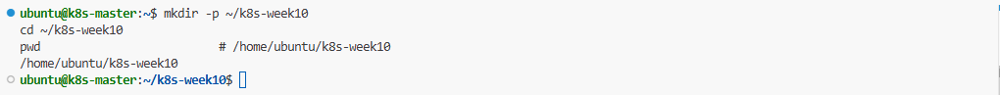

### 2. 노드 및 CNI 상태 확인

```bash
kubectl get nodes -o wide
kubectl get pods -n calico-system -o wide   # calico-node 가 노드 수(3개) 만큼 떠 있어야 정상
```
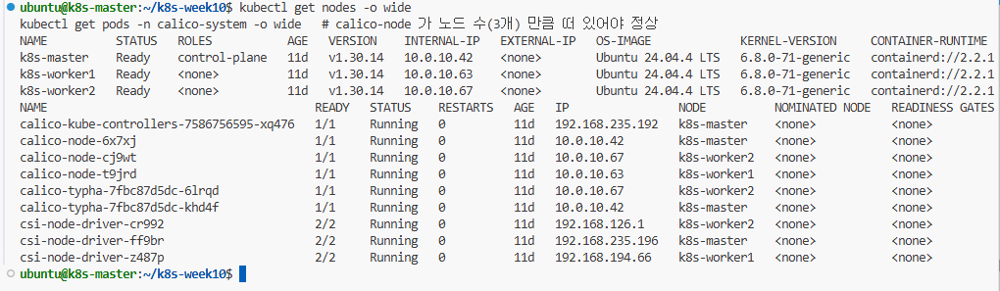

> **Calico-node 가 3개, calico-kube-controllers 1개** 가 모두 Running 이어야 본 실습이 정상 동작합니다.

---

## Step 1. 파드 네트워크 모델 검증 (PDF 2~3쪽: IP-per-Pod / Flat Network)

쿠버네티스의 첫 번째 원칙은 **모든 파드가 NAT 없이 고유 IP로 직접 통신**한다는 것입니다. 클러스터 어디에 배치되어도 같은 IP 공간(Flat Network)에 속합니다.

### 1. 디버그 파드 3개 생성 (각각 다른 노드 분포 유도)

```bash
cat > netshoot-pods.yaml << 'EOF'
apiVersion: v1
kind: Pod
metadata: { name: net-a, labels: { app: net } }
spec:
  containers:
    - name: shoot
      image: nicolaka/netshoot
      command: ["sh", "-c", "sleep 3600"]
---
apiVersion: v1
kind: Pod
metadata: { name: net-b, labels: { app: net } }
spec:
  containers:
    - name: shoot
      image: nicolaka/netshoot
      command: ["sh", "-c", "sleep 3600"]
---
apiVersion: v1
kind: Pod
metadata: { name: net-c, labels: { app: net } }
spec:
  containers:
    - name: shoot
      image: nicolaka/netshoot
      command: ["sh", "-c", "sleep 3600"]
EOF

kubectl apply -f netshoot-pods.yaml
kubectl wait --for=condition=Ready pod/net-a pod/net-b pod/net-c --timeout=120s
```
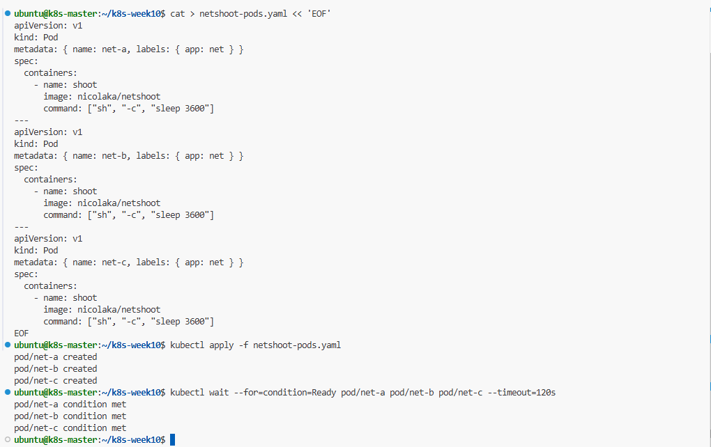

### 2. 파드별 고유 IP 확인 (IP-per-Pod 검증)

```bash
kubectl get pods -l app=net -o wide
# IP 컬럼이 모두 다른 값(예: 192.168.x.x)이며 같은 대역인 것을 확인
```
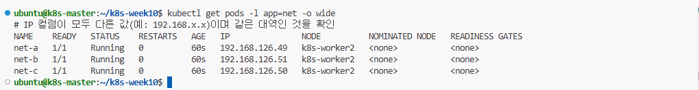

### 3. NAT 없는 직접 통신 검증 (Flat Network)

```bash
# net-a → net-b 의 Pod IP 로 직접 ping
B_IP=$(kubectl get pod net-b -o jsonpath='{.status.podIP}')
echo "net-b IP: $B_IP"

kubectl exec net-a -- ping -c 3 $B_IP
# net-c 로도 동일하게 직접 통신 가능
C_IP=$(kubectl get pod net-c -o jsonpath='{.status.podIP}')
kubectl exec net-a -- ping -c 3 $C_IP
```
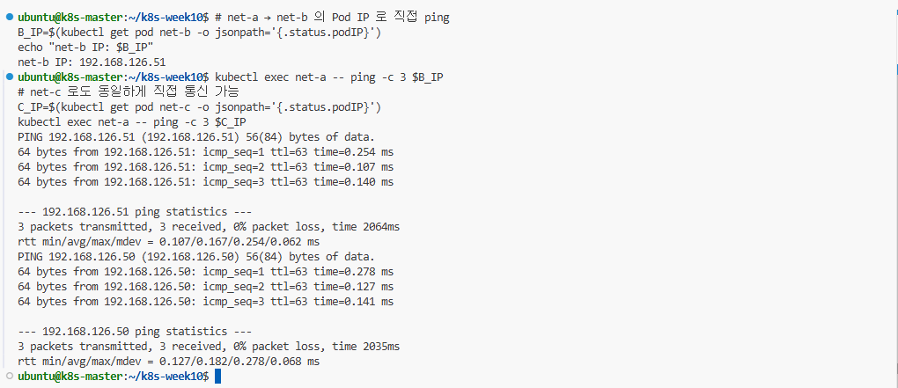

> 다른 노드에 위치한 파드라도 **NAT 변환 없이 Pod IP 그대로** 통신되는 것이 핵심입니다.

### 4. 같은 파드 내 컨테이너 — `localhost` 통신 검증 (PDF 2쪽)

파드 내부의 모든 컨테이너는 **같은 네트워크 네임스페이스(IP, Port)** 를 공유하므로 서로 `localhost` 로 통신합니다.

```bash
cat > localhost-test.yaml << 'EOF'
apiVersion: v1
kind: Pod
metadata: { name: localhost-test }
spec:
  containers:
    - name: server
      image: nginx:alpine          # 80 포트에서 listen
    - name: client
      image: nicolaka/netshoot
      command: ["sh", "-c", "sleep 3600"]
EOF

kubectl apply -f localhost-test.yaml
kubectl wait --for=condition=Ready pod/localhost-test --timeout=60s

# client 컨테이너에서 server 컨테이너의 80포트로 localhost 접근
kubectl exec localhost-test -c client -- curl -s -o /dev/null -w "HTTP %{http_code}\n" http://localhost:80
# HTTP 200 → 같은 파드 내부에서 localhost 통신됨

kubectl delete pod localhost-test
```
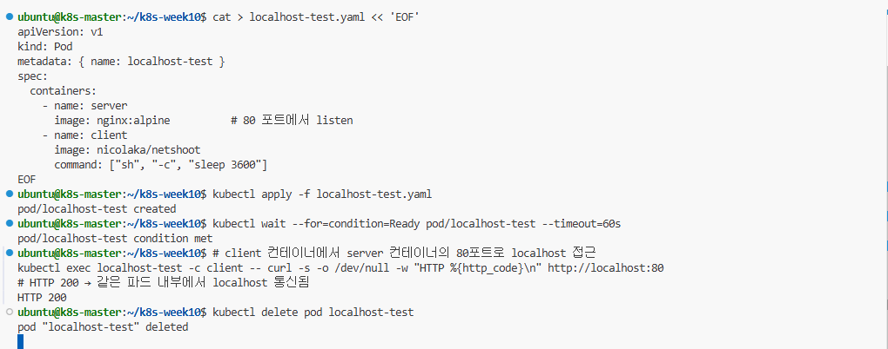

---

## Step 2. CIDR 할당 구조 확인 (PDF 8~9쪽)

**Cluster CIDR**(클러스터 전체)을 **Node CIDR**(노드별 서브넷)로 분할하여 할당합니다. 노드 간 IP 충돌이 없게 만드는 구조입니다.

### 1. Cluster CIDR 확인

```bash
# kubeadm 설치 시 지정한 --pod-network-cidr 값 (8주차 실습에서 192.168.0.0/16)
kubectl get configmap -n kube-system kubeadm-config -o yaml | grep podSubnet
```
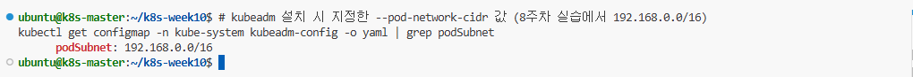

### 2. 각 노드의 Pod CIDR (서브넷) 확인

```bash
# 노드별로 잘게 쪼개 할당된 서브넷
kubectl get nodes -o jsonpath='{range .items[*]}{.metadata.name}{"\t"}{.spec.podCIDR}{"\n"}{end}'
```

> `kubeadm` 설치 시 `--pod-network-cidr=192.168.0.0/16` 으로 지정했으나, **Calico 는 자체 IPAM 을 사용**하므로 `.spec.podCIDR` 가 비어 있을 수 있습니다. 그 경우 다음 명령으로 Calico 의 IPPool 을 확인합니다.

```bash
# Calico 의 IP Pool — Cluster CIDR 와 동일 역할
kubectl get ippool -o jsonpath='{range .items[*]}{.metadata.name}{"\t"}{.spec.cidr}{"\n"}{end}'

# 노드별로 Calico 가 할당한 IP 블록 (Node CIDR 와 동일 역할)
kubectl get ipamblock -o jsonpath='{range .items[*]}{.spec.cidr}{"\t"}{.spec.affinity}{"\n"}{end}'
```
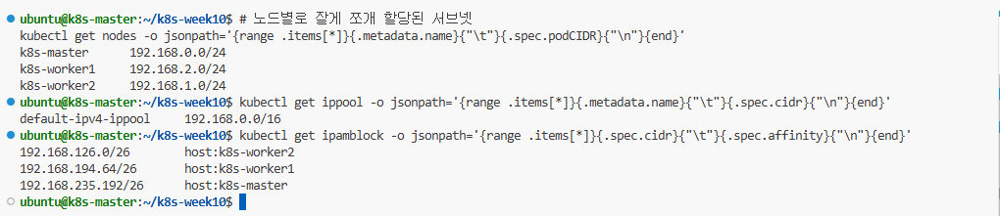

> 출력 예시:
> ```
> 192.168.166.128/26   host:k8s-worker1
> 192.168.235.192/26   host:k8s-master
> 192.168.119.64/26    host:k8s-worker2
> ```
> → 각 노드가 **겹치지 않는 /26 블록** 을 받았음을 확인할 수 있습니다.

---

## Step 3. 같은 노드 vs 다른 노드 파드 통신 (PDF 10~11쪽)

같은 노드의 파드는 **로컬 브리지**에서 직접 스위칭되고, 다른 노드의 파드는 **오버레이 네트워크(IP-in-IP / VXLAN)** 를 거쳐 통신합니다.

### 1. 노드 분포 확인

```bash
kubectl get pods -l app=net -o wide
# NODE 컬럼을 확인 — 운이 좋으면 worker1/worker2 에 분산되어 있을 것
```

### 2. 강제 배치 — 같은 노드에 두 파드 띄우기

```bash
cat > same-node-pods.yaml << 'EOF'
apiVersion: v1
kind: Pod
metadata: { name: same-a, labels: { app: same } }
spec:
  nodeSelector: { kubernetes.io/hostname: k8s-worker1 }
  containers:
    - name: shoot
      image: nicolaka/netshoot
      command: ["sh", "-c", "sleep 3600"]
---
apiVersion: v1
kind: Pod
metadata: { name: same-b, labels: { app: same } }
spec:
  nodeSelector: { kubernetes.io/hostname: k8s-worker1 }
  containers:
    - name: shoot
      image: nicolaka/netshoot
      command: ["sh", "-c", "sleep 3600"]
EOF

kubectl apply -f same-node-pods.yaml
kubectl wait --for=condition=Ready pod/same-a pod/same-b --timeout=60s
kubectl get pods -l app=same -o wide
```
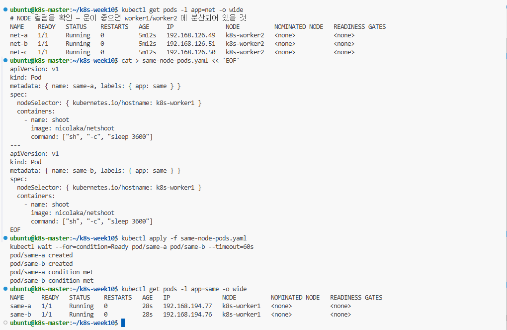

### 3. 강제 배치 — 다른 노드에 한 쌍 띄우기

```bash
cat > diff-node-pods.yaml << 'EOF'
apiVersion: v1
kind: Pod
metadata: { name: diff-a, labels: { app: diff } }
spec:
  nodeSelector: { kubernetes.io/hostname: k8s-worker1 }
  containers:
    - name: shoot
      image: nicolaka/netshoot
      command: ["sh", "-c", "sleep 3600"]
---
apiVersion: v1
kind: Pod
metadata: { name: diff-b, labels: { app: diff } }
spec:
  nodeSelector: { kubernetes.io/hostname: k8s-worker2 }
  containers:
    - name: shoot
      image: nicolaka/netshoot
      command: ["sh", "-c", "sleep 3600"]
EOF

kubectl apply -f diff-node-pods.yaml
kubectl wait --for=condition=Ready pod/diff-a pod/diff-b --timeout=60s
kubectl get pods -l app=diff -o wide
```
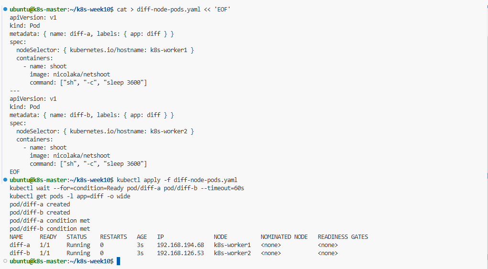

### 4. traceroute 로 경로 차이 관찰

```bash
SAME_B=$(kubectl get pod same-b -o jsonpath='{.status.podIP}')
DIFF_B=$(kubectl get pod diff-b -o jsonpath='{.status.podIP}')

echo "=== 같은 노드 통신 ==="
kubectl exec same-a -- traceroute -n -m 5 $SAME_B

echo "=== 다른 노드 통신 ==="
kubectl exec diff-a -- traceroute -n -m 5 $DIFF_B
```

> 같은 노드 통신은 **홉 수가 적고**, 다른 노드 통신은 **터널(IP-in-IP) 헤더로 한 단계 더** 거치는 차이를 관찰할 수 있습니다.

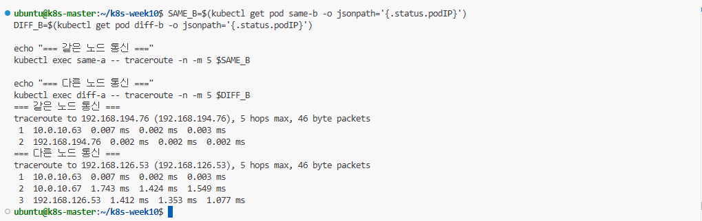

---

## Step 4. 노드 호스트의 네트워크 인터페이스 관찰 (PDF 10~11쪽)

CNI 가 만들어낸 가상 네트워크 장치들을 실제 워커 노드에서 직접 봅니다. **k8s-worker1 노드에 SSH 접속** 후 진행하세요.

### 1. 노드의 네트워크 인터페이스 목록

```bash
# (worker1 노드에서)
ip -brief link show
```

확인할 것:
- `cali<해시>@if<번호>` 형태의 인터페이스 다수 → **각 파드의 veth pair** 의 호스트 종단
- `tunl0@NONE` → Calico 의 **IP-in-IP 터널** 인터페이스 (다른 노드 파드와 통신용)
- `ens<번호>` → 노드의 물리 NIC

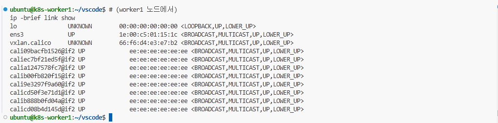

### 2. 노드의 라우팅 테이블

```bash
# (worker1 노드에서)
ip route
```

확인할 것:
- `192.168.x.x dev cali<해시>` → 노드 위에 있는 각 파드로 가는 직접 경로
- `192.168.y.y/26 via <worker2-IP> dev tunl0 onlink` → **다른 노드(worker2)** 의 Pod CIDR 로 가는 터널 경로 → 이게 BGP/IP-in-IP 라우팅의 실체

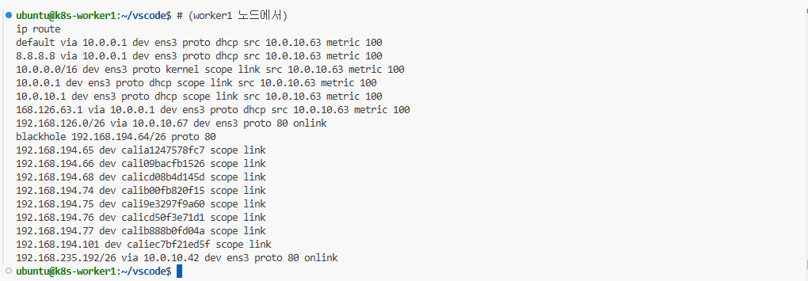

### 3. veth pair 의 컨테이너 종단 추적 (선택)

veth pair 는 한쪽이 컨테이너의 `eth0`, 반대쪽이 호스트의 `cali<해시>` 입니다. 인덱스 번호로 짝을 맞춰볼 수 있습니다.

```bash
# (Master 에서) Pod 내부의 eth0 인터페이스 인덱스 확인
kubectl exec same-a -- ip -brief link show eth0
# 출력 예: 3: eth0@if12 ...   ← '@if12' 의 12 가 호스트 측 인터페이스 인덱스(=짝)
```

```bash
# (worker1 노드에서) 모든 veth(cali*) 를 보고 컨테이너 측 if 번호로 짝을 찾기
ip -d link show type veth | grep -E 'cali|link-netnsid'
# 출력의 'caliXXXX@if3' 부분에서 if<숫자>가 컨테이너의 eth0 인덱스와 일치하는 게 짝
```

→ 컨테이너의 `eth0@ifN` 과 호스트의 `caliXXXX@ifM` 이 서로의 N/M 을 가리키는 짝인 것을 확인할 수 있습니다.

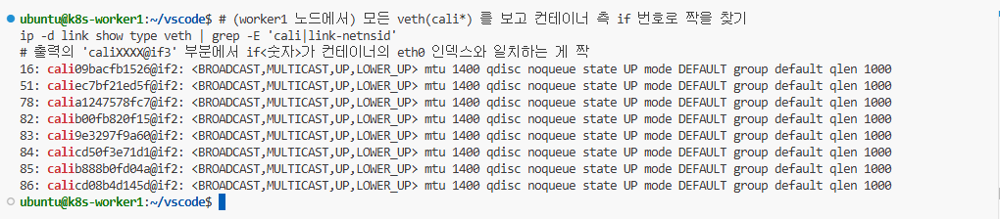

### 4. 외부 통신 SNAT (Masquerading) 검증 (PDF 6쪽)

파드가 클러스터 **외부** 로 트래픽을 보낼 때, 노드 IP로 출발지를 위장(SNAT)합니다. Pod IP는 클러스터 내부 사설 대역이라 외부 라우팅이 불가능하기 때문입니다.

```bash
# (Master 에서) 파드에서 외부로 트래픽 발생 — 응답에는 'Pod IP' 가 아니라 상위 게이트웨이 IP 가 보임
kubectl exec net-a -- curl -s -m 8 https://ipinfo.io/ip; echo
# 또는
kubectl exec net-a -- curl -s -m 8 https://ifconfig.me; echo

# 비교 — 파드 자체의 IP
kubectl get pod net-a -o jsonpath='{.status.podIP}{"\n"}'
```

응답에 보이는 IP가 **Pod IP 와 다르면** SNAT 가 적용된 것입니다. (기관 네트워크 환경에서는 외부 게이트웨이 공인 IP 가 보입니다.)

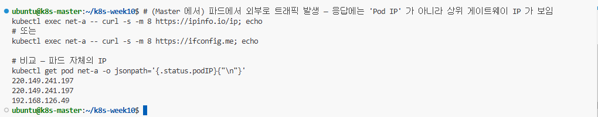

> 외부 인터넷 접근이 차단된 환경이면 위 curl 은 타임아웃됩니다. 그래도 다음 단계의 MASQUERADE 규칙은 그대로 확인할 수 있습니다.

### 5. 노드의 MASQUERADE 규칙 확인

Calico 가 만들어 놓은 외부행 NAT 규칙을 직접 봅니다.

```bash
# (worker1 노드에서)
sudo iptables -t nat -S cali-nat-outgoing 2>/dev/null
sudo iptables -t nat -L POSTROUTING -n | grep -E 'MASQUERADE|cali' | head
```

`cali-nat-outgoing` 체인에 `-j MASQUERADE` 가 보이고, 매칭 조건이 "출발지가 Pod CIDR 이고 목적지가 Pod CIDR 이 아닐 때" 인 것을 확인할 수 있습니다 — 즉 클러스터 내부 통신은 NAT 안 하고, **외부로 나갈 때만 NAT** 합니다.

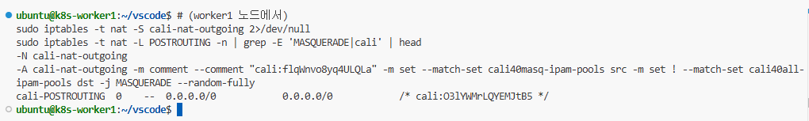

```bash
# (Master 에서) 정리: same/diff 파드 삭제 (Step 5 이후에서는 사용 안 함)
kubectl delete -f same-node-pods.yaml -f diff-node-pods.yaml
```

---

## Step 5. ClusterIP Service (PDF 16, 20쪽)

내부 통신용 가상 IP. 가장 기본적인 서비스 타입입니다.

### 1. 백엔드 Deployment 생성

```bash
cat > myapp-deploy.yaml << 'EOF'
apiVersion: apps/v1
kind: Deployment
metadata:
  name: myapp
spec:
  replicas: 3
  selector:
    matchLabels: { app: myapp }
  template:
    metadata:
      labels: { app: myapp }
    spec:
      containers:
        - name: myapp
          image: nginx:alpine
          ports:
            - containerPort: 80
EOF

kubectl apply -f myapp-deploy.yaml
kubectl rollout status deployment/myapp --timeout=120s
kubectl get pods -l app=myapp -o wide
```
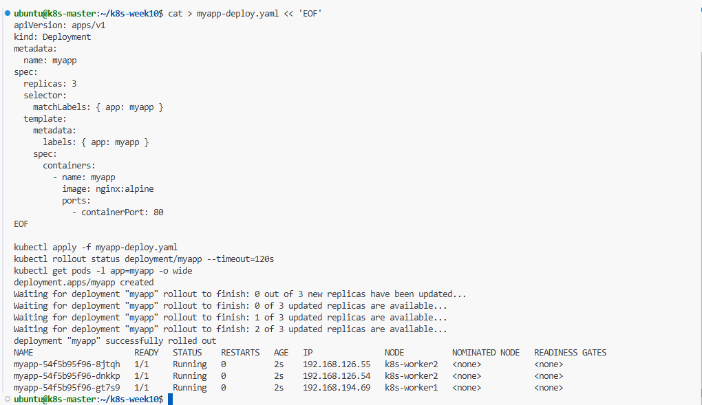

### 2. ClusterIP Service 생성 (PDF p.20 그대로)

```bash
cat > myapp-clusterip.yaml << 'EOF'
apiVersion: v1
kind: Service
metadata:
  name: myapp-clusterip
spec:
  # type: ClusterIP (Default)
  selector:
    app: myapp
  ports:
    - protocol: TCP
      port: 80         # Service Port
      targetPort: 80   # Container Port
EOF

kubectl apply -f myapp-clusterip.yaml
kubectl get svc myapp-clusterip
# CLUSTER-IP 컬럼에 가상 IP 가 할당된 것 확인
```
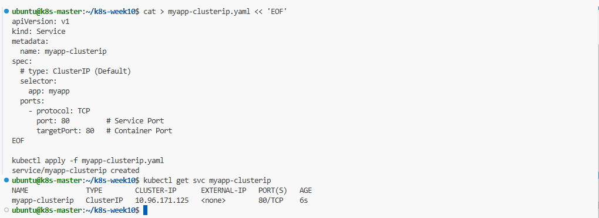

### 3. 클러스터 내부에서 접근 테스트

```bash
# net-a 디버그 파드(Step 1에서 생성)에서 ClusterIP DNS 로 접근
kubectl exec net-a -- curl -s -o /dev/null -w "HTTP %{http_code}\n" \
  http://myapp-clusterip.default.svc.cluster.local

kubectl exec net-a -- curl -s http://myapp-clusterip | head -3
```
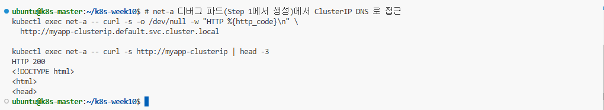

> 외부에서는 절대 접근 불가합니다. 다음 단계에서 확인합니다.

---

## Step 6. NodePort Service (PDF 17, 21쪽)

모든 워커 노드의 특정 포트(30000~32767)를 열어 외부 트래픽을 수신합니다.

### 1. NodePort Service 생성

```bash
cat > myapp-nodeport.yaml << 'EOF'
apiVersion: v1
kind: Service
metadata:
  name: myapp-nodeport
spec:
  type: NodePort      # 외부 접근 허용
  selector:
    app: myapp
  ports:
    - protocol: TCP
      port: 80
      targetPort: 80
      nodePort: 30080   # 30000-32767 포트 범위 내
EOF

kubectl apply -f myapp-nodeport.yaml
kubectl get svc myapp-nodeport
# PORT(S) 컬럼에 80:30080/TCP 표시
```
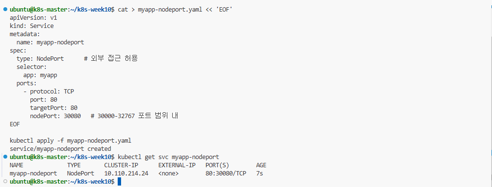

### 2. 외부 접근 테스트 (어느 노드 IP 로도 가능)

```bash
# Master 노드 IP 도, 워커 노드 IP 도 모두 30080 으로 진입 가능
for NODE_IP in $(kubectl get nodes -o jsonpath='{.items[*].status.addresses[?(@.type=="InternalIP")].address}'); do
  echo "=== $NODE_IP:30080 ==="
  curl -s -o /dev/null -w "HTTP %{http_code}\n" http://$NODE_IP:30080
done
```
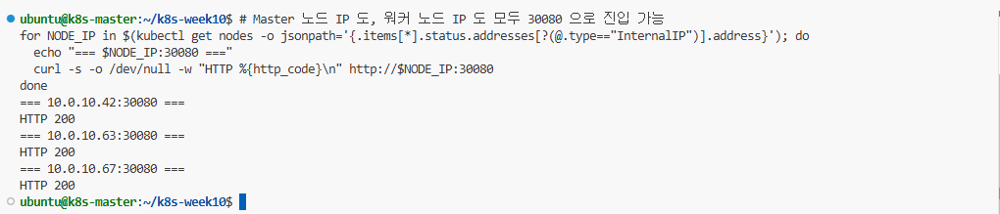

> 어느 노드 IP 로 접근해도 정상 응답. 내부에서 `kube-proxy` 가 ClusterIP 서비스로 DNAT 한 뒤 파드로 분산하기 때문입니다.

---

## Step 7. LoadBalancer Service 와 그 한계 (PDF 18, 22쪽)

LoadBalancer 타입 Service 는 **클라우드 공급자(AWS/GCP) 또는 온프레미스의 MetalLB** 가 외부 IP 를 자동 할당해 줄 때만 정상 동작합니다. 본 학습 환경은 **`10.0.10.0/24` 의 모든 IP 가 학생들에게 분배** 되어 있어 MetalLB 가 사용할 수 있는 미할당 IP 풀이 없습니다. (임의 IP 사용 시 다른 학생과 ARP 충돌 → 네트워크 장애 발생)

본 단계에서는 **LoadBalancer Service 를 그대로 적용해 보고, EXTERNAL-IP 가 영원히 `<pending>` 으로 남는 모습** 을 직접 확인해 LoadBalancer 의 한계를 학습합니다.

### 1. LoadBalancer Service 생성 (MetalLB 없이)

PDF 22쪽과 동일한 YAML 을 그대로 적용합니다.

```bash
cat > myapp-lb.yaml << 'EOF'
apiVersion: v1
kind: Service
metadata:
  name: myapp-lb
spec:
  type: LoadBalancer
  selector:
    app: myapp
  ports:
    - port: 80
      targetPort: 80
EOF

kubectl apply -f myapp-lb.yaml
```
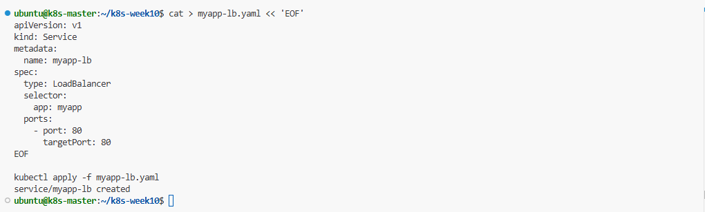

### 2. `<pending>` 관찰 — 왜 IP 가 할당되지 않는가

```bash
# 30초 정도 기다려도 EXTERNAL-IP 컬럼은 영원히 <pending>
sleep 30
kubectl get svc myapp-lb
# 예시 출력:
# NAME      TYPE          CLUSTER-IP    EXTERNAL-IP   PORT(S)        AGE
# myapp-lb  LoadBalancer  10.96.x.x     <pending>     80:31xxx/TCP   30s
```
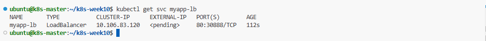

```bash
# Events 도 비어 있음 — 할당 시도 자체가 발생하지 않음
kubectl describe svc myapp-lb | tail -15
```
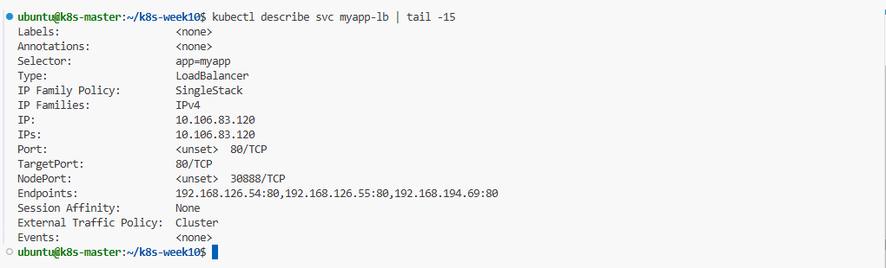

> **핵심 학습 포인트**
> - 온프레미스 클러스터에 **클라우드 LB 도 MetalLB 도 없으면** EXTERNAL-IP 는 영원히 `<pending>` — Service 객체는 만들어지지만 외부 진입점이 없는 상태
> - 단, **NodePort 는 자동으로 함께 할당** 되어 있음 (`80:31xxx/TCP`). LoadBalancer 타입은 내부적으로 ClusterIP + NodePort 를 모두 포함하기 때문
> - 즉 **노드 IP + 31xxx 포트로는 여전히 접근 가능** — Step 6 의 NodePort 와 본질적으로 같은 동작

```bash
# NodePort 부분으로는 접근 가능한 것 검증
NP=$(kubectl get svc myapp-lb -o jsonpath='{.spec.ports[0].nodePort}')
NODE_IP=$(kubectl get nodes -o jsonpath='{.items[0].status.addresses[?(@.type=="InternalIP")].address}')
echo "NodePort: $NP, Node IP: $NODE_IP"
curl -s -o /dev/null -w "HTTP %{http_code}\n" http://$NODE_IP:$NP
# HTTP 200 — EXTERNAL-IP 가 pending 이어도 NodePort 경유는 정상
```
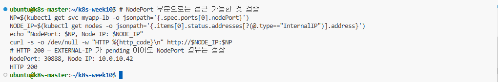

### 3. (참고) 실제 운영 환경에서의 절차 — 본 실습에서는 실행하지 마세요

운영 환경에서 MetalLB 와 함께 사용할 때의 절차는 다음과 같습니다. **본 실습 환경에서는 IP 풀 충돌 위험이 있어 실행하지 않습니다.** 졸업 후 자기 전용 클러스터에서 학습하실 때 참고하세요.

```bash
# (참고용 — 본 실습에서는 절대 실행 금지)
#
# # 1) MetalLB 설치
# kubectl apply -f https://raw.githubusercontent.com/metallb/metallb/v0.14.8/config/manifests/metallb-native.yaml
#
# # 2) 사용 가능한 IP 풀 등록 (노드와 같은 L2 서브넷의 미사용 대역)
# cat <<EOF | kubectl apply -f -
# apiVersion: metallb.io/v1beta1
# kind: IPAddressPool
# metadata: { name: lab-pool, namespace: metallb-system }
# spec: { addresses: ["10.0.10.240-10.0.10.250"] }   # ← 비어 있어야 함
# ---
# apiVersion: metallb.io/v1beta1
# kind: L2Advertisement
# metadata: { name: lab-l2adv, namespace: metallb-system }
# spec: { ipAddressPools: [lab-pool] }
# EOF
#
# # 3) 풀 등록 후 myapp-lb 의 EXTERNAL-IP 가 자동으로 채워지고
# # curl http://<EXTERNAL-IP> 가 HTTP 200 응답
```

> 클라우드(AWS ELB, GCP NLB 등) 환경에서는 위 1~2 단계 없이 곧바로 EXTERNAL-IP 가 자동 할당됩니다 (클라우드 LB 컨트롤러가 그 역할을 함).

---

## Step 8. Service 검증 — DNS / HTTP / Endpoints (PDF 23쪽)

### 1. DNS 이름 해석 확인 (CoreDNS)

```bash
# 풀 도메인
kubectl exec net-a -- nslookup myapp-clusterip.default.svc.cluster.local

# 짧은 이름 (같은 namespace 일 때만 됨)
kubectl exec net-a -- nslookup myapp-clusterip
```
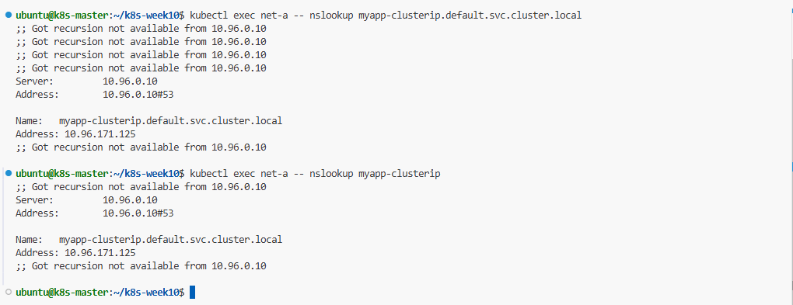

### 2. HTTP 통신 확인

```bash
kubectl exec net-a -- wget -qO- http://myapp-clusterip | head -5
```
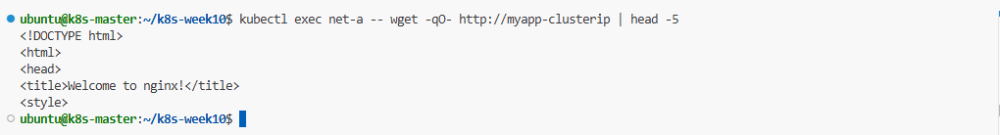

### 3. Endpoints 확인 — Service 가 어떤 파드 IP 들을 가리키는가

```bash
# describe 의 Endpoints 항목과 EndpointSlice 모두 확인
kubectl describe svc myapp-clusterip | grep -A1 Endpoints
kubectl get endpointslices -l kubernetes.io/service-name=myapp-clusterip
```

→ 출력의 IP 들이 `kubectl get pods -l app=myapp -o wide` 의 Pod IP 와 일치해야 합니다.

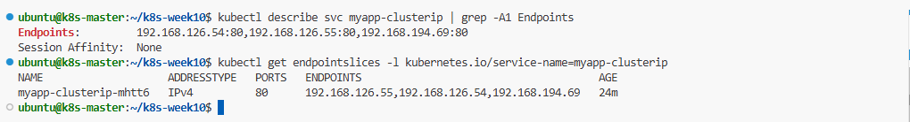

### 4. 로드밸런싱 동작 확인 — 각 백엔드 파드에 요청이 분산되는지

```bash
# 1) 다수의 요청 발생
for i in $(seq 1 12); do
  kubectl exec net-a -- curl -s -o /dev/null http://myapp-clusterip
done

# 2) 각 myapp 파드의 access.log 를 확인 — 요청 카운트가 모든 파드에 골고루 들어왔는지
for POD in $(kubectl get pods -l app=myapp -o jsonpath='{.items[*].metadata.name}'); do
  COUNT=$(kubectl logs $POD 2>/dev/null | wc -l)
  echo "$POD : $COUNT lines"
done
```

→ 모든 파드의 access 로그 라인 수가 0 이 아니면 로드밸런싱이 동작하는 것입니다 (정확히 균등하진 않을 수 있음 — iptables 의 random probability 분기 특성).

---

## Step 9. kube-proxy 동작 관찰 (PDF 5, 14, 15쪽)

`kube-proxy` 는 각 노드에서 **iptables 규칙**(또는 IPVS)을 만들어 Service VIP 를 Pod IP 로 DNAT 시킵니다.

### 1. kube-proxy 의 모드 확인

```bash
kubectl get configmap -n kube-system kube-proxy -o yaml | grep -E "mode:|strictARP"
# 기본값은 비어있거나 "" (= iptables 모드)
```
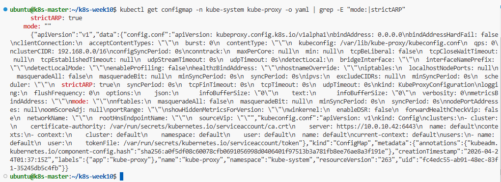

### 2. 워커 노드에서 직접 iptables 규칙 보기

**k8s-worker1 노드에 SSH 접속** 후:

```bash
# (worker1 노드에서)
sudo iptables -t nat -L KUBE-SERVICES -n | head -20
```

출력에서 `myapp-clusterip` 의 ClusterIP 로 가는 규칙이 `KUBE-SVC-XXXXXX` 체인으로 점프(jump)되어 있는지 확인.

```bash
# (worker1 노드에서) — myapp Service 의 해시 체인을 직접 추적
SVC_HASH=$(sudo iptables -t nat -S KUBE-SERVICES | grep myapp-clusterip | grep -oE 'KUBE-SVC-[A-Z0-9]+' | head -1)
echo "Chain: $SVC_HASH"

sudo iptables -t nat -S $SVC_HASH
# probability 0.33333..., 0.50000..., 1.0 으로 분기되어 KUBE-SEP-* 로 점프 → 파드 3개 분산
```
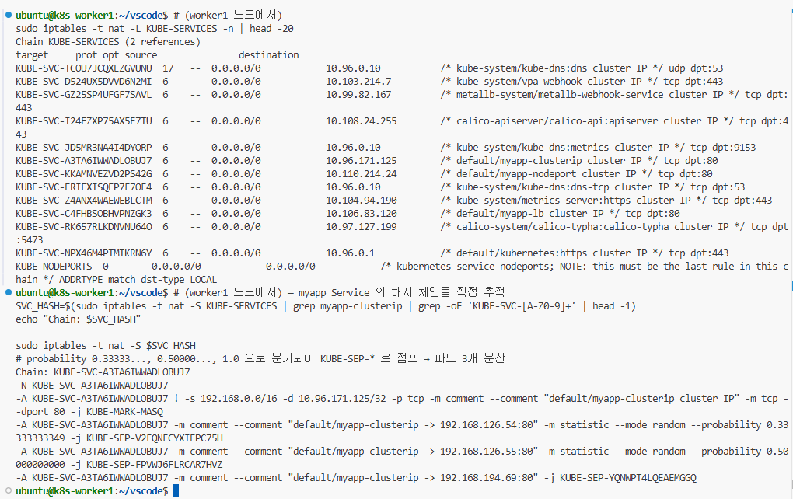

> 각 KUBE-SEP-* 체인의 마지막은 `DNAT --to-destination <PodIP>:80` — Service VIP 트래픽이 실제 Pod IP 로 변환되는 지점입니다.

### 3. kube-proxy 의 규칙 자동 반영 검증 (PDF 14쪽)

PDF 가 강조하는 "**파드가 스케일/재생성되면 kube-proxy 가 iptables 규칙을 실시간 업데이트한다**" 를 직접 확인합니다.

```bash
# (worker1 노드에서) Step 9.2 와 다른 세션이면 SVC_HASH 를 다시 계산
SVC_HASH=$(sudo iptables -t nat -S KUBE-SERVICES | grep myapp-clusterip | grep -oE 'KUBE-SVC-[A-Z0-9]+' | head -1)

# 현재 분기 규칙 — 파드 3개라 약 33%/50%/100% 형태로 분기됨
sudo iptables -t nat -S $SVC_HASH | grep KUBE-SEP
```

```bash
# (Master 에서) 파드를 5개로 스케일
kubectl scale deploy myapp --replicas=5
kubectl rollout status deploy/myapp --timeout=60s
```

```bash
# (worker1 노드에서) 잠시 후 다시 확인 — 분기 규칙이 5개로 자동 업데이트됨
sleep 5
sudo iptables -t nat -S $SVC_HASH | grep KUBE-SEP
# probability 가 0.20 / 0.25 / 0.33 / 0.50 / 1.0 형태로 5단계로 바뀜
```

```bash
# (Master 에서) 원래대로 복구
kubectl scale deploy myapp --replicas=3
```
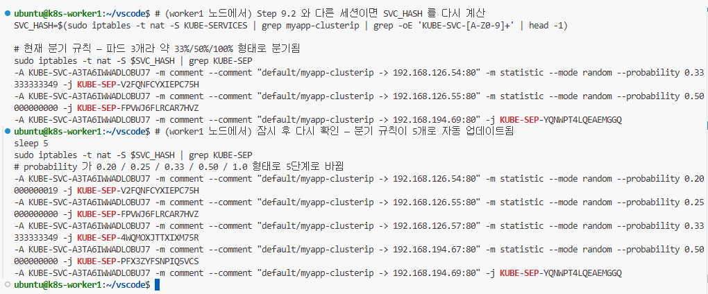

→ 사람이 손대지 않았는데 **kube-proxy 가 API Server 의 변화를 감지(Watch)** 해서 노드의 iptables 를 실시간 갱신하는 게 핵심입니다.

---

## Step 10. CNI 구성과 Calico 동작 분석 (PDF 24~28, 33~36쪽)

CNI 플러그인이 만들어 놓은 설정 파일과 Calico 컴포넌트를 직접 확인합니다.

### 1. CNI 설정 파일 / 바이너리 확인 (worker1 노드에서)

```bash
# (worker1 노드에서)
ls /etc/cni/net.d/             # 활성 CNI 설정 (10-calico.conflist 등)
sudo cat /etc/cni/net.d/10-calico.conflist | head -30

ls /opt/cni/bin/               # CNI 플러그인 바이너리들 (calico, calico-ipam, portmap...)
```
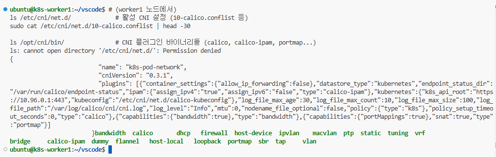

### 2. Calico 컴포넌트 분석 (마스터에서)

```bash
# Felix Agent + BGP 라우팅을 담당하는 calico-node DaemonSet
kubectl get pods -n calico-system -o wide

# 각 calico-node 파드 안에는 Felix, BIRD(BGP), confd 등이 동시에 동작
kubectl exec -n calico-system $(kubectl get pod -n calico-system -l k8s-app=calico-node -o jsonpath='{.items[0].metadata.name}') \
  -c calico-node -- ps -ef | head
```
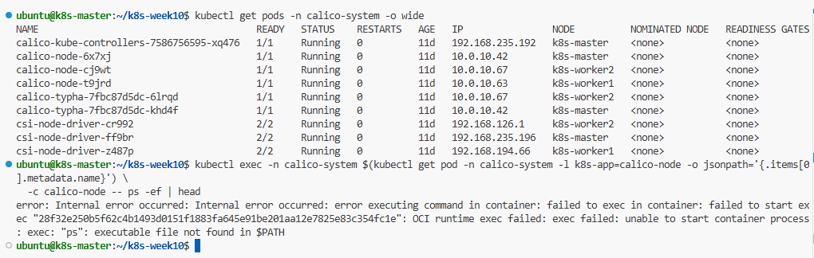

### 3. Calico IP Pool / IPAM Block (PDF 31쪽 — 서브넷 할당의 실제)

```bash
# Cluster CIDR 에 해당
kubectl get ippool -o wide

# 노드별로 분할된 블록 (Node CIDR 에 해당)
kubectl get ipamblock -o jsonpath='{range .items[*]}{.spec.cidr}{"\t"}{.spec.affinity}{"\n"}{end}'
```
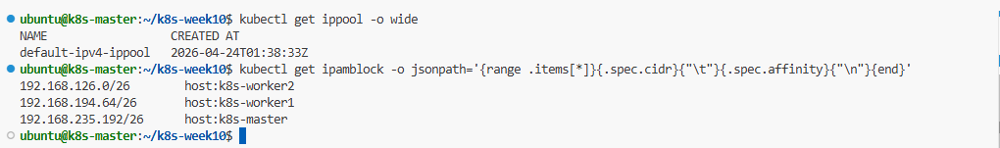

### 4. BGP 라우팅 정보 (선택, calicoctl 필요)

```bash
# calicoctl 설치 (이미 있으면 스킵)
curl -L https://github.com/projectcalico/calico/releases/download/v3.28.0/calicoctl-linux-amd64 \
  -o ~/calicoctl
chmod +x ~/calicoctl
sudo mv ~/calicoctl /usr/local/bin/calicoctl

# BGP 피어 상태 — 각 노드 간 BGP 연결 (Established) 가 잡혀있어야 함
sudo calicoctl node status
```
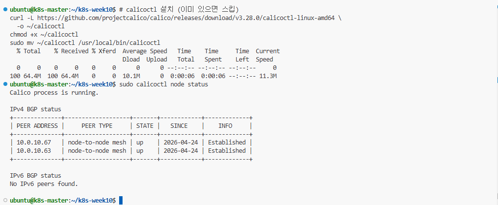

> 각 노드끼리 BGP 로 자기 노드의 Pod CIDR 정보를 교환합니다. Step 4 에서 본 `tunl0 via <peer-IP>` 라우팅이 바로 그 결과입니다.

---

## Step 11. NetworkPolicy 시연 (PDF 34쪽 — Calico의 정책 기능)

Calico 의 **세분화된 네트워크 정책** 을 직접 적용해 봅니다. **기본은 모든 통신 허용** 이며, NetworkPolicy 가 있으면 그 정책에 매칭되지 않는 트래픽은 차단됩니다.

### 1. 기본 통신 — 정책 없는 상태에서 통신 가능 확인

```bash
# net-a, net-b 는 라벨 app=net 을 가짐 (Step 1에서 생성)
# myapp 파드 IP 로 접근 가능
APP_IP=$(kubectl get pod -l app=myapp -o jsonpath='{.items[0].status.podIP}')
kubectl exec net-a -- curl -s -o /dev/null -w "before policy: HTTP %{http_code}\n" http://$APP_IP
```
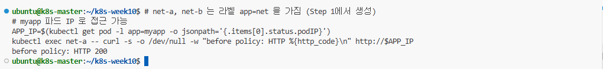

### 2. 외부 접근 차단 정책 적용 (`app=trusted` 라벨만 허용)

```bash
cat > netpol-deny.yaml << 'EOF'
apiVersion: networking.k8s.io/v1
kind: NetworkPolicy
metadata:
  name: myapp-allow-trusted
spec:
  podSelector:
    matchLabels:
      app: myapp           # 적용 대상: myapp 파드
  policyTypes: [Ingress]
  ingress:
    - from:
        - podSelector:
            matchLabels:
              app: trusted   # ← 'trusted' 라벨을 가진 파드만 허용
EOF

kubectl apply -f netpol-deny.yaml
```

### 3. 차단 검증 — net-a (라벨 net) 는 차단되어야 함

```bash
# 타임아웃을 주고 시도 — 실패하면 정책이 막은 것
kubectl exec net-a -- curl -s -m 5 -o /dev/null -w "after policy: HTTP %{http_code}\n" http://$APP_IP
# HTTP 000 또는 connection timeout 이 정상
```
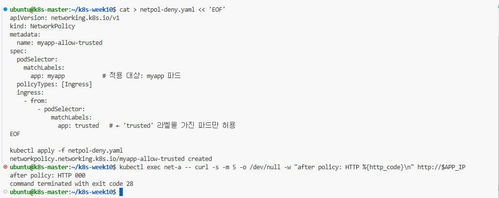

### 4. 허용 검증 — `app=trusted` 라벨을 가진 파드는 통과

```bash
# 라벨 trusted 를 가진 파드 새로 띄우기
kubectl run trusted-client --image=nicolaka/netshoot --labels="app=trusted" \
  --restart=Never -- sleep 3600
kubectl wait --for=condition=Ready pod/trusted-client --timeout=60s

kubectl exec trusted-client -- curl -s -m 5 -o /dev/null -w "trusted: HTTP %{http_code}\n" http://$APP_IP
# HTTP 200 이 정상
```
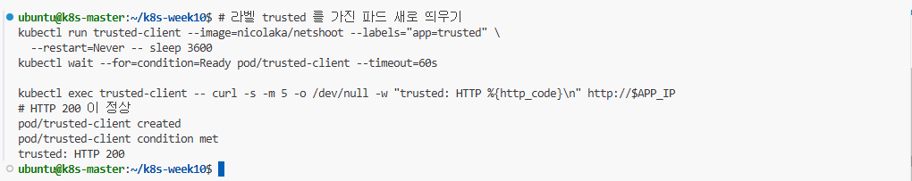

### 5. 정책 정리

```bash
kubectl delete -f netpol-deny.yaml
kubectl delete pod trusted-client
```

---

## Step 12. (선택) CNI 플러그인 비교 관찰 (PDF 28~45쪽)

> **주의**: 운영 중인 클러스터의 CNI 를 교체하는 것은 **Pod 통신 중단을 동반하는 위험한 작업** 입니다 (PDF 46쪽). 본 실습 클러스터에서는 **교체하지 않고**, 각 CNI 의 특성만 비교 학습합니다.

### 1. 현재 클러스터의 CNI 종합 정보

```bash
# CNI 종류 / 버전
kubectl get pods -n calico-system -l app.kubernetes.io/name=calico-node \
  -o jsonpath='{.items[0].spec.containers[0].image}{"\n"}'

# Cluster 의 데이터 경로 모드 — Calico 는 IP-in-IP / VXLAN / 직접 라우팅 모드 선택 가능
kubectl get ippool -o jsonpath='{range .items[*]}{.metadata.name}{"\t"}{.spec.ipipMode}{"\t"}{.spec.vxlanMode}{"\n"}{end}'
```

| CNI | 데이터 경로 | 정책 | 가시성 | 추천 환경 |
|---|---|---|---|---|
| **Flannel** | VXLAN (L2 Overlay) | 제한적 | 부족 | 학습/소규모 |
| **Calico** (현재) | IP-in-IP / VXLAN / BGP (L3) | 우수 | 양호 | 일반 프로덕션 |
| **Cilium** | eBPF (Kernel Hook) | 최상 (L7) | 최상 (Hubble) | 고성능/마이크로서비스 |

### 2. (선택, 별도 클러스터 권장) Cilium 시연

이 부분은 **새 클러스터** 에서 진행해야 합니다. 본 클러스터에서 실행하면 Calico 와 충돌합니다.

```bash
# (예시 — 본 실습 환경에서는 실행하지 마세요)
# helm install cilium cilium/cilium --version 1.16 \
#   --namespace kube-system --set kubeProxyReplacement=strict
# cilium hubble enable --ui
```

---

## Step 13. 리소스 정리

```bash
# Step 11 정책 (이미 지웠지만 안전망)
kubectl delete -f netpol-deny.yaml --ignore-not-found
kubectl delete pod trusted-client --ignore-not-found

# Step 7 LoadBalancer Service (MetalLB 는 본 실습에서 설치 안 했음)
kubectl delete -f myapp-lb.yaml --ignore-not-found

# Step 6 NodePort
kubectl delete -f myapp-nodeport.yaml --ignore-not-found

# Step 5 ClusterIP + Deployment
kubectl delete -f myapp-clusterip.yaml --ignore-not-found
kubectl delete -f myapp-deploy.yaml --ignore-not-found

# Step 1 디버그 파드 + localhost-test 안전망
kubectl delete -f netshoot-pods.yaml --ignore-not-found
kubectl delete -f localhost-test.yaml --ignore-not-found
```

```bash
# (참고) 운영 환경에서 MetalLB 를 설치했다면 다음 명령으로 제거 — 본 실습에선 설치 안 했으므로 해당 없음
# kubectl delete -f https://raw.githubusercontent.com/metallb/metallb/v0.14.8/config/manifests/metallb-native.yaml
```
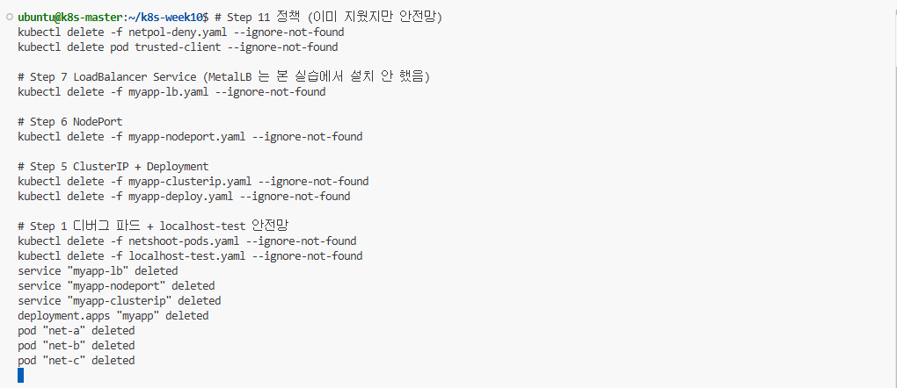

---

## 트러블슈팅 체크리스트

| 증상 | 주요 원인 / 조치 |
| :--- | :--- |
| 파드 간 ping 실패 (다른 노드) | Calico tunl0 인터페이스 비정상 / BGP 미연결 → `calicoctl node status` 로 Established 확인 |
| ClusterIP 로 접근 시 연결 안 됨 | Service `selector` 와 Pod `labels` 불일치 → `kubectl describe svc` 의 Endpoints 가 `<none>` 인지 확인 |
| NodePort 외부 접근 실패 | 노드 방화벽이 30000~32767 차단 → 클라우드 보안그룹 / `ufw` 설정 확인 |
| LoadBalancer EXTERNAL-IP 가 `<pending>` | **본 실습 환경에서는 의도된 동작** — 클라우드 LB / MetalLB 미설치 시 정상 (Step 7 의 학습 포인트). 그래도 NodePort 부분은 정상 동작 |
| NetworkPolicy 가 적용 안 됨 | CNI 가 NetworkPolicy 를 지원하는지 확인 (Calico/Cilium ✓, 기본 Flannel ✗) |
| Pod CIDR 블록이 `kubectl get nodes` 에 비어 있음 | Calico 는 자체 IPAM 사용 → `kubectl get ipamblock` 로 확인 |
| `traceroute` 가 모든 hop 에 `* * *` | ICMP TTL exceeded 가 차단됨 (정상 동작에 영향 없음) |
| iptables 규칙에 `KUBE-SVC-*` 가 안 보임 | kube-proxy 가 IPVS 모드일 수 있음 → `ipvsadm -Ln` 으로 확인 |
| BGP `Established` 가 안 됨 | 노드 간 179/TCP 차단 / hostNetwork 설정 문제 — `calico-node` 로그 확인 |
| `curl https://ipinfo.io/ip` 가 타임아웃 | 학교/회사 방화벽이 외부 HTTPS 차단 → MASQUERADE 규칙 확인만으로 SNAT 학습 가능 |
| iptables 규칙이 스케일 후에도 갱신 안 됨 | kube-proxy 가 IPVS 모드 → `ipvsadm -Ln` 으로 확인, 또는 kube-proxy 파드 재시작 |
| `localhost-test` 에서 client → server 접근 실패 | nginx 가 80포트에 listen 까지 시간이 걸림 → `kubectl wait` 후 2~3초 더 대기 |
