# 11. 쿠버네티스 스토리지

> 본 실습은 **Master 1 + Worker 2 (총 3노드) 클러스터**를 기준으로 합니다. 9주차에서 설치한 **local-path-provisioner**(`local-path` StorageClass)를 그대로 활용합니다.
>
> 모든 `kubectl` 명령은 별도 표기가 없는 한 **Master 노드**에서 실행하며, 일부 단계(Step 2, Step 6)는 워커 노드에 SSH 접속해 호스트 파일을 확인합니다.

---

## Step 0. 작업 폴더 & 사전 점검

### 1. 작업 디렉터리

```bash
mkdir -p ~/k8s-week11
cd ~/k8s-week11
pwd
```
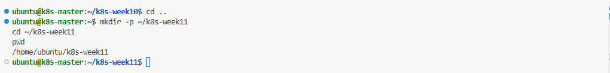

### 2. local-path-provisioner 가 설치되어 있는지 확인

```bash
# 9주차에서 이미 설치했다면 local-path 가 default 로 보임
kubectl get storageclass

# 만약 비어 있으면 아래 명령으로 설치
# kubectl apply -f https://raw.githubusercontent.com/rancher/local-path-provisioner/v0.0.27/deploy/local-path-storage.yaml
# kubectl patch storageclass local-path \
#   -p '{"metadata": {"annotations":{"storageclass.kubernetes.io/is-default-class":"true"}}}'
```

`local-path (default)` 로 표시되어야 본 실습 후반(Step 10~13)이 정상 동작합니다.

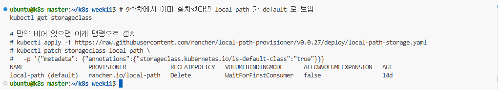

---

## Step 1. 임시 볼륨 ① — emptyDir (PDF 9쪽)

`emptyDir` 는 파드 시작 시 빈 디렉터리로 생성되어 **파드 내 컨테이너 간 데이터 공유**에 쓰이고, **파드 삭제 시 함께 소멸**합니다.

### 1. writer + reader 두 컨테이너로 emptyDir 공유 시연

```bash
cat > emptydir-pod.yaml << 'EOF'
apiVersion: v1
kind: Pod
metadata:
  name: emptydir-demo
spec:
  containers:
    - name: writer
      image: busybox
      command: ["sh", "-c", "echo 'hello from writer' > /data/msg.txt; sleep 3600"]
      volumeMounts:
        - name: workdir
          mountPath: /data
    - name: reader
      image: busybox
      command: ["sh", "-c", "sleep 3600"]
      volumeMounts:
        - name: workdir
          mountPath: /shared
  volumes:
    - name: workdir
      emptyDir: {}
EOF

kubectl apply -f emptydir-pod.yaml
kubectl wait --for=condition=Ready pod/emptydir-demo --timeout=60s
```
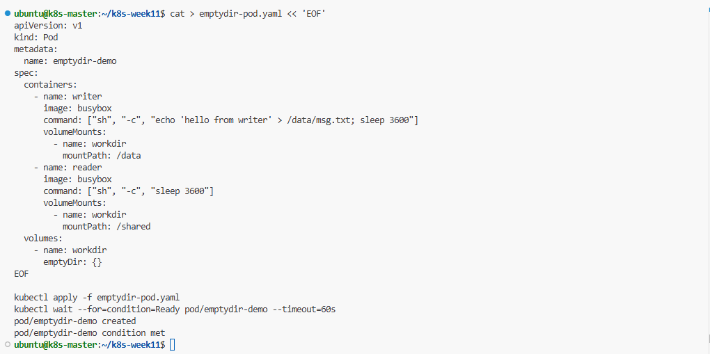

### 2. reader 가 writer 의 파일을 볼 수 있는지 검증

```bash
# writer 가 /data/msg.txt 에 쓴 내용을 reader 는 /shared/msg.txt 로 보게 됨
kubectl exec emptydir-demo -c reader -- cat /shared/msg.txt
# 출력: hello from writer
```
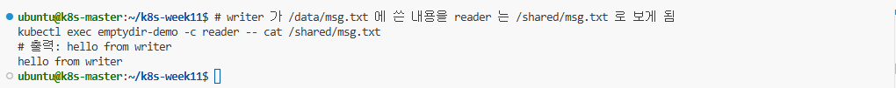

### 3. 파드 삭제 시 emptyDir 데이터 소멸 검증

```bash
# 파드 삭제 후 같은 이름으로 재생성하면 데이터가 사라져 있음
kubectl delete pod emptydir-demo

kubectl apply -f emptydir-pod.yaml
kubectl wait --for=condition=Ready pod/emptydir-demo --timeout=60s
sleep 2

# 이번엔 writer 가 다시 한 번 쓰는데, 이전 데이터가 남아있는지 확인하려면 reader 가 먼저 보면 됨
# 실제로는 writer 명령이 시작되면서 새로 쓰므로 항상 새 데이터.
# 핵심: emptyDir 볼륨 자체가 새로 생성되어 빈 디렉터리부터 시작
kubectl exec emptydir-demo -c reader -- ls -la /shared
```

```bash
# 정리
kubectl delete pod emptydir-demo
```
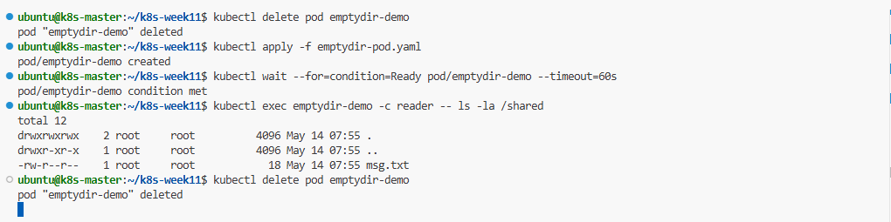

---

## Step 2. 임시 볼륨 ② — hostPath (PDF 10쪽)

`hostPath` 는 **노드의 파일 시스템 경로** 를 컨테이너에 직접 마운트합니다. 파드가 삭제돼도 노드의 데이터는 남지만, **파드가 다른 노드로 스케줄링되면 접근 불가** 합니다.

### 1. hostPath 파드 생성 (worker1 노드에 강제 배치)

```bash
cat > hostpath-pod.yaml << 'EOF'
apiVersion: v1
kind: Pod
metadata:
  name: hostpath-demo
spec:
  nodeSelector: { kubernetes.io/hostname: k8s-worker1 }
  containers:
    - name: app
      image: busybox
      command: ["sh", "-c", "echo 'persisted on node' > /mnt/hostpath/marker.txt; sleep 3600"]
      volumeMounts:
        - name: host-vol
          mountPath: /mnt/hostpath
  volumes:
    - name: host-vol
      hostPath:
        path: /tmp/hostpath-demo       # 호스트(worker1)의 경로
        type: DirectoryOrCreate         # 없으면 자동 생성
EOF

kubectl apply -f hostpath-pod.yaml
kubectl wait --for=condition=Ready pod/hostpath-demo --timeout=60s
```
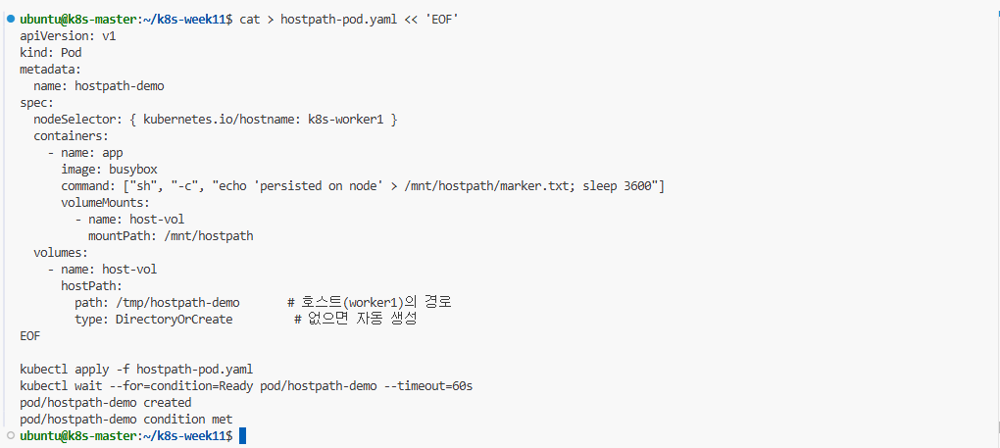

### 2. 워커 노드에서 직접 파일 확인

**worker1 노드에 SSH 접속** 후:

```bash
# (worker1 노드에서)
ls -la /tmp/hostpath-demo/
cat /tmp/hostpath-demo/marker.txt
# 출력: persisted on node
```
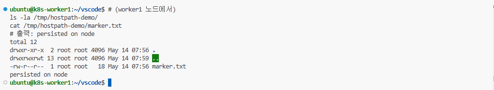

### 3. 파드 삭제 후 호스트 데이터 잔존 검증

```bash
# (Master 에서) 파드 삭제
kubectl delete pod hostpath-demo
```

```bash
# (worker1 노드에서) 파일이 그대로 남아있음
ls -la /tmp/hostpath-demo/
cat /tmp/hostpath-demo/marker.txt
```
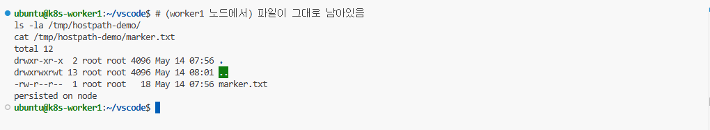

> **보안 주의**: hostPath 는 호스트의 민감한 파일(`/etc/passwd`, `/var/run/docker.sock` 등)에도 접근 가능하므로 운영 환경에서는 사용을 제한해야 합니다.

```bash
# (worker1 노드에서) 정리
sudo rm -rf /tmp/hostpath-demo
```

---

## Step 3. 임시 볼륨 ③ — ConfigMap (PDF 11쪽)

`ConfigMap` 은 비보안 설정 데이터(로그 레벨, UI 테마 등)를 분리 관리합니다. 평문으로 etcd 에 저장됩니다.

### 1. ConfigMap + 이를 마운트하는 Pod

```bash
cat > configmap-pod.yaml << 'EOF'
apiVersion: v1
kind: ConfigMap
metadata:
  name: app-config
data:
  app.conf: |
    log_level=info
    theme=dark
  greeting: "hello from configmap"
---
apiVersion: v1
kind: Pod
metadata:
  name: configmap-demo
spec:
  containers:
    - name: app
      image: busybox
      command: ["sh", "-c", "sleep 3600"]
      env:
        - name: GREETING                    # 환경 변수 주입 방식
          valueFrom:
            configMapKeyRef:
              name: app-config
              key: greeting
      volumeMounts:
        - name: config-vol                  # 파일 마운트 방식
          mountPath: /etc/config
  volumes:
    - name: config-vol
      configMap:
        name: app-config
EOF

kubectl apply -f configmap-pod.yaml
kubectl wait --for=condition=Ready pod/configmap-demo --timeout=60s
```
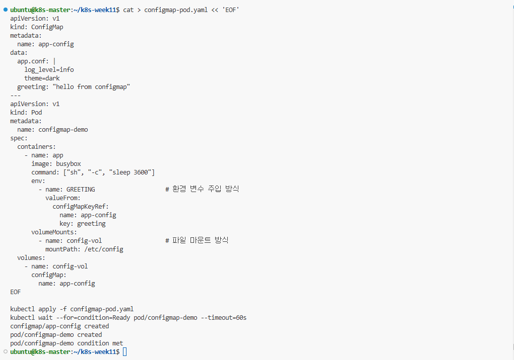

### 2. 파일 마운트 확인 — Key 별로 하나의 파일이 생성됨

```bash
kubectl exec configmap-demo -- ls /etc/config
# 출력: app.conf  greeting

kubectl exec configmap-demo -- cat /etc/config/app.conf
kubectl exec configmap-demo -- cat /etc/config/greeting
```
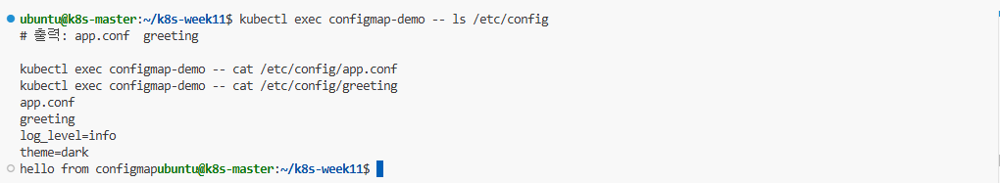

### 3. 환경 변수 주입 확인

```bash
kubectl exec configmap-demo -- printenv GREETING
# 출력: hello from configmap
```
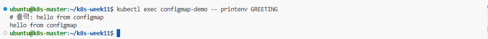

```bash
# 정리는 Step 5 (Secret 과 비교) 후에 일괄
```

---

## Step 4. 임시 볼륨 ④ — Secret (PDF 12쪽)

`Secret` 은 비밀번호·토큰 등 민감 정보를 관리합니다. Base64 인코딩으로 etcd 에 저장되며, 노드의 **tmpfs(메모리)** 에 마운트되어 디스크 기록을 방지합니다.

### 1. Secret 생성 (kubectl create 로 자동 Base64 인코딩)

```bash
kubectl create secret generic db-creds \
  --from-literal=username=admin \
  --from-literal=password='S3cretP@ss!'

# YAML 로 확인 — 값이 Base64 로 인코딩되어 있음
kubectl get secret db-creds -o yaml | head -15
```
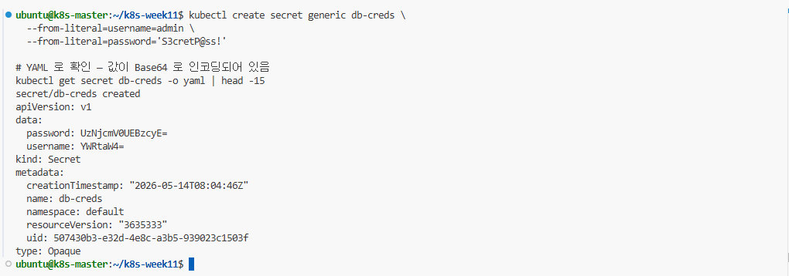

### 2. Secret 을 파드에 마운트 (readOnly + defaultMode)

```bash
cat > secret-pod.yaml << 'EOF'
apiVersion: v1
kind: Pod
metadata:
  name: secret-demo
spec:
  containers:
    - name: app
      image: busybox
      command: ["sh", "-c", "sleep 3600"]
      volumeMounts:
        - name: secret-vol
          mountPath: /etc/secret
          readOnly: true                    # 보안 권장
  volumes:
    - name: secret-vol
      secret:
        secretName: db-creds
        defaultMode: 0640                   # rw-r-----
EOF

kubectl apply -f secret-pod.yaml
kubectl wait --for=condition=Ready pod/secret-demo --timeout=60s
```
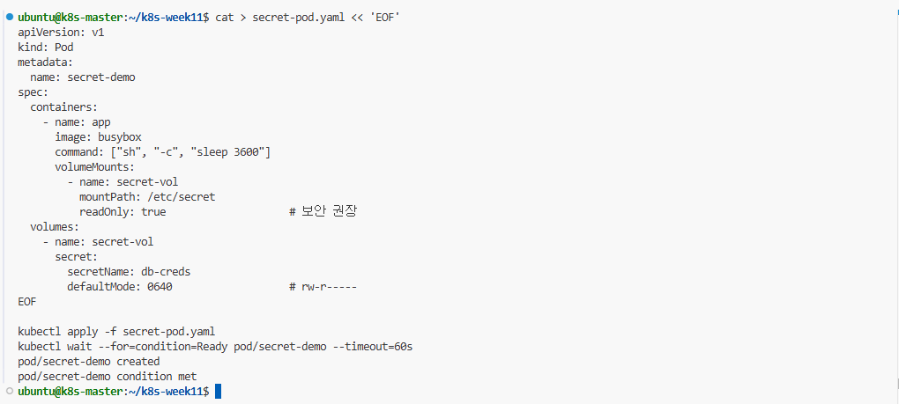

### 3. 마운트 검증 — 권한 + 평문 값 확인

```bash
# 파일 권한이 -rw-r----- (0640) 로 보임
kubectl exec secret-demo -- ls -l /etc/secret

# Secret 은 마운트 시점에 자동으로 디코딩되어 평문으로 보임
kubectl exec secret-demo -- cat /etc/secret/username
kubectl exec secret-demo -- cat /etc/secret/password
```
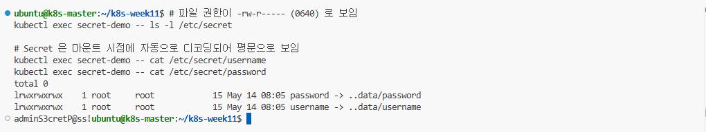

### 4. 마운트가 tmpfs(메모리) 인지 검증

```bash
# 마운트 정보 — type 컬럼이 tmpfs 임을 확인
kubectl exec secret-demo -- mount | grep /etc/secret
```
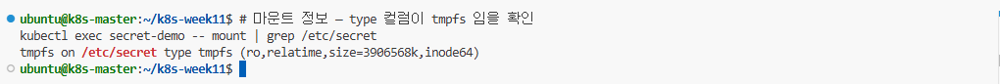

---

## Step 5. ConfigMap vs Secret 비교 (PDF 13~14쪽)

저장 방식과 보안 수준의 차이를 직접 확인합니다.

### 1. etcd 저장 형태 비교

```bash
# ConfigMap: 평문
kubectl get cm app-config -o jsonpath='{.data}' && echo

# Secret: Base64 인코딩
kubectl get secret db-creds -o jsonpath='{.data}' && echo
```
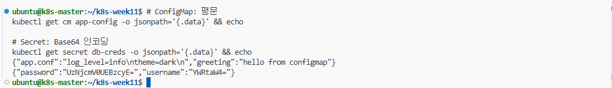

### 2. Base64 직접 디코딩 시연 — Secret 은 암호화가 아님

```bash
kubectl get secret db-creds -o jsonpath='{.data.password}' | base64 -d && echo
# 출력: S3cretP@ss!
```

> **핵심**: Secret 의 Base64 는 **암호화가 아닌 단순 인코딩**입니다. etcd 자체 암호화(`EncryptionConfiguration`) 와 RBAC 으로 추가 보호해야 합니다.

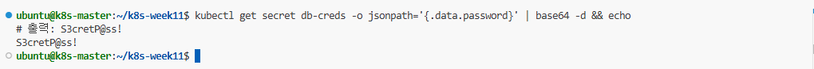

```bash
# 정리
kubectl delete pod configmap-demo secret-demo
kubectl delete cm app-config
kubectl delete secret db-creds
```

---

## Step 6. PersistentVolume(PV) — 정적 프로비저닝 (PDF 16~17쪽)

영구 볼륨의 **실제 자원** 측면. 관리자가 직접 PV 를 만들어 클러스터에 등록합니다.

### 1. 사전 — worker1 에 PV 가 가리킬 호스트 디렉터리 만들기

**worker1 노드에 SSH 접속** 후:

```bash
# (worker1 노드에서)
sudo mkdir -p /mnt/pv-demo
echo "data on worker1" | sudo tee /mnt/pv-demo/seed.txt
```

### 2. PV 생성 (5Gi, RWO, Retain 정책)

```bash
# (Master 에서)
cat > pv-demo.yaml << 'EOF'
apiVersion: v1
kind: PersistentVolume
metadata:
  name: demo-pv
  labels:
    tier: gold                                 # Step 8 라벨 매칭용
spec:
  capacity:
    storage: 5Gi
  accessModes:
    - ReadWriteOnce                            # RWO
  persistentVolumeReclaimPolicy: Retain        # PVC 삭제해도 PV 유지
  storageClassName: manual                     # 동적 프로비저너와 분리
  nodeAffinity:                                # 이 PV 는 worker1 에서만 마운트 가능
    required:
      nodeSelectorTerms:
        - matchExpressions:
            - key: kubernetes.io/hostname
              operator: In
              values: ["k8s-worker1"]
  hostPath:
    path: /mnt/pv-demo
    type: DirectoryOrCreate
EOF

kubectl apply -f pv-demo.yaml
kubectl get pv demo-pv
# STATUS: Available (아직 PVC 와 바인딩 전)
```
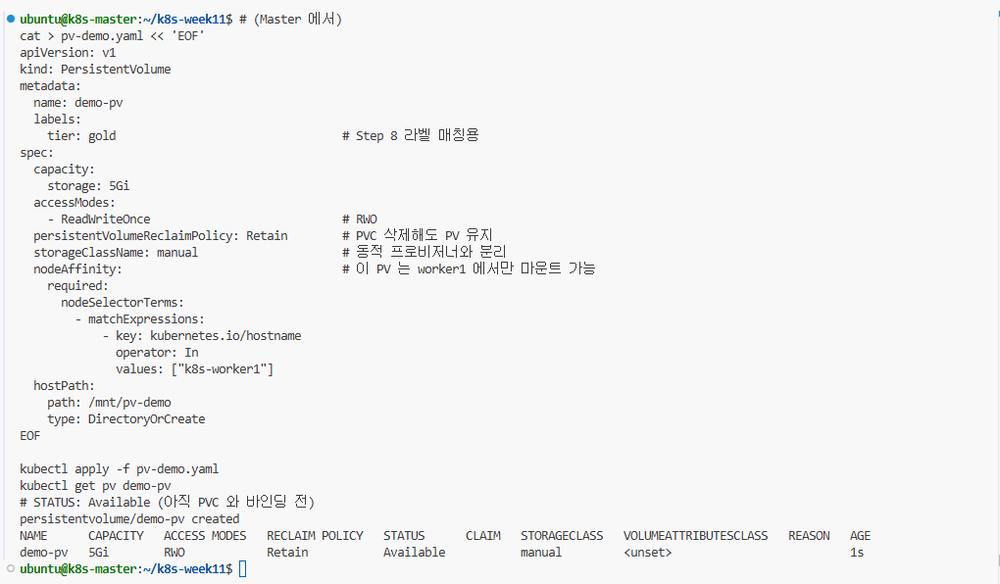

### 3. Access Modes 의 의미 확인

```bash
kubectl describe pv demo-pv | grep -A1 'Access Modes'
# RWO = 단일 노드에서 read/write 가능
# ROX = 여러 노드 read-only
# RWX = 여러 노드 read/write (NFS 등에서만)
```
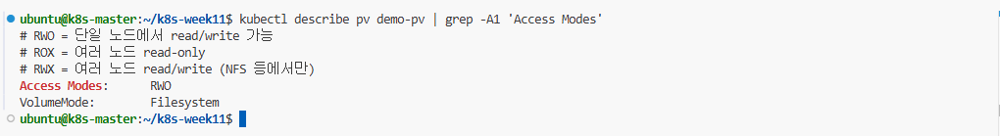

---

## Step 7. PersistentVolumeClaim(PVC) 과 바인딩 (PDF 18~19쪽)

사용자(개발자) 관점에서 **용량과 접근 모드** 를 요청합니다.

### 1. PVC 생성 — 조건이 PV 와 호환됨

```bash
cat > pvc-demo.yaml << 'EOF'
apiVersion: v1
kind: PersistentVolumeClaim
metadata:
  name: demo-pvc
spec:
  storageClassName: manual                     # PV 와 동일해야 함
  accessModes:
    - ReadWriteOnce
  resources:
    requests:
      storage: 2Gi                             # PV 의 5Gi 보다 작으므로 OK
EOF

kubectl apply -f pvc-demo.yaml
sleep 3
kubectl get pvc demo-pvc
kubectl get pv demo-pv
# pvc STATUS: Bound, pv STATUS: Bound
```
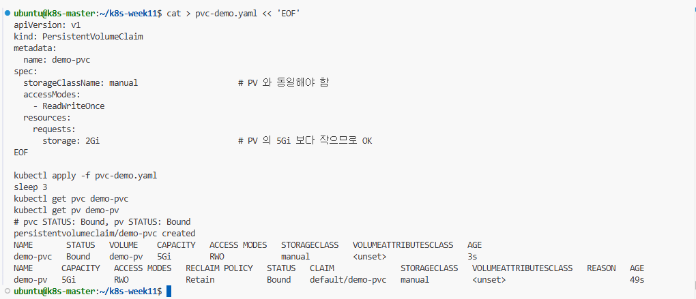

> **3대 바인딩 조건** (PDF 19쪽):
> 1. **StorageClass 일치**: PVC 와 PV 의 `storageClassName` 가 같아야 함
> 2. **AccessMode 호환**: PV 가 PVC 요청 모드를 포함해야 함
> 3. **용량 충족**: PV ≥ PVC

---

## Step 8. 바인딩 실패 시나리오 시연 (PDF 19쪽)

조건이 안 맞으면 PVC 가 `Pending` 상태에 머무는 것을 직접 봅니다.

### 1. 용량 부족 — PVC 요청이 PV 보다 큼

```bash
cat > pvc-too-big.yaml << 'EOF'
apiVersion: v1
kind: PersistentVolumeClaim
metadata:
  name: pvc-too-big
spec:
  storageClassName: manual
  accessModes: [ReadWriteOnce]
  resources:
    requests:
      storage: 10Gi                            # PV 의 5Gi 보다 큼 → Pending
EOF

kubectl apply -f pvc-too-big.yaml
sleep 5
kubectl get pvc pvc-too-big
# STATUS: Pending
kubectl describe pvc pvc-too-big | tail -10
```
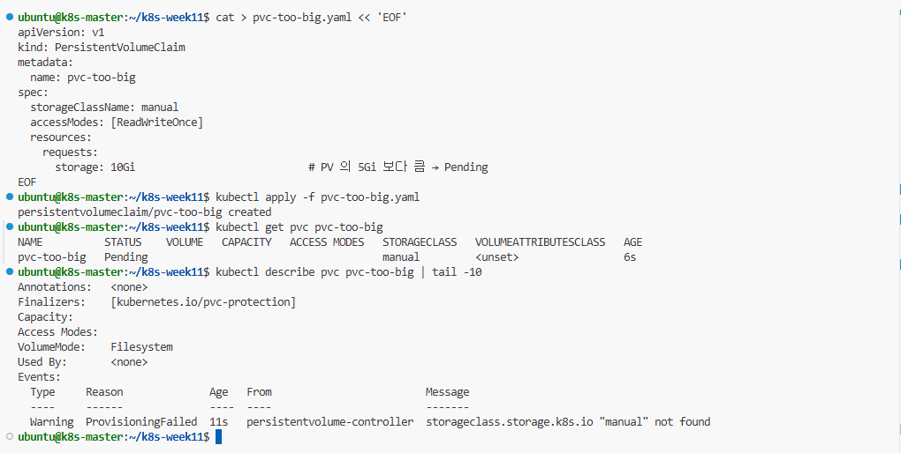

### 2. StorageClass 불일치

```bash
cat > pvc-wrong-sc.yaml << 'EOF'
apiVersion: v1
kind: PersistentVolumeClaim
metadata:
  name: pvc-wrong-sc
spec:
  storageClassName: nonexistent                # 존재하지 않는 SC
  accessModes: [ReadWriteOnce]
  resources:
    requests:
      storage: 1Gi
EOF

kubectl apply -f pvc-wrong-sc.yaml
sleep 5
kubectl get pvc pvc-wrong-sc
# STATUS: Pending (matching SC 가 없음)
```
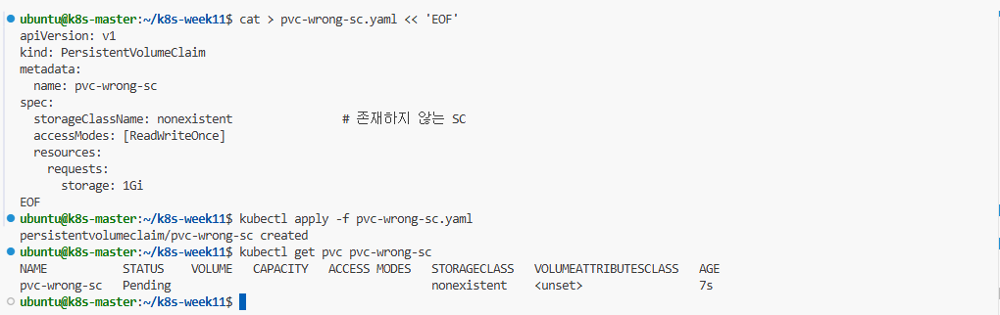

```bash
kubectl delete pvc pvc-too-big pvc-wrong-sc
```

---

## Step 9. Pod 에 PVC 마운트 + 데이터 영속성 검증 (PDF 21쪽)

영구 볼륨의 **핵심 가치** — 파드가 삭제·재생성되어도 데이터는 살아남는다.

### 1. PVC 를 사용하는 Pod 생성

```bash
cat > pod-pv-test.yaml << 'EOF'
apiVersion: v1
kind: Pod
metadata:
  name: pv-test-pod
spec:
  containers:
    - name: app
      image: busybox
      command: ["sh", "-c", "sleep 3600"]
      volumeMounts:
        - name: data
          mountPath: /usr/share/data
  volumes:
    - name: data
      persistentVolumeClaim:
        claimName: demo-pvc                   # Step 7 의 PVC 참조
EOF

kubectl apply -f pod-pv-test.yaml
kubectl wait --for=condition=Ready pod/pv-test-pod --timeout=60s
```
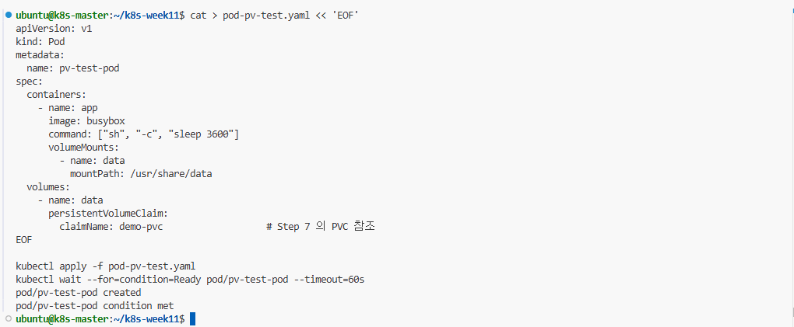

### 2. 마운트 확인 + 데이터 쓰기

```bash
# 마운트된 디스크 공간 확인 (df)
kubectl exec pv-test-pod -- df -h /usr/share/data

# 사전(Step 6)에 호스트에 만들어둔 seed.txt 가 보임
kubectl exec pv-test-pod -- ls /usr/share/data
kubectl exec pv-test-pod -- cat /usr/share/data/seed.txt

# 새 파일 쓰기
kubectl exec pv-test-pod -- sh -c "echo 'written by pod' > /usr/share/data/from-pod.txt"
kubectl exec pv-test-pod -- ls /usr/share/data
```
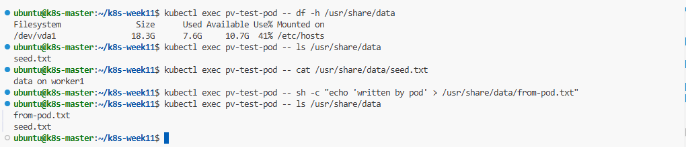

### 3. 파드 삭제 → 재생성 → 데이터 잔존 검증

```bash
kubectl delete pod pv-test-pod
kubectl apply -f pod-pv-test.yaml
kubectl wait --for=condition=Ready pod/pv-test-pod --timeout=60s

# 이전 파드가 쓴 from-pod.txt 가 그대로 보임
kubectl exec pv-test-pod -- cat /usr/share/data/from-pod.txt
```
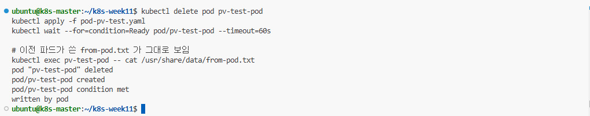

```bash
# 정리 (PVC 는 Step 13 Reclaim Policy 시연 후 삭제)
kubectl delete pod pv-test-pod
```

---

## Step 10. Dynamic Provisioning — local-path StorageClass (PDF 24~25쪽)

이번엔 **PV 를 만들지 않고도** PVC 만 생성하면 자동으로 PV 가 만들어지는 동적 프로비저닝.

### 1. 현재 클러스터의 StorageClass 확인

```bash
kubectl get storageclass
kubectl describe storageclass local-path | head -20
# provisioner: rancher.io/local-path
# reclaimPolicy: Delete
# volumeBindingMode: WaitForFirstConsumer
```
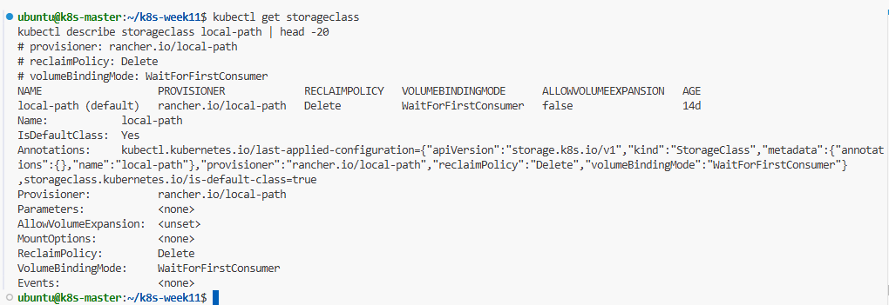

### 2. PV 없이 PVC 만 생성 — `WaitForFirstConsumer` 동작 관찰

```bash
cat > pvc-dynamic.yaml << 'EOF'
apiVersion: v1
kind: PersistentVolumeClaim
metadata:
  name: pvc-dynamic
spec:
  storageClassName: local-path
  accessModes: [ReadWriteOnce]
  resources:
    requests:
      storage: 1Gi
EOF

kubectl apply -f pvc-dynamic.yaml
sleep 3
kubectl get pvc pvc-dynamic
# STATUS: Pending — WaitForFirstConsumer 모드라 Pod 가 와야 PV 생성
```
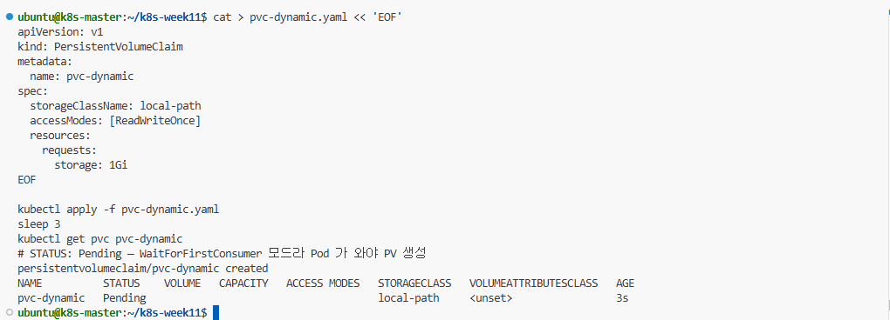

### 3. Pod 를 만들면 즉시 PV 가 자동 생성·바인딩됨

```bash
cat > pod-dynamic.yaml << 'EOF'
apiVersion: v1
kind: Pod
metadata:
  name: dynamic-pod
spec:
  containers:
    - name: app
      image: busybox
      command: ["sh", "-c", "echo dynamic > /data/hello.txt; sleep 3600"]
      volumeMounts:
        - name: vol
          mountPath: /data
  volumes:
    - name: vol
      persistentVolumeClaim:
        claimName: pvc-dynamic
EOF

kubectl apply -f pod-dynamic.yaml
kubectl wait --for=condition=Ready pod/dynamic-pod --timeout=120s

# 이제 PVC 가 Bound, PV 도 자동 생성됨
kubectl get pvc pvc-dynamic
kubectl get pv
```
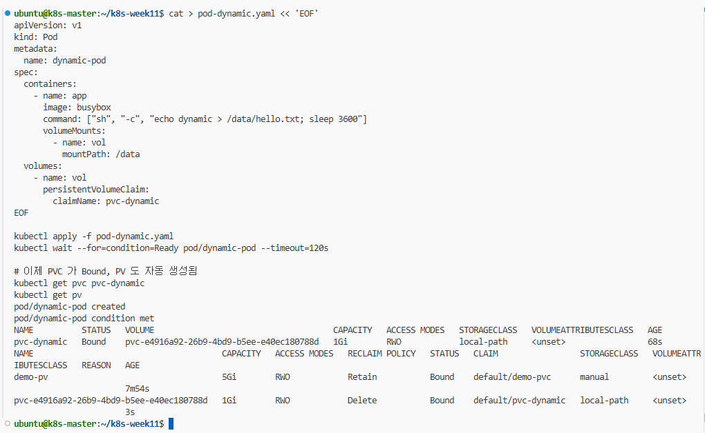

### 4. 데이터 확인

```bash
kubectl exec dynamic-pod -- cat /data/hello.txt
# 출력: dynamic
```

---

## Step 11. VolumeBindingMode 비교 (PDF 26쪽)

위 Step 10 에서 본 `WaitForFirstConsumer` 와 기본값 `Immediate` 의 차이.

```bash
# local-path 의 모드 — WaitForFirstConsumer (Pod 가 와야 바인딩)
kubectl get storageclass local-path -o jsonpath='{.volumeBindingMode}{"\n"}'

# 본 실습 환경에서 만든 manual PV(Step 6)는 정적이므로 모드와 무관하게 즉시 바인딩됨.
# Immediate 모드의 SC를 흉내 내려면 별도 SC 를 만들어 본다 (시연용)
cat > sc-immediate.yaml << 'EOF'
apiVersion: storage.k8s.io/v1
kind: StorageClass
metadata:
  name: local-path-immediate
provisioner: rancher.io/local-path
reclaimPolicy: Delete
volumeBindingMode: Immediate                   # 차이 포인트
EOF

kubectl apply -f sc-immediate.yaml
kubectl get sc local-path-immediate -o jsonpath='{.volumeBindingMode}{"\n"}'
```
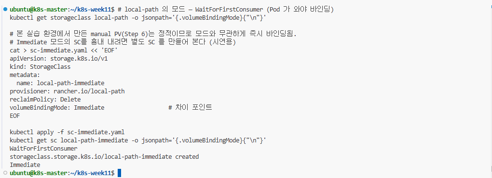

> **운영 권장**: 다중 가용영역(AZ) 환경에서는 `WaitForFirstConsumer` 가 표준. 파드가 배치될 Zone 에 맞춰 볼륨이 같은 위치에 생성됨 → "Pod=ZoneA, 볼륨=ZoneB" 같은 마운트 불가 사고 방지.

```bash
kubectl delete sc local-path-immediate
```

---

## Step 12. Reclaim Policy — Retain vs Delete (PDF 27쪽)

PVC 삭제 시 PV 와 백엔드 데이터를 어떻게 처리할지의 정책.

### 1. Retain — Step 6 의 demo-pv 는 Retain 정책

```bash
# PVC 삭제
kubectl delete pvc demo-pvc

# PV 는 'Released' 상태로 남고 데이터도 보존됨
kubectl get pv demo-pv
# STATUS: Released

# Released 상태의 PV 는 자동으로 새 PVC 와 바인딩되지 않음
# (claimRef 를 수동으로 비워야 재사용 가능)
kubectl describe pv demo-pv | grep -E 'Status|Claim|Reclaim'
```
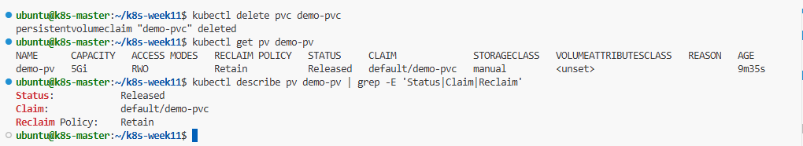

```bash
# worker1 노드에서 실제 데이터가 남아있는지 확인
# (worker1 노드에서)
ls /mnt/pv-demo
cat /mnt/pv-demo/from-pod.txt   # Step 9 에서 쓴 데이터 살아있음
```
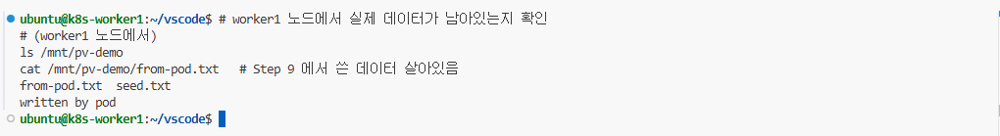

### 2. Delete — local-path 의 동적 PV 는 Delete 정책

```bash
# (Master 에서) 동적 PV 의 이름 확인
DYN_PV=$(kubectl get pvc pvc-dynamic -o jsonpath='{.spec.volumeName}')
echo "Dynamic PV: $DYN_PV"
kubectl get pv $DYN_PV -o jsonpath='{.spec.persistentVolumeReclaimPolicy}{"\n"}'
# 출력: Delete

# Pod 와 PVC 삭제
kubectl delete pod dynamic-pod
kubectl delete pvc pvc-dynamic

# PV 가 자동으로 사라짐
sleep 5
kubectl get pv $DYN_PV 2>&1 | head -2
# Error: not found
```
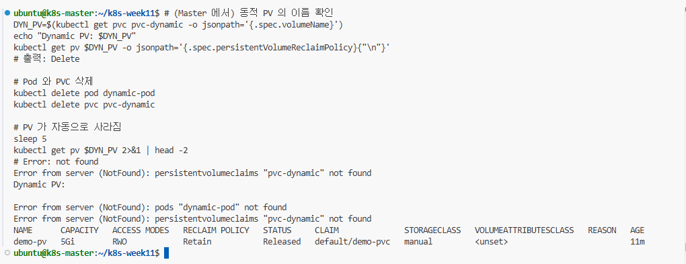

```bash
# Step 6 PV 정리 (Released 상태 PV 는 명시적으로 삭제)
kubectl delete pv demo-pv
```

---

## Step 13. VolumeSnapshot 개념 학습 (PDF 28쪽)

PVC 의 특정 시점 데이터를 백업하는 리소스. **CSI 드라이버가 스냅샷을 지원해야** 동작합니다.

```bash
# 본 클러스터의 CSI 드라이버 목록
kubectl get csidrivers

# 본 실습의 local-path-provisioner 는 스냅샷 미지원 → 실제 시연은 어려움
# 운영 환경에서 사용하는 YAML 골격은 다음과 같음 (참고용)
cat <<'EOF'
# 참고용 — 본 실습 환경에서는 동작하지 않습니다
#
# apiVersion: snapshot.storage.k8s.io/v1
# kind: VolumeSnapshotClass
# metadata: { name: csi-snap-class }
# driver: ebs.csi.aws.com         # 클라우드 CSI 드라이버
# deletionPolicy: Delete
# ---
# apiVersion: snapshot.storage.k8s.io/v1
# kind: VolumeSnapshot
# metadata: { name: my-snap }
# spec:
#   volumeSnapshotClassName: csi-snap-class
#   source:
#     persistentVolumeClaimName: my-pvc
EOF
```
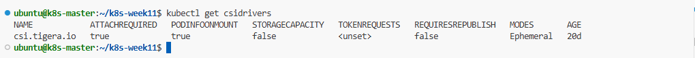

> 스냅샷을 직접 시연하려면 AWS EBS CSI, Ceph RBD CSI 등 스냅샷 지원 드라이버가 필요합니다. 본 학습 환경에서는 **개념과 YAML 골격만** 학습하고 넘어갑니다.

---

## Step 14. CSI 정보 확인 (PDF 29~31쪽)

CSI(Container Storage Interface) 는 스토리지 플러그인의 표준 인터페이스. 현재 클러스터에 어떤 드라이버들이 있는지 확인합니다.

### 1. 설치된 CSI 드라이버 조회

```bash
kubectl get csidrivers
kubectl get csinodes                                # 각 노드에서 사용 가능한 드라이버
```
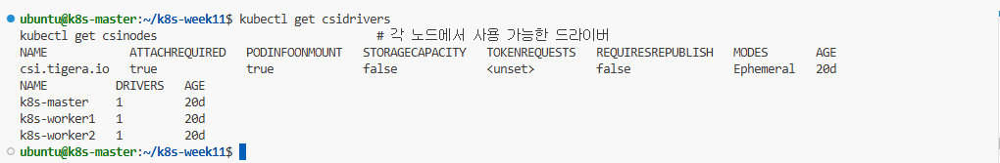

### 2. local-path-provisioner 의 컴포넌트 확인 — Out-of-Tree 구조

```bash
# In-Tree(쿠버네티스 코어 내장) 가 아닌, 별도 Deployment 로 동작
kubectl get pods -n local-path-storage -o wide

# 매니페스트의 핵심 구성: provisioner Pod + StorageClass
kubectl describe deploy -n local-path-storage local-path-provisioner | head -20
```
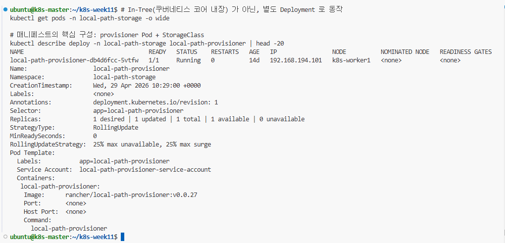

> **In-Tree → Out-of-Tree 전환의 의미**: 예전엔 스토리지 플러그인이 K8s 바이너리 안에 있어서 신규 기능마다 K8s 자체를 업데이트해야 했음. CSI 도입 후 벤더가 K8s 와 무관한 일정으로 드라이버 배포 가능 → 안정성·확장성 향상.

---

## Step 15. 리소스 정리

```bash
# Step 1~5 임시 볼륨
kubectl delete pod emptydir-demo hostpath-demo configmap-demo secret-demo --ignore-not-found
kubectl delete cm app-config --ignore-not-found
kubectl delete secret db-creds --ignore-not-found

# Step 6~9 정적 PV/PVC
kubectl delete pod pv-test-pod --ignore-not-found
kubectl delete pvc demo-pvc --ignore-not-found
kubectl delete pv demo-pv --ignore-not-found

# Step 10~12 동적
kubectl delete pod dynamic-pod --ignore-not-found
kubectl delete pvc pvc-dynamic --ignore-not-found
# PV 는 reclaimPolicy=Delete 이므로 자동 정리됨

# Step 11 SC 시연용
kubectl delete sc local-path-immediate --ignore-not-found

# worker1 노드의 잔여 디렉터리 (필요 시)
# (worker1 노드에서)
# sudo rm -rf /mnt/pv-demo
```
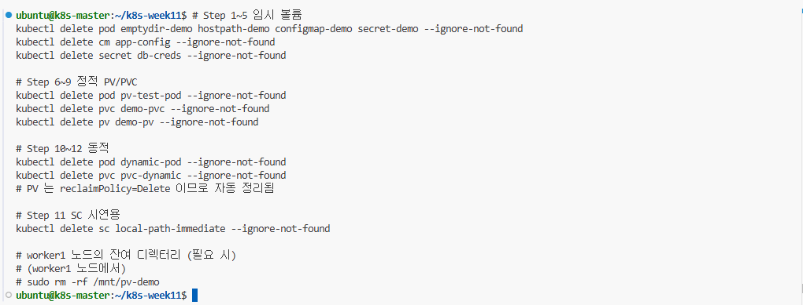

```bash
# (참고) local-path-provisioner 자체는 12주차 이후에도 활용하므로 제거하지 않습니다.
# 굳이 제거하려면:
# kubectl delete -f https://raw.githubusercontent.com/rancher/local-path-provisioner/v0.0.27/deploy/local-path-storage.yaml
```

---

## 트러블슈팅 체크리스트

| 증상 | 주요 원인 / 조치 |
| :--- | :--- |
| PVC 가 `Pending` 으로 머무름 | 1) StorageClass 불일치 2) 용량 부족 3) AccessMode 불일치 — `kubectl describe pvc` 의 Events 확인 |
| local-path PVC 가 `Pending` 인데 Pod 도 없음 | `WaitForFirstConsumer` 모드라 정상 — Pod 를 만들면 바인딩됨 |
| PV `STATUS: Available` 인데 PVC 가 못 잡음 | StorageClass 이름이 정확히 같은지 확인 (`""` 와 `manual` 은 다름) |
| `hostPath` Pod 가 다른 노드로 옮겨갔는데 데이터 없음 | hostPath 는 노드 종속 — `nodeSelector` 로 노드 고정 필요 |
| `kubectl exec ... -- cat` 으로 Secret 값이 깨져 보임 | Secret 마운트는 자동 디코딩됨, 값 자체에 줄바꿈이 있으면 그대로 표시 |
| Secret YAML 의 값이 평문이 아닌 알 수 없는 문자열 | Base64 인코딩됨 — `kubectl get secret X -o jsonpath='{.data.KEY}' \| base64 -d` 로 디코딩 |
| PV `STATUS: Released` 인데 새 PVC 가 잡지 못함 | Reclaim Policy=Retain 의 정상 동작 — PV 의 `spec.claimRef` 를 비우거나 PV 자체 재생성 |
| VolumeSnapshot 생성 후 `READYTOUSE: false` | CSI 드라이버가 스냅샷 미지원 (local-path 등) — EBS·Ceph 등으로 변경 필요 |
| `kubectl get csidrivers` 가 비어 있음 | In-Tree 만 쓰는 클러스터일 가능성 — 또는 CSI 컴포넌트 미설치 |
| ConfigMap 값을 바꿔도 컨테이너에 반영 안 됨 | 파일 마운트는 약 1분 후 갱신되나 환경변수 주입은 파드 재시작 필요 |
