# 오픈소스SW(클라우드)

# 03. 도커 이미지 빌드

> (본 실습은 Ubuntu 24.04 VM 환경을 기준으로 작성되었습니다.)

---

## Step 1. 도커 이미지 검색 및 보안 취약점 분석
Docker Hub의 방대한 저장소에서 신뢰할 수 있는 이미지를 찾고, 잠재적인 보안 위협을 점검합니다.

```bash
# 1. 기본적인 키워드 검색 (nginx)
docker search nginx
```
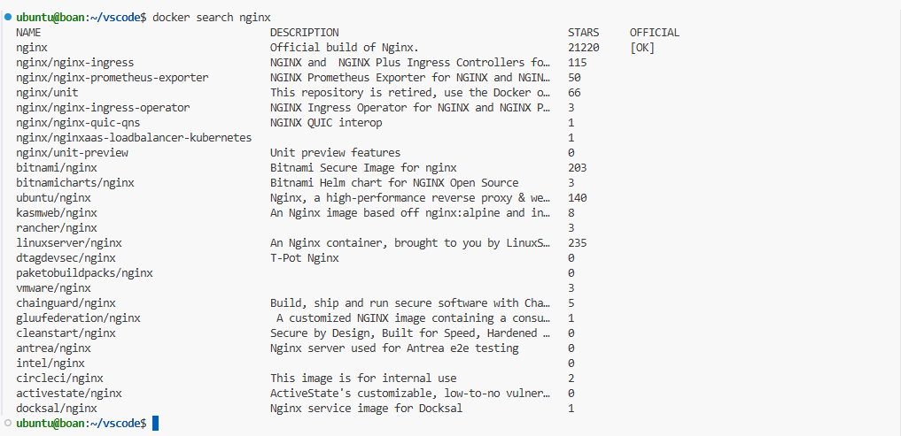
---
```bash
# 2. 필터 및 제한 옵션을 활용한 고급 검색
# 공식 이미지이면서 별점이 1000개 이상인 이미지를 상위 5개만 출력
docker search nginx --filter "is-official=true" --filter "stars=1000" --limit 5
```
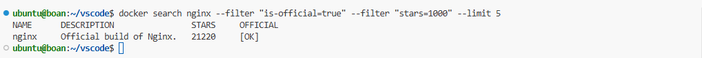
---
```bash
#docker scout 플러그인 설치
curl -sSfL https://raw.githubusercontent.com/docker/scout-cli/main/install.sh | sh -s --
```
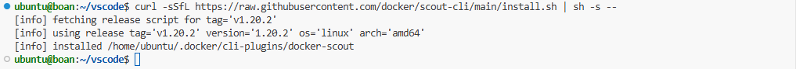
---
```bash
# 3. Docker Scout를 이용한 베이스 이미지 취약점 요약 리포트 확인
docker scout quickview nginx:latest
```
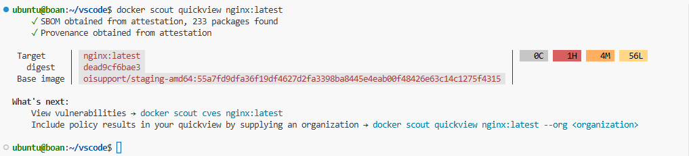
---
```bash
# 4. 특정 CVE 취약점 상세 조회
docker scout cves nginx:latest
```
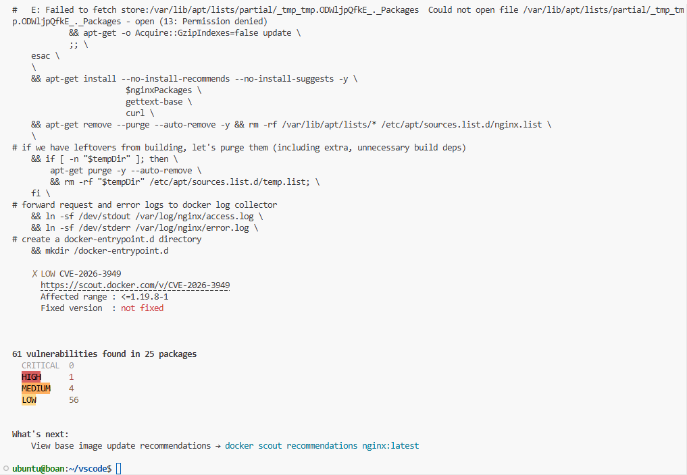
---
```bash
# [참고] Trivy 설치
# 1. 필수 의존성 패키지 설치
sudo apt-get update
sudo apt-get install -y wget apt-transport-https gnupg lsb-release

# 2. Trivy 공식 GPG 키 다운로드 및 시스템 키링에 저장
wget -qO - https://aquasecurity.github.io/trivy-repo/deb/public.key | gpg --dearmor | sudo tee /usr/share/keyrings/trivy.gpg > /dev/null

# 3. apt 소스 리스트에 Trivy 저장소 추가
echo "deb [signed-by=/usr/share/keyrings/trivy.gpg] https://aquasecurity.github.io/trivy-repo/deb $(lsb_release -sc) main" | sudo tee /etc/apt/sources.list.d/trivy.list

# 4. 패키지 목록 업데이트 후 Trivy 설치
sudo apt-get update
sudo apt-get install -y trivy
```
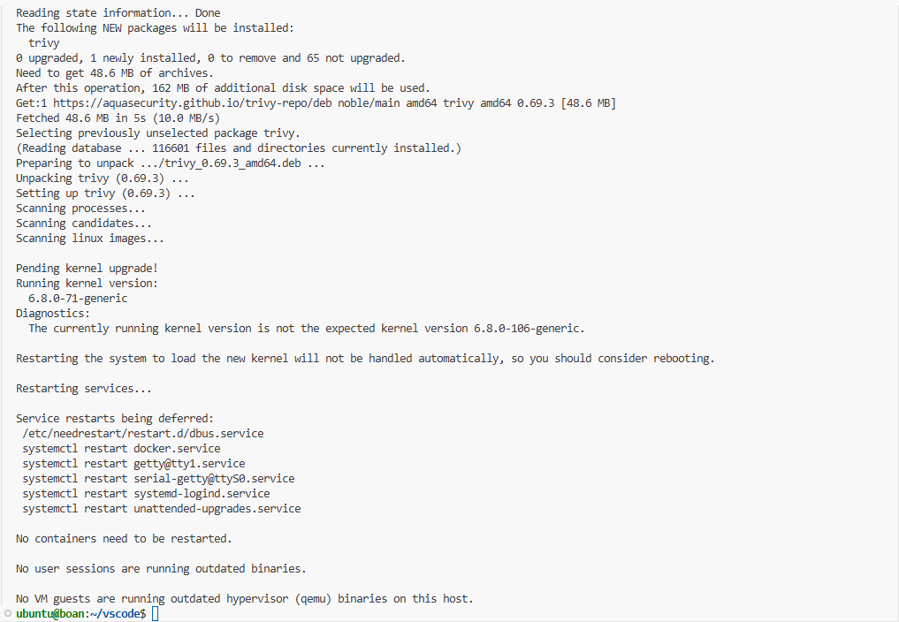
---
```bash
# 5. Trivy를 활용한 CRITICAL 심각도 스캔 (Trivy 설치 환경 한정)
trivy image --severity CRITICAL python:3.8
```
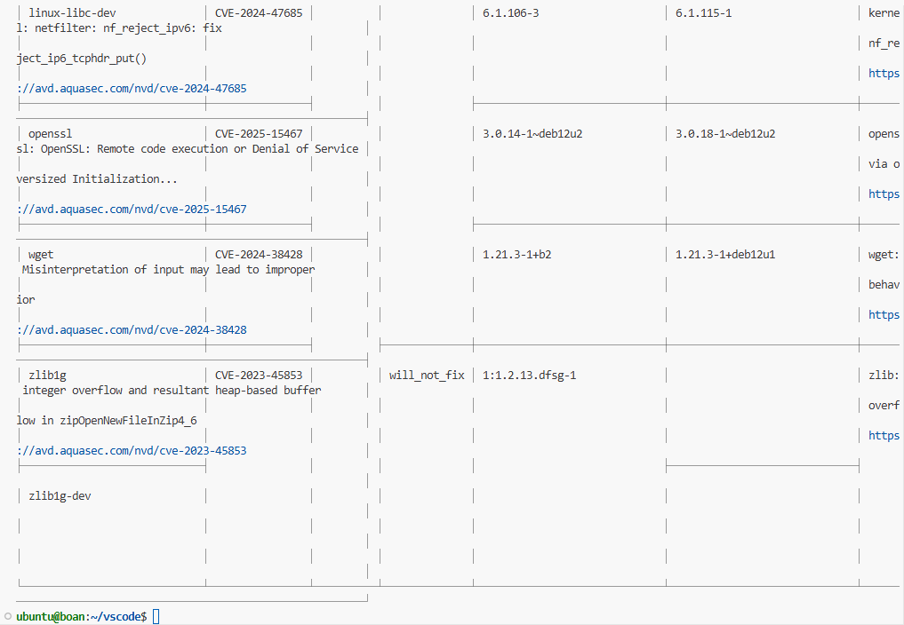
---

### 이미지 검색 및 분석 (`docker search`, `docker scout`)

| 옵션/명령어 | 설명 |
|---|---|
| `--filter "is-official=true"` | 도커 팀이 관리하여 보안과 안정성이 검증된 공식 이미지만 필터링합니다. |
| `--filter "stars=N"` | 별점이 N개 이상인 이미지만 필터링합니다. |
| `--limit` | 검색 결과가 너무 많을 때 출력되는 이미지의 수를 제한합니다 (기본값: 25). |
| `scout quickview` | 이미지의 보안 취약점을 즉시 식별하고 요약 리포트를 제공합니다. |
| `scout cves` | 이미지의 특정 CVE 취약점을 상세하게 조회합니다. |

## Step 2. 빌드 컨텍스트 최적화 및 기본 Dockerfile 작성
이미지 빌드의 핵심인 `Dockerfile`과 불필요한 파일 전송을 막는 `.dockerignore`를 작성해 봅니다.

```bash
# 1. 실습용 디렉토리 생성 및 이동
sudo mkdir -p /opt/docker-build-lab && cd /opt/docker-build-lab

# 2. 실습 폴더의 주인을 ubuntu 계정으로 변경
sudo chown -R $USER:$USER /opt/docker-build-lab

# 3. .dockerignore 파일 작성 (빌드 컨텍스트 최소화)
cat <<EOF > .dockerignore
.git
node_modules
build
.env
*.log
EOF
```
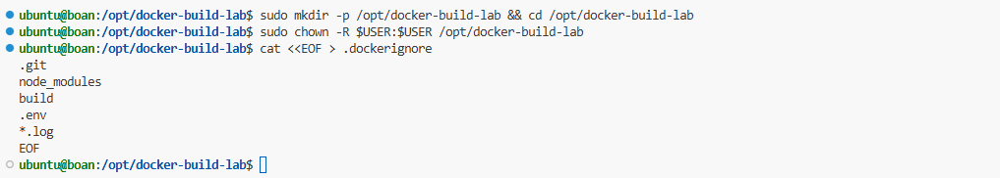
---

```bash
# 3. 기본 Dockerfile 작성 (레이어 최적화 및 비특권 사용자 적용)
cat <<EOF > Dockerfile
# Base Image: 경량화된 Alpine Linux 지정
FROM alpine:3.19

# 런타임 환경 변수 설정
ENV TZ=Asia/Seoul

# 작업 디렉토리 설정 (없으면 자동 생성됨)
WORKDIR /app

# 패키지 설치 및 보안용 비루트(Non-root) 유저 생성 (명령어 체이닝 적용)
RUN apk update && apk add --no-cache curl && \
    adduser -D appuser && chown -R appuser:appuser /app

# 소스 복사 및 권한 부여
COPY --chown=appuser:appuser . /app/

# 실행 권한 사용자 전환
USER appuser

# 컨테이너 기본 실행 명령어 설정 (Exec 형식)
CMD ["echo", "Hello BoanLab! Build is successful."]
EOF
```
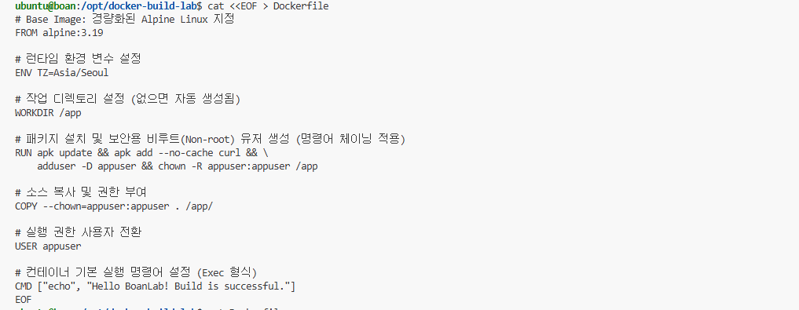
---
```bash
# [참고] Dockerfile 확인해보기
nano Dockerfile
```
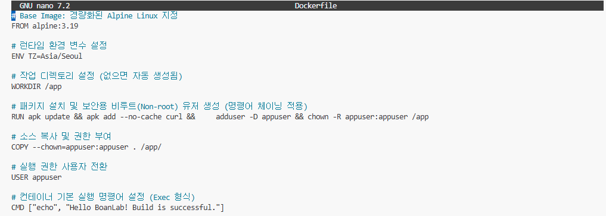
---

### Dockerfile 핵심 명령어 (기본)

| 지시어 | 설명 |
|---|---|
| `FROM` | 빌드의 기반이 되는 부모 이미지를 지정하며, 구체적인 버전을 명시해야 합니다. |
| `ENV` | 런타임까지 지속되는 환경 변수를 설정합니다. |
| `WORKDIR` | 이후 명령어들이 실행될 작업 디렉토리를 설정하며 절대 경로 사용을 권장합니다. |
| `RUN` | 명령을 실행하고 새로운 레이어를 생성합니다. `&&` 연산자로 체이닝하여 레이어를 줄입니다. |
| `COPY` | 호스트의 파일을 컨테이너로 복사하며 `--chown` 옵션으로 소유권 변경이 가능합니다. |
| `USER` | 명령어를 실행할 비특권(Non-root) 사용자를 지정하여 보안을 강화합니다. |

## Step 3. 도커 이미지 빌드 실행 (`docker build`)
작성한 Dockerfile을 바탕으로 실제로 실행 가능한 불변의 이미지를 생성합니다.

```bash
# 1. 기본 빌드 및 태그 설정 (현재 디렉토리 '.' 지정)
docker build -t myapp:1.0 .
```
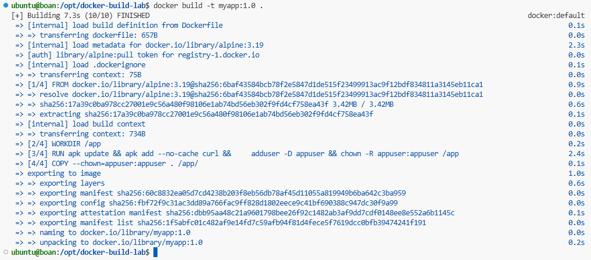

---

```bash
# 2. 빌드 캐시 확인 및 재실행
# 소스 코드가 변경되지 않았다면 캐시를 재사용하여 순식간에 빌드됩니다.
docker build -t myapp:1.0 .
```
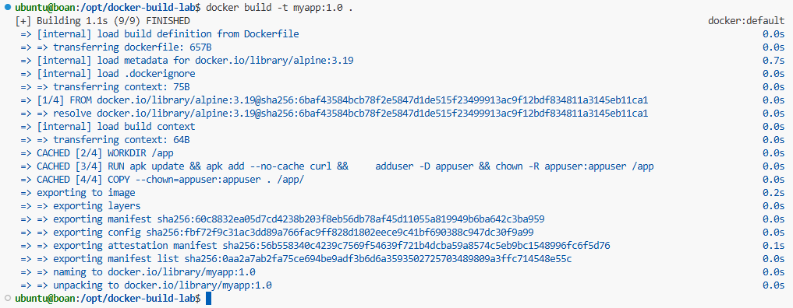

---

```bash
# 3. 특정 아키텍처 및 빌드 변수를 주입하여 빌드
docker build --build-arg APP_VERSION=2.0 --platform linux/amd64 -t myapp:2.0 .
```
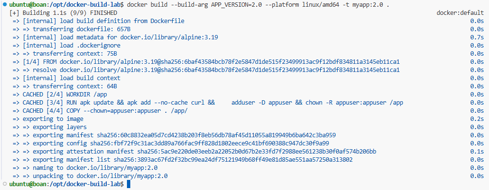

---

### 이미지 빌드 (`docker build`)

| 옵션 | 설명 |
|---|---|
| `-t` | 생성될 이미지의 이름과 태그(버전)를 지정합니다. |
| `-f` | 기본 `Dockerfile`이 아닌 다른 이름의 파일(예: `Dockerfile.prod`)을 명시적으로 지정합니다. |
| `--build-arg` | 빌드 시점에만 유효한 변수(`ARG`)의 값을 주입하거나 덮어씁니다. |
| `--platform` | 크로스 컴파일 등을 위해 특정 CPU 아키텍처(예: `linux/amd64`)용으로 빌드합니다. |

## Step 4. 특수 목적 명령어 실습 (ARG, ADD, EXPOSE, VOLUME)
포트 노출 명세, 볼륨 마운트, 빌드 타임 변수 등을 활용하는 고급 형태의 Dockerfile을 다뤄봅니다.

```bash
# 1. 고급 설정을 포함한 Dockerfile.adv 작성
cat <<EOF > Dockerfile.adv
FROM ubuntu:22.04

# 빌드 타임 변수 선언 (기본값 포함)
ARG BUILD_DATE
ARG APP_VERSION=1.0.0

# 컨테이너가 런타임에 사용할 포트 명세화
EXPOSE 80/tcp

# 데이터 영속성을 위한 마운트 포인트 선언
VOLUME ["/var/lib/mysql"]

# 원격 URL에서 파일 다운로드 (ADD 사용 예시)
ADD [https://example.com/index.html](https://example.com/index.html) /usr/src/

# Exec 형식의 엔트리포인트 지정
ENTRYPOINT ["/bin/bash", "-c", "echo Version: \$APP_VERSION"]
EOF
```
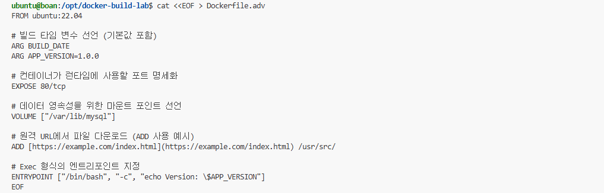

---

```bash
# Dockerfile.adv 확인
nano Dockerfile.adv
```
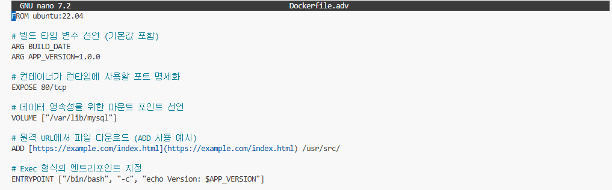

---

```bash
# 2. 지정된 파일(-f)로 빌드 변수(--build-arg) 주입하여 빌드
docker build -f Dockerfile.adv --build-arg BUILD_DATE=$(date +%Y-%m-%d) -t advanced-app:latest .
```
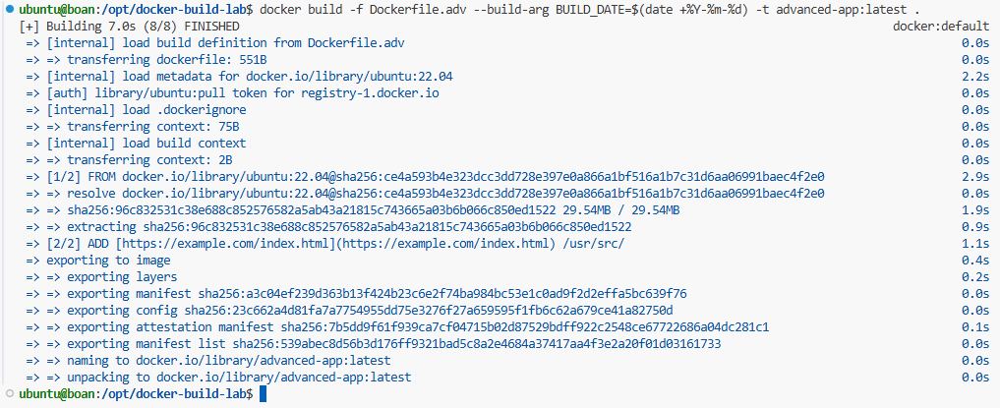

---

### Dockerfile 특수 명령어 (심화)

| 지시어 | 설명 |
|---|---|
| `ARG` | 빌드 시점에만 유효하며 런타임 환경 변수로는 남지 않는 변수를 정의합니다. |
| `EXPOSE` | 컨테이너가 수신 대기할 포트를 명시하는 문서화 역할이며 실제 포트를 열지는 않습니다. |
| `VOLUME` | 데이터베이스나 로그 등 데이터 영속성이 필요한 경로의 마운트 포인트를 선언합니다. |
| `ADD` | 파일 복사 외에 tar 자동 압축 해제 및 원격 URL 다운로드 기능을 제공합니다. |
| `ENTRYPOINT` | 컨테이너 시작 시 무조건 실행되는 명령을 고정하며, `run`의 인자로 덮어쓰기 어렵습니다. |

## Step 5. 멀티 스테이지 빌드 (최적화의 꽃)
빌드 환경과 실행 환경을 분리하여 최종 이미지의 용량을 극적으로 줄이는 기법을 실습합니다.

```bash
# 1. 멀티 스테이지를 위한 Go 애플리케이션 Dockerfile 작성
cat <<EOF > Dockerfile.multi
# [Stage 1] Build Stage: 소스 컴파일 전용 (무거운 컴파일러 포함)
FROM golang:1.22-alpine AS builder
WORKDIR /src
# 가상의 Go 소스 파일 생성 (echo 대신 printf 사용)
RUN printf 'package main\nimport "fmt"\nfunc main() { fmt.Println("Distroless Multi-stage!") }\n' > main.go
RUN go build -o /out/app main.go

# [Stage 2] Run Stage: 쉘(Shell)이 없는 초경량 Distroless 이미지 사용
FROM gcr.io/distroless/static-debian12
# 첫 번째 스테이지(builder)에서 컴파일된 결과물만 복사
COPY --from=builder /out/app /app
ENTRYPOINT ["/app"]
EOF
```
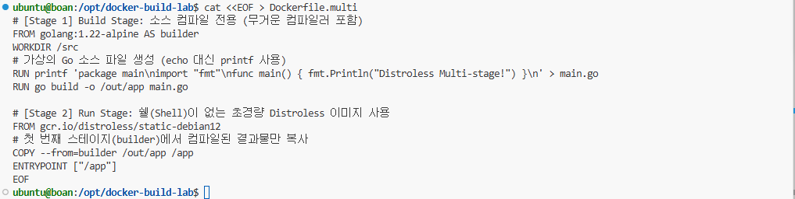

---

```bash
# 2. 멀티 스테이지 이미지 빌드 및 크기 비교
docker build -f Dockerfile.multi -t multi-app:optimized .

# golang 베이스 이미지(수백 MB)와 최종 생성된 이미지(수 MB) 크기 비교
docker images | grep -E "golang|multi-app"
```
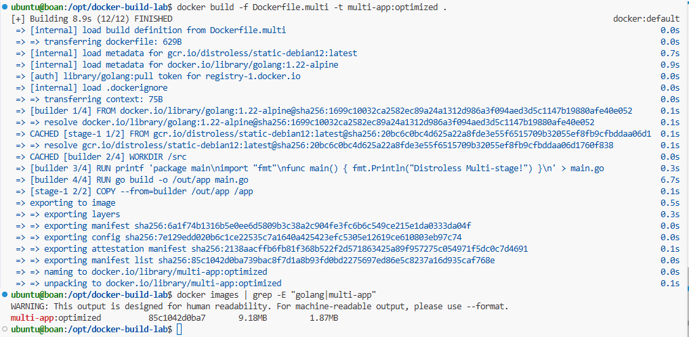

---

## 🏆 [심화 과제] BoanLab 이미지 경량화 및 방어력 극대화 작전!

**📝 시나리오 배경**
네트워크 시스템 및 보안 연구실(BoanLab)에서 개발한 Node.js 기반 사내 관리 시스템의 도커 이미지가 현재 **800MB**를 육박하고 있습니다. 게다가 불필요한 OS 패키지들과 Shell(`/bin/sh`)이 내장되어 있어 타이포스쿼팅이나 백도어 공격 시 공격자에게 너무 많은 표면을 내어주는 보안 취약점이 발견되었습니다.

이번 과제의 핵심은 **멀티 스테이지 빌드**와 **Distroless 이미지**를 결합하여 800MB짜리 거대한 괴물을 **80MB(90% 감소)**로 다이어트시키고, 공격자가 컨테이너에 침투하더라도 명령어를 칠 수조차 없게 방어력을 극대화하는 것입니다.

### 🎯 미션 요구 사항 (Tasks)

**🔥 Task 1. 절대 빠져나가면 안 될 비밀, `.dockerignore` 결계 치기**
1. 빌드 컨텍스트 디렉토리에 `.env`, `*.pem`, `config/secrets.yml` 같은 민감한 정보와 무거운 `node_modules`가 도커 데몬으로 전송되지 않도록 `.dockerignore` 파일에 명시하세요.

**👨‍💻 Task 2. 빌드 스테이지(builder) 구성: 캐시의 마술사**
1. `node:18-alpine` 이미지를 베이스로 `AS builder` 별칭을 선언합니다.
2. `WORKDIR /app`을 선언하고, `package.json` 등 의존성 목록만 먼저 `COPY` 합니다.
3. 소스 코드를 복사하기 전에 `RUN yarn install` (혹은 npm)을 실행하세요. (소스가 변경되어도 의존성 설치 캐시를 재사용하는 것이 핵심입니다!)
4. 전체 소스 코드를 복사하고 앱을 빌드합니다.

**🚀 Task 3. 런타임 스테이지(runner) 구성: 무적의 Distroless 성곽**
1. 새로운 스테이지를 시작합니다. 쉘(Shell)이 제거되어 공격 표면을 최소화할 수 있는 `FROM gcr.io/distroless/nodejs18-debian11 AS runner`를 사용합니다.
2. `ENV NODE_ENV=production`을 선언하여 런타임 환경을 확정합니다.
3. `builder` 스테이지에서 생성된 빌드 결과물(`/app/dist`)과 프로덕션용 의존성(`/app/node_modules`)만 선택적으로 `COPY --from=builder` 명령어로 가져옵니다.
4. **가장 중요한 보안 원칙!** 루트 권한으로 실행되지 않도록 `USER 65532:65532`를 선언하여 UID:GID 기반의 비특권 사용자로 계정을 전환합니다.
5. 마지막으로 `CMD ["dist/main.js"]`를 선언하여 실행을 명세합니다.

**💣 Task 4. 빌드 및 검증 (최종 보고)**
1. 작성한 Dockerfile을 빌드하여 이미지 크기가 획기적으로 줄어들었는지 `docker images`로 확인합니다.
2. `docker run -it --entrypoint /bin/sh [이미지명]` 으로 접속을 시도해 보세요. Distroless의 특성상 쉘이 없어 오류가 발생하며 튕겨 나갈 것입니다. 이것이 우리가 원하던 완벽한 보안 방어선입니다.