# 06. 멀티 컨테이너 운용 (Docker Compose)

> (본 실습은 Ubuntu 24.04 VM 환경을 기준으로 작성되었습니다.)

---

## Step 1. 도커 컴포즈 기초 및 설정 파일 구조 (PDF 2~10쪽)
도커 컴포즈는 여러 컨테이너로 구성된 애플리케이션을 정의하고 실행하는 도구입니다. `docker-compose.yml` 파일을 통해 서비스, 네트워크, 볼륨을 일괄 설정합니다.

### 주요 설정 옵션 요약
| 옵션 | 설명 |
| :--- | :--- |
| `version` | YAML 파일의 포맷 버전을 명시합니다. (최신 문법 사용 권장) |
| `services` | 실행할 컨테이너들의 집합을 정의합니다. |
| `image` | 사용할 이미지를 지정합니다. |
| `build` | Dockerfile이 있는 경로를 지정하여 이미지를 직접 빌드합니다. |
| `ports` | 호스트와 컨테이너의 포트를 매핑합니다. ("호스트:컨테이너") |
| `volumes` | 데이터를 보존하기 위한 볼륨 마운트나 바인드 마운트를 설정합니다. |
| `depends_on` | 서비스 간의 실행 순서 의존성을 정의합니다. |
| `environment` | 컨테이너 내부에서 사용할 환경변수를 설정합니다. |
| `env_file` | 환경변수가 정의된 파일(.env)을 로드합니다. |

### [옵션 실습] docker-compose.yml 작성 및 실행
> 가장 기본적인 구조의 Compose 파일을 직접 작성하고 실행해봅니다.

```bash
mkdir -p ~/compose-basic && cd ~/compose-basic

# docker-compose.yml 생성
cat << 'EOF' > docker-compose.yml
version: '3.8'
services:
  web:
    image: nginx:alpine
    ports:
      - "8082:80"
    volumes:
      - ./html:/usr/share/nginx/html
    environment:
      - NGINX_HOST=localhost

  db:
    image: mysql:5.7
    environment:
      MYSQL_ROOT_PASSWORD: secret
      MYSQL_DATABASE: testdb
    volumes:
      - db_data:/var/lib/mysql

volumes:
  db_data:
EOF
```

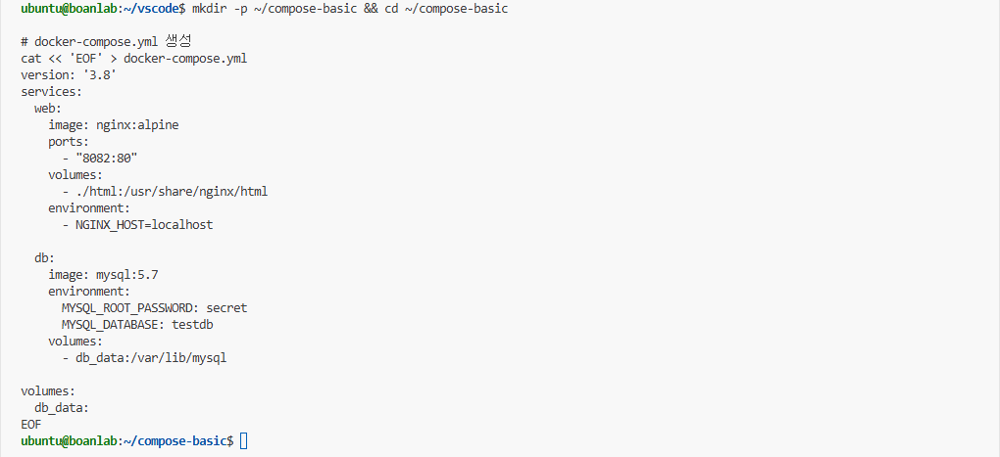
```bash
# 서비스 실행
docker compose up -d
```

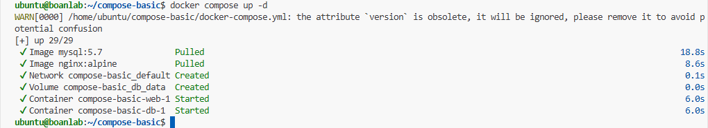

```bash
# 실행 상태 확인
docker compose ps
```
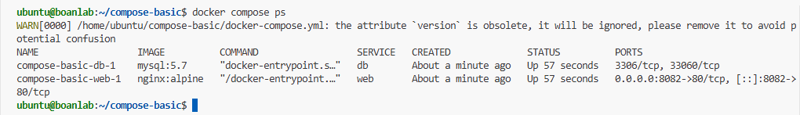

```bash
# 정리
docker compose down -v
cd ~ && rm -rf ~/compose-basic
```
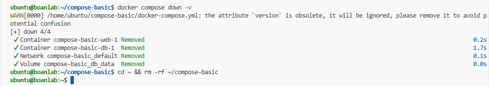

## Step 2. 네트워크 및 자원 제한 설정 (PDF 11~13쪽)
컨테이너 간의 통신을 격리하거나 하드웨어 리소스 사용량을 제한할 수 있습니다.

```bash
# [참고] CLI 환경에서 직접 자원 제한 실행 시 (PDF 13쪽)
# CPU 0.5개 제한
docker run -d --name nginx-cpu --cpus="0.5" nginx
```
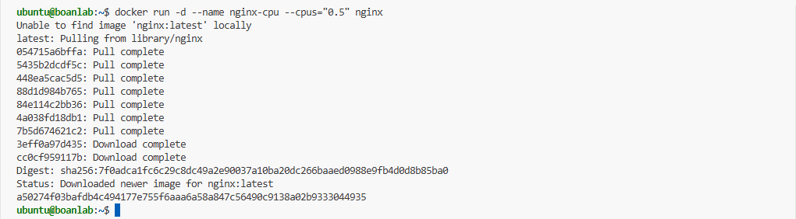

```bash
# 메모리 256MB 제한
docker run -d --name nginx-mem --memory="256m" nginx
```
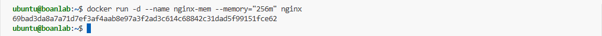

```bash
# 설정 확인
docker inspect nginx-cpu | grep -i cpu
```
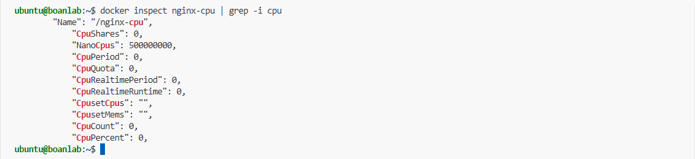

```bash
# 실습 컨테이너 정리
docker rm -f nginx-cpu nginx-mem
```
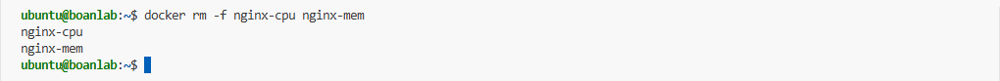

### 자원 제한 (`deploy.resources`)
- `limits`: 컨테이너가 사용할 수 있는 최대 자원량.
- `reservations`: 컨테이너 실행 시 최소한으로 보장받아야 하는 자원량.

## Step 3. 컨테이너 관리 정책 (PDF 14~17쪽)
컨테이너의 자동 복구, 상태 확인, 로그 관리 등을 설정합니다.

### 주요 정책
- **Restart Policy**: `no`, `on-failure`, `always`, `unless-stopped`
- **Healthcheck**: 컨테이너 내부 프로세스가 정상적으로 응답하는지 주기적으로 확인.
- **Logging**: 로그 드라이버 설정 및 로그 파일 크기/개수 제한(`max-size`, `max-file`).

### [옵션 실습] restart / healthcheck / logging 옵션 확인

```bash
mkdir -p ~/policy-test && cd ~/policy-test

cat << 'EOF' > docker-compose.yml
version: '3.8'
services:
  web:
    image: nginx:alpine
    ports:
      - "8081:80"
    restart: always
    healthcheck:
      test: ["CMD", "curl", "-f", "http://localhost"]
      interval: 10s
      timeout: 5s
      retries: 3
    logging:
      driver: json-file
      options:
        max-size: "1m"
        max-file: "3"
EOF
```
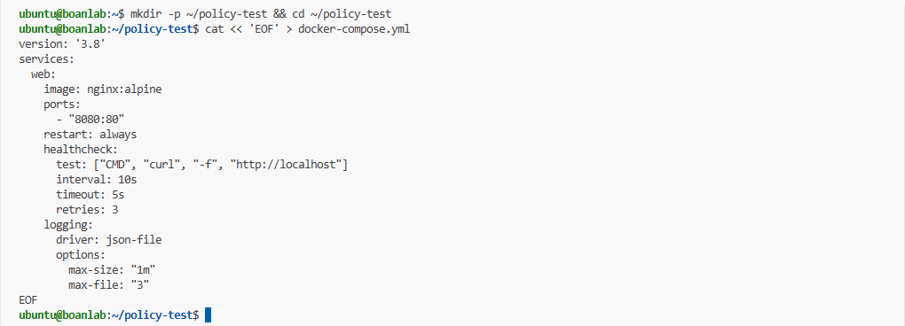

```bash
# 실행
docker compose up -d
```
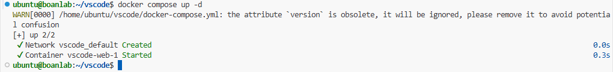

```bash
# restart 정책 확인
docker inspect --format='{{.HostConfig.RestartPolicy.Name}}' policy-test-web-1
```
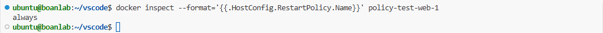

```bash
# healthcheck 상태 확인 (10초 후 healthy로 변경됨)
sleep 15
docker inspect --format='{{.State.Health.Status}}' policy-test-web-1
```
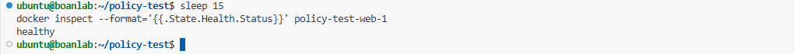

```bash
# 로그 드라이버 설정 확인
docker inspect policy-test-web-1 | grep -A5 -i logconfig
```
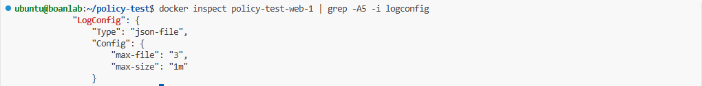

```bash
# 정리
docker compose down
cd ~ && rm -rf ~/policy-test
```
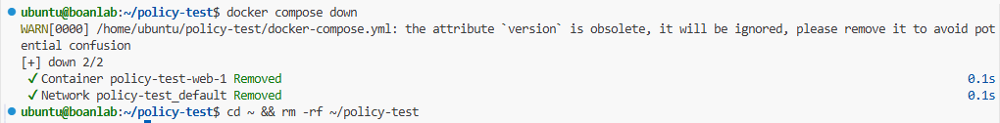


## Step 4. 도커 컴포즈 주요 명령어 (PDF 18~19쪽)
명령어는 `docker-compose.yml` 파일이 있는 디렉토리에서 실행해야 합니다.
```bash
# 0. docker-compse.yml 파일 만들기
# 실습용 디렉터리 생성 및 이동
mkdir -p ~/compose-cmds && cd ~/compose-cmds

# 테스트용 docker-compose.yml 생성
cat << 'EOF' > docker-compose.yml
version: '3.8'
services:
  web:
    image: nginx:alpine
    ports:
      - "8083:80"
EOF
```
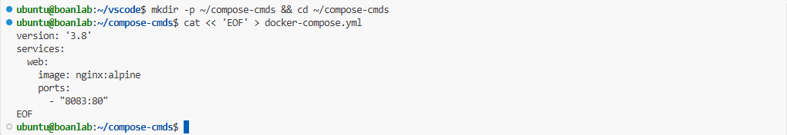
```bash
# 1. 서비스 실행 (이미지가 없으면 자동 빌드 후 백그라운드 실행)
docker compose up -d
```
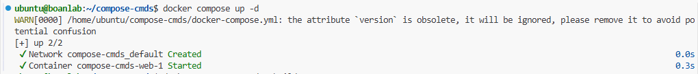

```bash
# 2. 이미지를 강제로 다시 빌드하며 실행
docker compose up -d --build
```
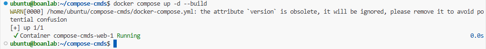

```bash
# 3. 컨테이너를 강제로 재생성하며 실행 (설정 변경 시 유용)
docker compose up -d --force-recreate
```
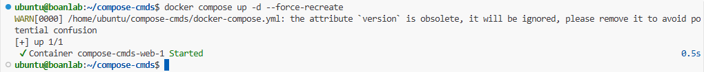

```bash
# 4. 특정 서비스의 컨테이너 개수 조정
docker compose up -d --scale web=3
```
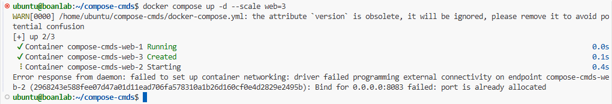

```bash
#4-1. 왜 이런 오류가 났을까?
현재 docker-compose.yml 파일에는 포트가 - "8083:80"으로 고정되어 있습니다. --scale web=3 명령어를 내리면 똑같은 web 컨테이너 3개가 동시에 실행되는데, 첫 번째 컨테이너가 호스트의 8083번 포트를 먼저 선점해 버립니다. 그다음 두 번째 컨테이너도 8083번 포트를 쓰려고 시도하다가 "이미 사용 중인 포트"라며 튕겨버린 것입니다.

version: '3.8'
services:
  web:
    image: nginx:alpine
    ports:
      - "8083-8085:80"
```
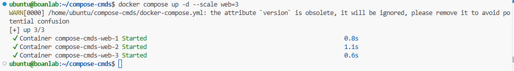

```bash
# 5. 실행 중인 컨테이너 상태 확인
docker compose ps
```
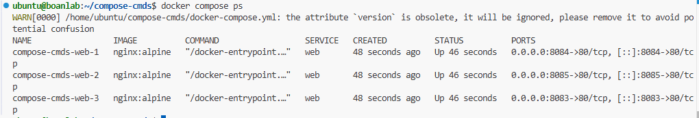

```bash
# 6. 서비스 로그 확인 (-f: 실시간 스트리밍)
docker compose logs -f
```
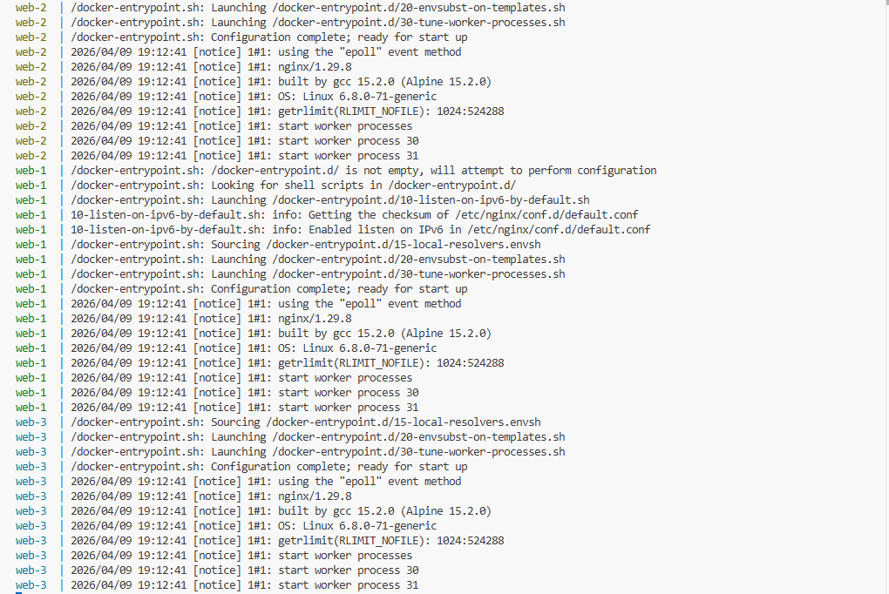

```bash
# 7. 컨테이너 중지 및 관련 리소스(네트워크 등) 삭제
docker compose down

# 8. 볼륨까지 모두 삭제하며 종료
docker compose down -v

# 9. 정의되지 않은 고아 컨테이너까지 제거
docker compose down --remove-orphans
```
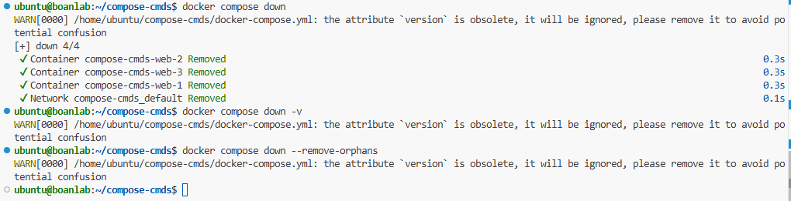

## Step 5. [실습] Flask + MySQL + Adminer 구축 (PDF 20~23쪽)
멀티 컨테이너 애플리케이션을 직접 구축하고 테스트합니다.

### 1. 프로젝트 디렉토리 생성
```bash
mkdir -p ~/compose-lab/web
cd ~/compose-lab
```
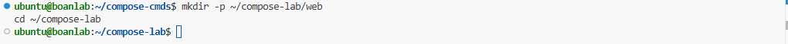

### 2. Dockerfile 생성 (`web/Dockerfile`)
```bash
cat << 'EOF' > web/Dockerfile
FROM python:3.9-slim
WORKDIR /app
COPY . /app
RUN pip install flask mysql-connector-python
CMD ["python", "app.py"]
EOF
```
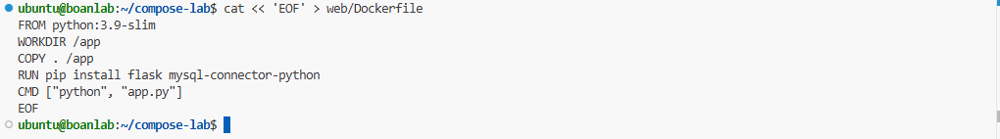

### 3. Flask 앱 생성 (`web/app.py`)
```bash
cat << 'EOF' > web/app.py
from flask import Flask
import mysql.connector
import time

app = Flask(__name__)

def get_connection(retries=10, delay=3):
    for i in range(retries):
        try:
            return mysql.connector.connect(host="db", user="root", password="rootpassword", database="mydb")
        except Exception as e:
            if i < retries - 1:
                time.sleep(delay)
            else:
                raise

@app.route('/')
def index():
    return "Docker Compose Final!"

@app.route('/add')
def add_user():
    conn = get_connection()
    cursor = conn.cursor()
    cursor.execute("CREATE TABLE IF NOT EXISTS users (name VARCHAR(255))")
    cursor.execute("INSERT INTO users (name) VALUES ('BOANLAB')")
    conn.commit()
    return "User Added!"

if __name__ == '__main__':
    app.run(host='0.0.0.0', port=5000)
EOF
```
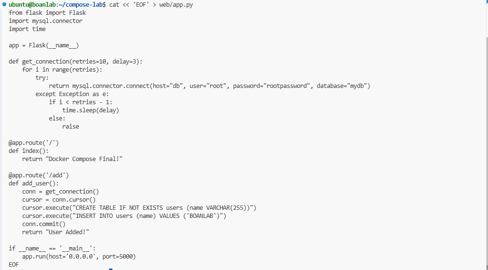


### 4. Docker Compose 설정 생성 (`docker-compose.yml`)
```bash
cat << 'EOF' > docker-compose.yml
version: '3.8'
services:
  db:
    image: mysql:5.7
    restart: always
    environment:
      MYSQL_ROOT_PASSWORD: rootpassword
      MYSQL_DATABASE: mydb
    volumes:
      - db_data:/var/lib/mysql
    networks:
      - backend

  web:
    build: ./web
    depends_on:
      - db
    ports:
      - "5000:5000"
    networks:
      - backend

  adminer:
    image: adminer
    ports:
      - "8084:8080"
    networks:
      - backend

networks:
  backend:
    driver: bridge

volumes:
  db_data:
EOF
```
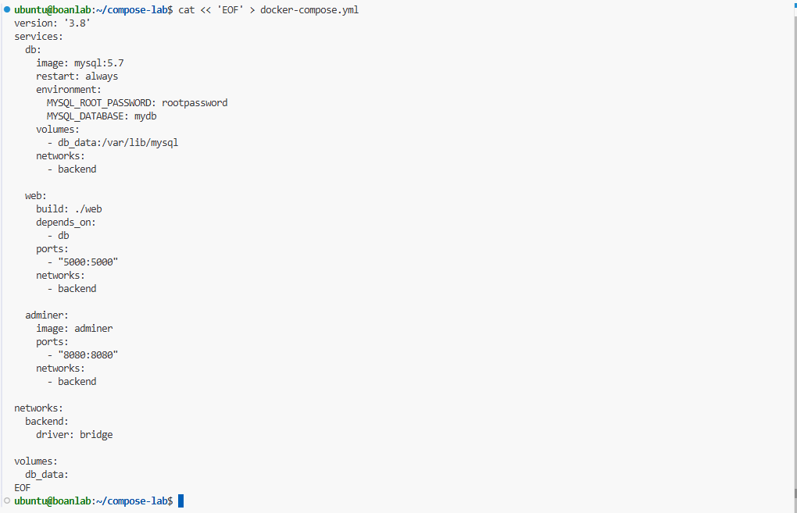

### 5. 실행 및 검증
```bash
# 서비스 빌드 및 실행
docker compose up -d --build
```
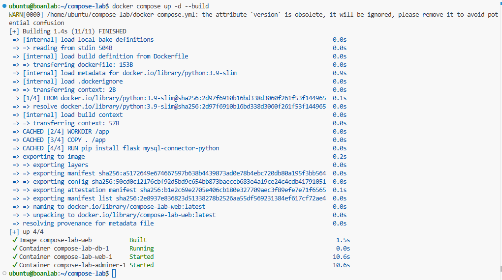
```bash
# 실행 상태 확인 (db, web, adminer 모두 Up 상태인지 확인)
docker compose ps
```
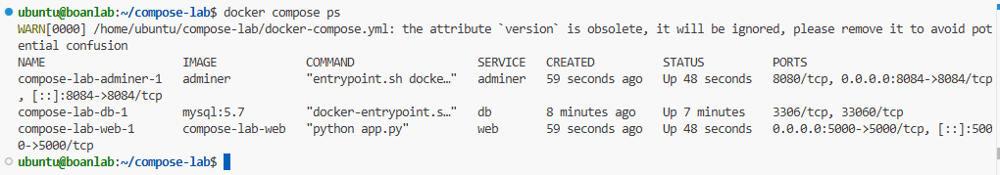

```bash
# 실시간 로그 확인 (MySQL 초기화 완료 확인 후 Ctrl+C로 종료)
docker compose logs -f
```
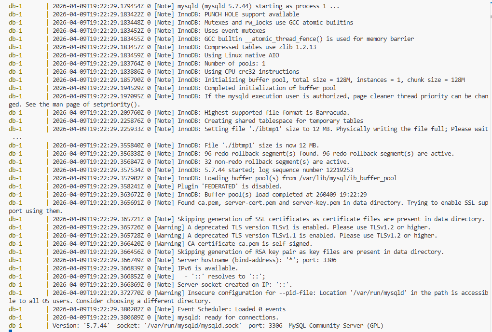

```bash

# 웹 접속 테스트
curl http://localhost:5000
curl http://localhost:5000/add

# Adminer 접속 (브라우저 이용)
# 주소: http://localhost:8084
# 서버: db / 사용자: root / 암호: rootpassword / DB: mydb
```
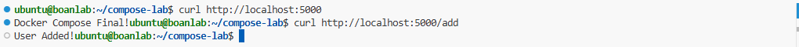
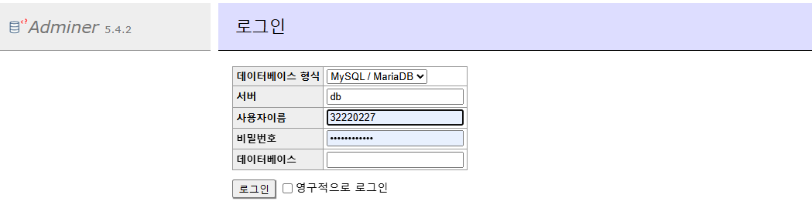


## Step 6. 리소스 정리
```bash
# 실습 완료 후 전체 서비스 및 볼륨 삭제
docker compose down -v
```

---

# 07. 멀티 컨테이너 운용 (Docker Swarm)

> 도커 스웜(Docker Swarm)은 단일 호스트를 넘어 여러 개의 도커 엔진을 하나의 가상 시스템처럼 묶어 클러스터로 관리하는 네이티브 오케스트레이션 도구입니다.
>
> **(본 실습은 Manager 1대 + Worker 1대, 총 2노드 클러스터 환경을 기준으로 합니다.)**

## Step 1. 도커 스웜 클러스터 초기화 및 개념 (PDF 2~7쪽)
도커 엔진에 기본 내장되어 있어 별도 설치 없이 즉시 사용할 수 있습니다. Manager 노드가 상태를 관리하고 Worker 노드가 실제 컨테이너를 실행합니다.

```bash
# 1. 스웜 클러스터 초기화 (Manager 노드에서 실행)
docker swarm init
```
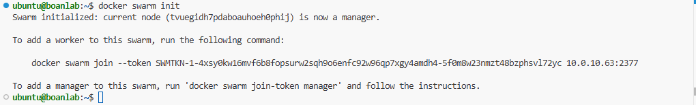

```bash
# 2. Worker 노드 조인 토큰 확인 (Manager 노드에서 실행)
docker swarm join-token worker
```
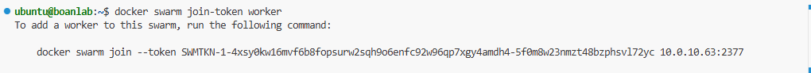

```bash
# 3. Worker 노드 추가 (Worker 노드에서 실행 — 위 명령어 출력값 그대로 붙여넣기)
# 예시: docker swarm join --token SWMTKN-1-xxxx <manager-ip>:2377
```
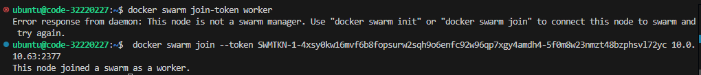

```bash
# 4. 클러스터 노드 목록 및 상태 확인 (Manager 노드에서 실행)
# AVAILABILITY가 Active, STATUS가 Ready인지 확인
docker node ls
```
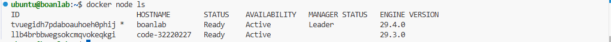

### 서비스 배포 모드
- **Replicated 모드**: 사용자가 지정한 수(N개)만큼 태스크(컨테이너)를 가용한 노드에 분산 배치합니다.
- **Global 모드**: 클러스터 내 모든 가용 노드에 1개씩 실행합니다. (모니터링 에이전트 등에 적합)

## Step 2. 스웜 클러스터 제어 및 배포 옵션 (PDF 8~11쪽)
Docker Stack을 사용하여 여러 서비스, 네트워크, 볼륨을 묶어 일괄 배포할 수 있습니다.

### 주요 배포 및 제어 전략
1. **Rolling Update**: 서비스 중단 없이 구 버전을 신 버전으로 점진적으로 교체. 실패 시 `rollback` 처리.
2. **Placement Constraints (노드 배치 제약)**: 특정 노드(Manager/Worker)나 조건에 맞춰 컨테이너를 배치.
   - 예: `constraints: [node.role == worker]` → Web 레플리카를 Worker 노드에만 배치
3. **Secrets & Configs**: 비밀번호 등 민감 정보를 암호화하여 인메모리 볼륨에 안전하게 마운트.
4. **Routing Mesh & Ingress Network**: 내장 로드밸런서를 통해 어느 노드로 접속하든 컨테이너로 자동 라우팅.

## Step 3. [실습] Docker Swarm 서비스 스택 배포 (PDF 14쪽)
Web, DB, Visualizer로 구성된 서비스 스택을 Manager 1 + Worker 1 클러스터에 배포합니다.

### 1. 실습 디렉토리 생성 및 스웜 배포용 파일 작성
> Stack 배포 시 `build` 옵션은 무시되므로, 미리 빌드된 이미지를 사용해야 합니다.

```bash
mkdir -p ~/swarm-lab && cd ~/swarm-lab

cat << 'EOF' > docker-compose-swarm.yml
version: '3.8'

services:
  web:
    image: nginx:alpine
    ports:
      - "80:80"
    networks:
      - backend
    deploy:
      replicas: 3
      placement:
        constraints: [node.role == worker]  # Worker 노드(1대)에 3개 레플리카 배치
      update_config:
        parallelism: 1       # 한 번에 1개씩 교체 (Rolling Update)
        delay: 10s
      restart_policy:
        condition: on-failure

  db:
    image: mysql:5.7
    environment:
      MYSQL_ROOT_PASSWORD: rootpassword
      MYSQL_DATABASE: mydb
    volumes:
      - db_data:/var/lib/mysql
    networks:
      - backend
    deploy:
      placement:
        constraints: [node.role == manager]  # Manager 노드에 배치

  visualizer:
    image: dockersamples/visualizer:stable
    ports:
      - "8086:8080"
    volumes:
      - "/var/run/docker.sock:/var/run/docker.sock"
    deploy:
      placement:
        constraints: [node.role == manager]  # Manager 노드에 배치

networks:
  backend:
    driver: overlay  # 스웜에서는 오버레이 네트워크 사용

volumes:
  db_data:
EOF
```
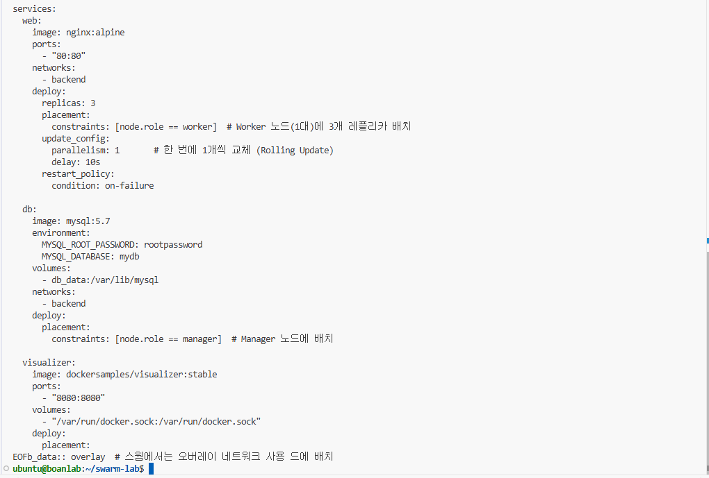

### 2. 스택(Stack) 배포 및 확인
```bash
# 1. 스택 전체 배포 (Overlay 네트워크, 서비스, 볼륨 일괄 생성)
docker stack deploy -c docker-compose-swarm.yml swarm_lab
```
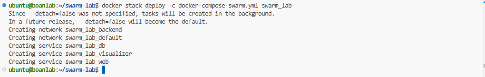

```bash
# 2. 배포된 스택 목록 확인
docker stack ls
```
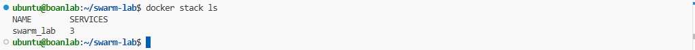

```bash
# 3. 스택 내 서비스 상태 확인 (REPLICAS 열에서 3/3 등 확인)
docker stack services swarm_lab
```
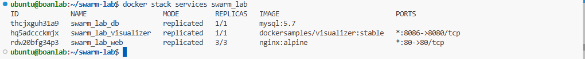

```bash
# 4. 스택에 포함된 전체 태스크(컨테이너) 및 노드 분배 상태 확인
# NODE 열에서 web 레플리카가 Worker 노드에, db/visualizer가 Manager 노드에 배치되는지 확인
docker stack ps swarm_lab
```
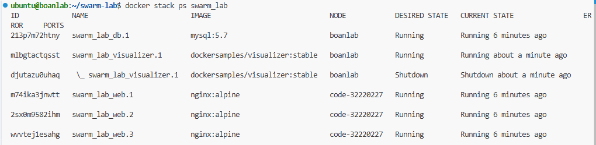

```bash
# 5. Visualizer 웹 접속 테스트 (클러스터 상태 시각화)
# 브라우저에서 http://<Manager-IP>:8086 접속
```
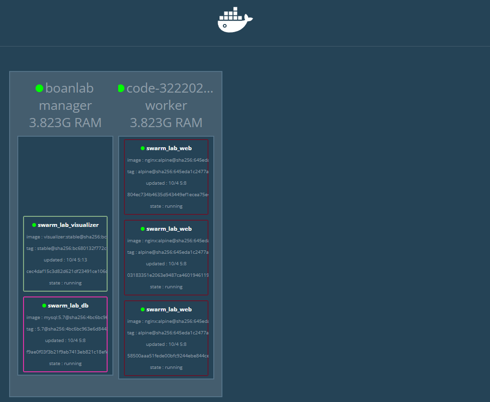

### 3. [실습] Rolling Update 테스트
서비스 중단 없이 이미지를 새 버전으로 교체하는 과정을 확인합니다.

```bash
# nginx:alpine → nginx:1.25 로 Rolling Update
docker service update --image nginx:1.25 swarm_lab_web
```
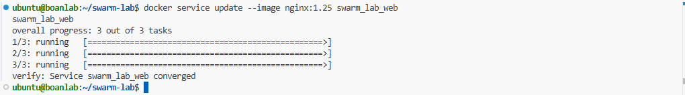

```bash
# 업데이트 진행 상황 실시간 확인 (CURRENT STATE 열 변화 관찰)
docker service ps swarm_lab_web
```
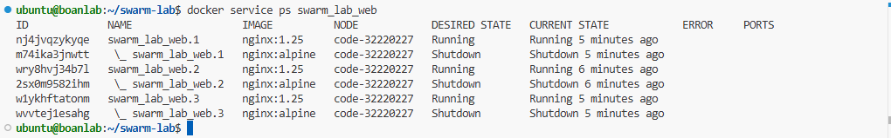

```bash
# 업데이트가 문제 있을 경우 이전 버전으로 롤백
docker service rollback swarm_lab_web
```
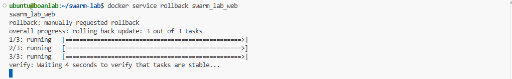

### 4. [실습] 레플리카 수 조정
```bash
# web 서비스 레플리카를 5개로 확장 (Worker 1대에 5개 컨테이너가 몰림)
docker service scale swarm_lab_web=5

# 상태 확인
docker stack ps swarm_lab
```
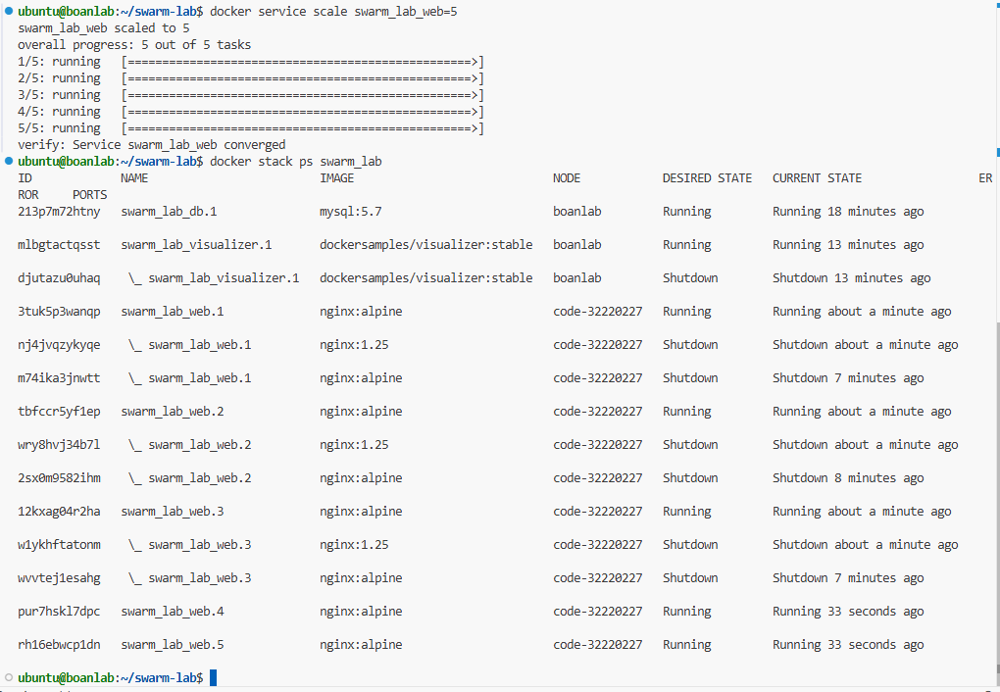

## Step 4. 스웜 클러스터 및 리소스 정리
실습 완료 후 스택을 삭제하고 스웜 모드를 해제합니다.

```bash
# 1. 배포된 스택(swarm_lab) 삭제
docker stack rm swarm_lab

# 2. Worker 노드에서 클러스터 탈퇴 (Worker 노드에서 실행)
docker swarm leave

# 3. Manager 노드에서 스웜 모드 강제 해제 (Manager 노드에서 실행)
docker swarm leave --force
```
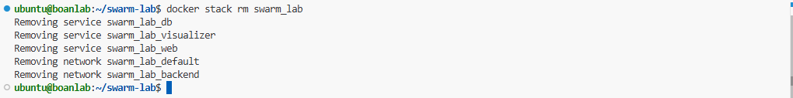

