# 09. 쿠버네티스 워크로드 개요 및 관리 전략

> 본 실습은 **Master 1 + Worker 2 (총 3노드) 클러스터**를 기준으로 합니다. 8주차 실습으로 구성한 Master/Worker1 에 더해, 과제로 진행한 **Worker2 조인까지 완료된 상태**라고 가정합니다.
>
> 모든 `kubectl` 명령은 별도 표기가 없는 한 **Master 노드**에서 실행합니다.

---

## Step 0. 작업 폴더 생성 & 클러스터 점검

### 1. 작업 디렉터리 생성

이번 주차에서 작성할 모든 YAML 파일은 **하나의 작업 폴더(`~/k8s-week9/`)** 에 저장합니다. 이후 모든 명령은 이 폴더에서 실행됩니다.

```bash
mkdir -p ~/k8s-week9
cd ~/k8s-week9
pwd                        # /home/ubuntu/k8s-week9 형태로 출력되면 OK
```
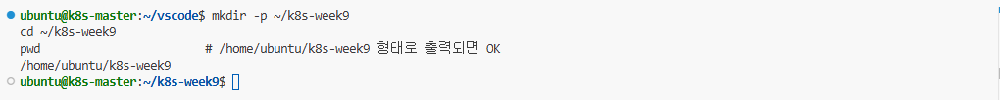

> 이후 단계에서 작성하는 `pod-nginx.yaml`, `nginx-deployment.yaml` 등 모든 매니페스트가 이 폴더에 쌓입니다. 실습이 끝난 후에도 `~/k8s-week9/` 만 백업하면 전체 실습 자료가 보존됩니다.

### 2. 사전 도구 설치 (Master 노드에서 1회만)

일부 단계(StatefulSet/VPA)에서 추가 도구가 필요하므로 미리 설치해 둡니다.

```bash
sudo apt -y install git curl openssl

# 동적 프로비저너(StatefulSet의 PVC 를 위한 기본 StorageClass)
kubectl apply -f https://raw.githubusercontent.com/rancher/local-path-provisioner/v0.0.27/deploy/local-path-storage.yaml
kubectl patch storageclass local-path \
  -p '{"metadata": {"annotations":{"storageclass.kubernetes.io/is-default-class":"true"}}}'
kubectl get sc             # local-path 가 (default) 로 표시되어야 함
```
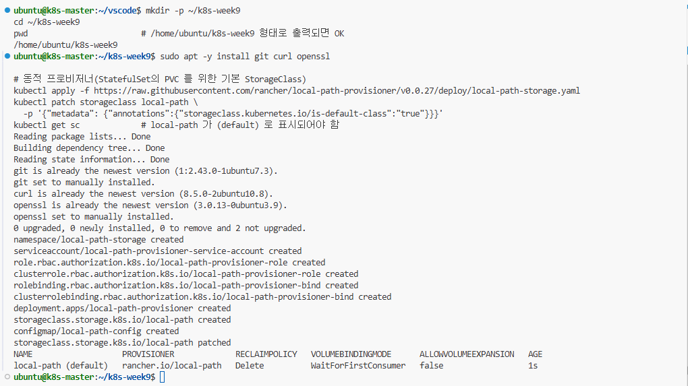

### 3. 노드 목록과 Ready 상태

```bash
kubectl get nodes
# NAME          STATUS   ROLES           AGE   VERSION
# k8s-master    Ready    control-plane   ...   v1.30.x
# k8s-worker1   Ready    <none>          ...   v1.30.x
# k8s-worker2   Ready    <none>          ...   v1.30.x
```

세 노드 모두 `STATUS: Ready` 가 표시되어야 합니다.
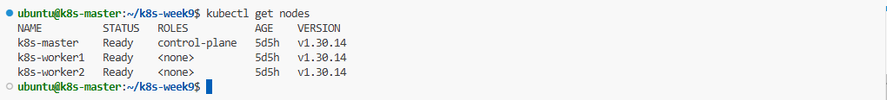

### 4. 노드 상세 정보 (IP / OS / 런타임)

```bash
kubectl get nodes -o wide
```

`INTERNAL-IP` 가 같은 사설 네트워크 대역(예: `10.0.10.x`)에 있어야 노드 간 통신이 가능합니다. `CONTAINER-RUNTIME` 컬럼은 `containerd://...` 형태가 나와야 합니다.
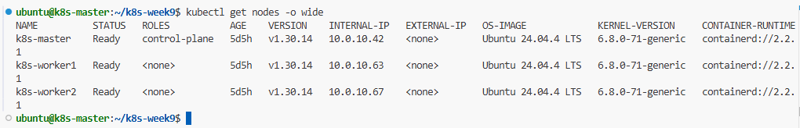

### 5. 시스템 파드가 워커에도 잘 떠 있는지

```bash
# 컨트롤 플레인 + kube-proxy 가 정상 분포돼 있는지
kubectl get pods -n kube-system -o wide

# CNI(Calico)는 별도 네임스페이스에 설치되어 있음
kubectl get pods -n calico-system -o wide
```

다음 두 가지를 반드시 확인합니다:
- `kube-system` 의 **`kube-proxy-XXXXX` 가 노드 수(3개) 만큼** 각 노드에 1개씩 떠 있는지
- `calico-system` 의 **`calico-node-XXXXX` 도 3개**, `calico-kube-controllers` 1개가 Running 인지

이 두 가지가 비면 워커는 등록은 됐어도 네트워크/서비스 라우팅이 끊긴 상태입니다.
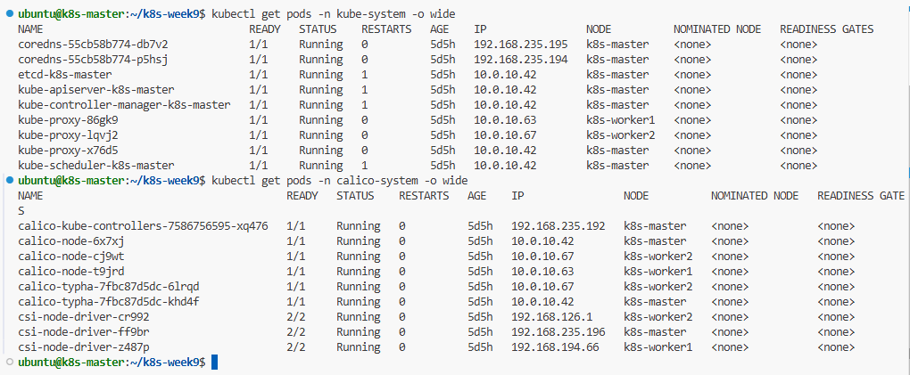

### 6. 실제 워크로드 분산 테스트

레플리카 4개짜리 임시 Deployment를 만들어 **두 워커에 파드가 분산 배치**되는지 확인합니다.

```bash
kubectl create deployment hello --image=nginx --replicas=4
# 파드가 Running 으로 전이될 시간을 충분히 줌 (Pending → ContainerCreating → Running)
sleep 15
kubectl get pods -o wide -l app=hello
# NODE 컬럼에 k8s-worker1, k8s-worker2 가 섞여 나오면 정상

kubectl delete deployment hello
```
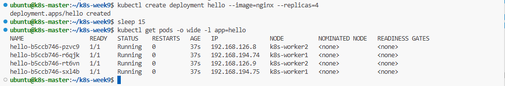

> **만약 파드가 계속 `Pending`** 이라면: `kubectl describe pod <POD>` 의 Events 섹션에서 사유를 확인하세요. 흔한 원인은 ① CNI 미설치 ② 워커 노드 NotReady ③ taint/toleration 불일치 입니다.

---

## Step 1. 파드(Pod) 생성과 상태 확인 (PDF 3~5쪽)

쿠버네티스에서 **파드(Pod)** 는 배포 가능한 가장 작은 단위입니다. 1개 이상의 컨테이너가 같은 네트워크/볼륨을 공유하며 동작하고, 상태가 없는(ephemeral) 단기 객체로 취급됩니다.

### 1. 파드 YAML 작성

```bash
cat > pod-nginx.yaml << 'EOF'
apiVersion: v1
kind: Pod
metadata:
  name: nginx-pod
  labels:
    app: nginx
spec:
  containers:
    - name: nginx
      image: nginx:1.14.2
      ports:
        - containerPort: 80
EOF
```
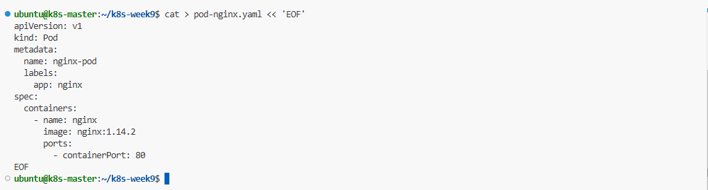

### 2. 파드 배포

```bash
# 선언적 적용 — 동일 명령 재실행 시 변경분만 반영(멱등성)
kubectl apply -f pod-nginx.yaml
```
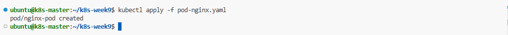

### 3. 파드 상태 확인

```bash
# READY 1/1, STATUS Running 이면 정상
kubectl get pods
kubectl get pods -o wide   # 노드/IP 까지 확인
```
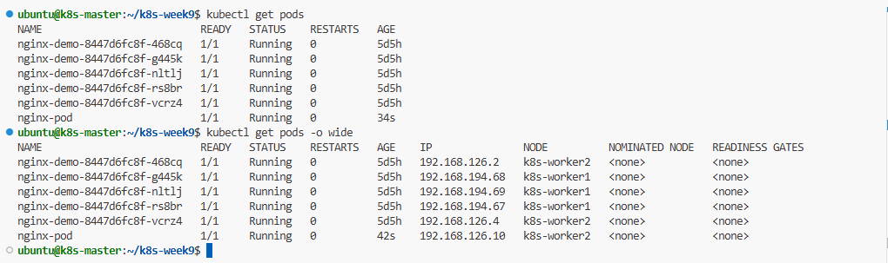

---

## Step 2. 파드 라이프사이클과 진단 (PDF 6~10쪽)

파드는 **Pending → Running → Succeeded/Failed** 단계를 거칩니다. 장애 진단에는 `describe`로 확인할 수 있는 **Conditions / Container State / Reason** 정보가 핵심입니다.

### 1. 상세 정보 조회 (`describe`)

```bash
# Conditions(PodScheduled/Initialized/Ready), Container State, Events 확인
kubectl describe pod nginx-pod
```
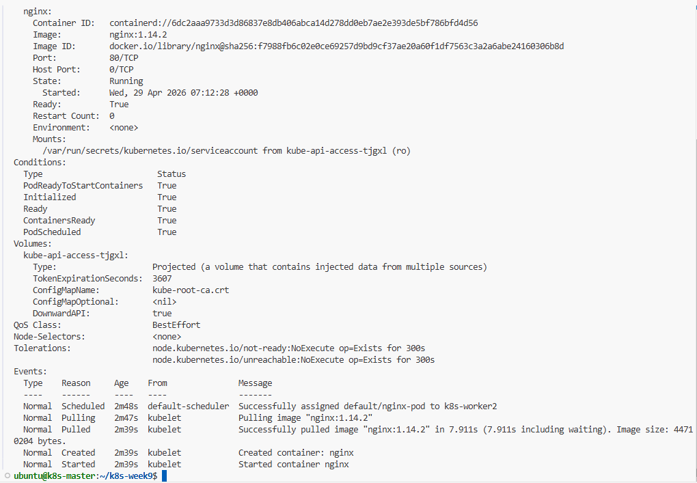

### 2. 컨테이너 로그/터미널 접근

```bash
# 표준출력 로그 확인
kubectl logs nginx-pod

# 파드 내부 셸 진입 (디버깅 용도)
kubectl exec -it nginx-pod -- /bin/sh
# 안에서 hostname / ls /usr/share/nginx/html 등 확인 후 'exit'
```
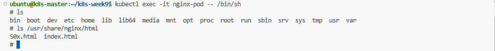

### 3. 의도적 장애 — `ImagePullBackOff` 재현

존재하지 않는 이미지를 사용해 파드의 **Waiting 상태와 Reason** 을 관찰합니다.

```bash
cat > pod-bad.yaml << 'EOF'
apiVersion: v1
kind: Pod
metadata:
  name: nginx-bad
spec:
  containers:
    - name: nginx
      image: nginx:does-not-exist
EOF

kubectl apply -f pod-bad.yaml
sleep 10
kubectl get pod nginx-bad
kubectl describe pod nginx-bad | tail -20   # Events 에 ErrImagePull/ImagePullBackOff 표시
kubectl delete pod nginx-bad
```
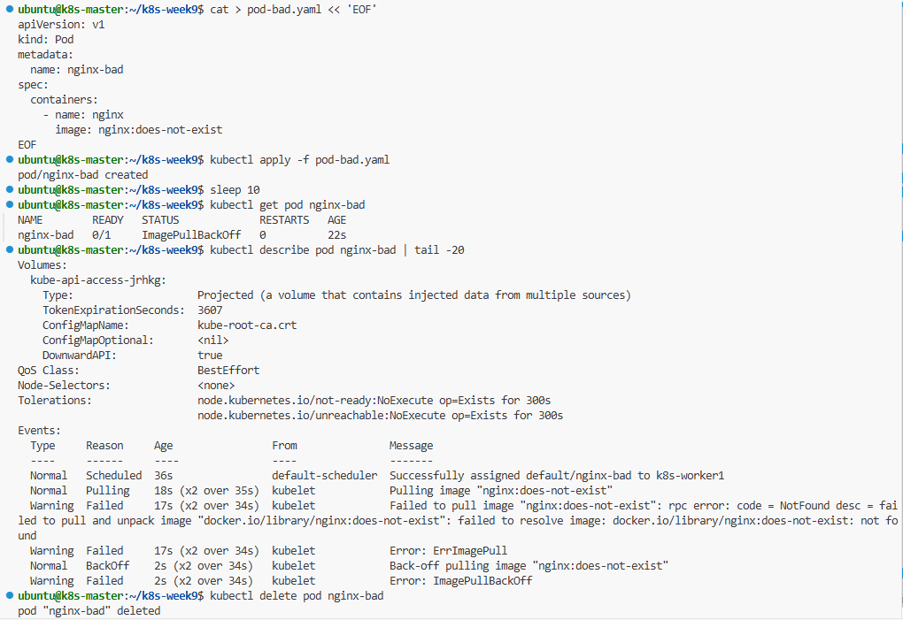

### 4. RestartPolicy 비교

`Always`(기본) / `OnFailure` / `Never` 세 가지 정책을 비교합니다. 일부러 **즉시 종료**되는 컨테이너로 동작 차이를 관찰합니다.

```bash
cat > pod-restart-onfailure.yaml << 'EOF'
apiVersion: v1
kind: Pod
metadata:
  name: pod-onfailure
spec:
  restartPolicy: OnFailure
  containers:
    - name: app
      image: busybox
      command: ["sh", "-c", "echo 'job done' && exit 0"]   # exit 0 → 재시작 X
EOF

cat > pod-restart-never.yaml << 'EOF'
apiVersion: v1
kind: Pod
metadata:
  name: pod-never
spec:
  restartPolicy: Never
  containers:
    - name: app
      image: busybox
      command: ["sh", "-c", "exit 1"]                       # 실패해도 재시작 X
EOF

kubectl apply -f pod-restart-onfailure.yaml
kubectl apply -f pod-restart-never.yaml
sleep 5
kubectl get pods    # STATUS: Completed / Error, RESTARTS: 0
```
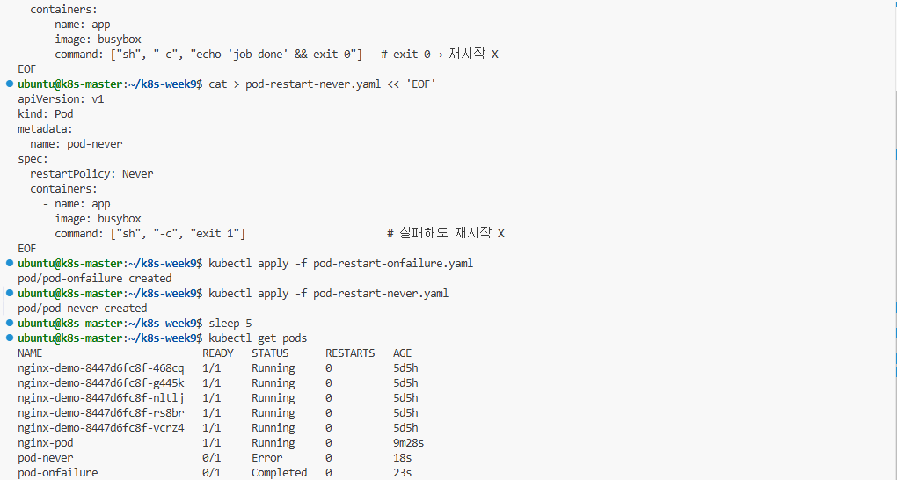

```bash
# 정리
kubectl delete pod pod-onfailure pod-never
```

---

## Step 3. 멀티 컨테이너 패턴 ① — Sidecar (PDF 12~13쪽)

**Sidecar** 는 메인 컨테이너의 코드 변경 없이 보조 기능(로그 수집·프록시 등)을 덧붙이는 패턴입니다. 같은 파드에서 **공유 볼륨**으로 데이터를 주고받습니다.

### 1. YAML 작성

```bash
cat > nginx-sidecar.yaml << 'EOF'
apiVersion: v1
kind: Pod
metadata:
  name: nginx-sidecar
spec:
  containers:
    - name: nginx                       # 메인 컨테이너
      image: nginx
      volumeMounts:
        - name: logs
          mountPath: /var/log/nginx
    - name: sidecar-access              # 사이드카: access.log를 tail
      image: busybox
      args: ["/bin/sh", "-c", "tail -n+1 -F /var/log/nginx/access.log"]
      volumeMounts:
        - name: logs
          mountPath: /var/log/nginx
  volumes:
    - name: logs
      emptyDir: {}
EOF

kubectl apply -f nginx-sidecar.yaml
kubectl wait --for=condition=Ready pod/nginx-sidecar --timeout=60s
kubectl get pod nginx-sidecar
```
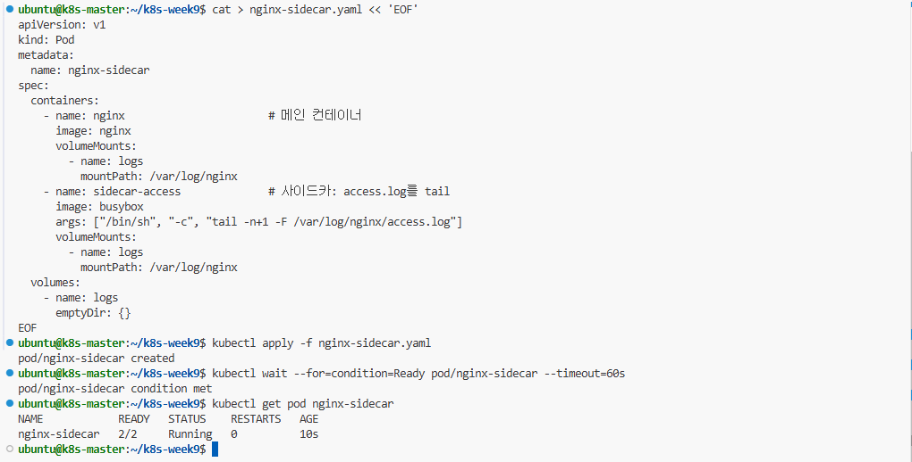

### 2. 동작 확인 — 메인에 트래픽을 주고 사이드카에서 로그 읽기

> nginx 공식 이미지는 `curl`이 없으므로 **Master 노드에서 `kubectl port-forward`** 로 트래픽을 발생시킵니다.

```bash
# 백그라운드로 포트포워딩 (Master 노드의 8080 → 파드의 80)
kubectl port-forward pod/nginx-sidecar 8080:80 >/dev/null 2>&1 &
PF_PID=$!
sleep 2

# 트래픽 발생
curl -s http://localhost:8080/        > /dev/null
curl -s http://localhost:8080/index.html > /dev/null

# 포트포워딩 종료
kill $PF_PID 2>/dev/null

# 사이드카가 tail 한 access.log 확인
kubectl logs nginx-sidecar -c sidecar-access
```
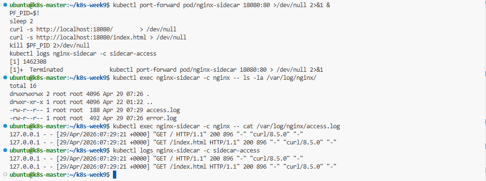

```bash
kubectl delete pod nginx-sidecar
```

---

## Step 4. 멀티 컨테이너 패턴 ② — Adapter (PDF 14~15쪽)

**Adapter** 는 메인 앱이 만드는 **비표준 출력**을 외부 시스템(모니터링·로깅)이 요구하는 **표준 형식**으로 변환해 주는 패턴입니다.

### 1. YAML 작성

```bash
cat > adapter-pod.yaml << 'EOF'
apiVersion: v1
kind: Pod
metadata:
  name: adapter-container-demo
spec:
  containers:
    # 1) 메인 컨테이너: 비표준 로그 생성
    - name: main-container
      image: busybox
      args:
        - "/bin/sh"
        - "-c"
        - "while true; do echo $(date -u)'# Log' >> /var/log/file.log; sleep 5; done"
      volumeMounts:
        - name: var-logs
          mountPath: /var/log
    # 2) 어댑터 컨테이너: 동일 로그를 표준 포맷으로 노출
    - name: adapter-container
      image: bbachin1/adapter-node-server
      ports:
        - containerPort: 3080
      volumeMounts:
        - name: var-logs
          mountPath: /var/log
  volumes:
    - name: var-logs
      emptyDir: {}
EOF

kubectl apply -f adapter-pod.yaml
kubectl wait --for=condition=Ready pod/adapter-container-demo --timeout=120s
kubectl get pod adapter-container-demo
```
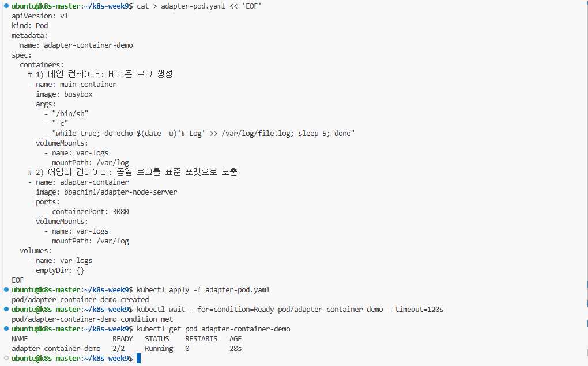

### 2. 동작 확인

```bash
# 5초마다 한 줄씩 쌓이므로 잠시 대기 후 비표준 로그 직접 확인
sleep 12
kubectl exec adapter-container-demo -c main-container -- tail -n 3 /var/log/file.log

# 어댑터가 노출한 표준 형식 확인 (포트 포워딩)
kubectl port-forward pod/adapter-container-demo 3080:3080 >/dev/null 2>&1 &
PF_PID=$!
sleep 2
curl -s http://localhost:3080
kill $PF_PID 2>/dev/null
```
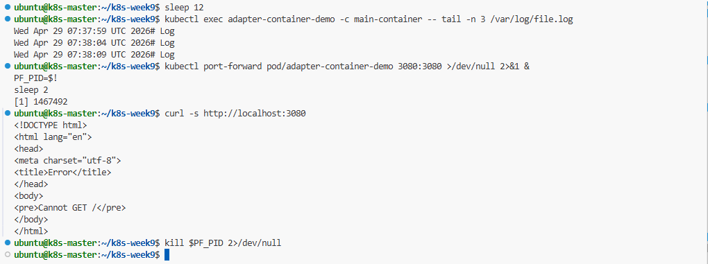

```bash
kubectl delete pod adapter-container-demo
```

---

## Step 5. 멀티 컨테이너 패턴 ③ — Ambassador (PDF 16~17쪽)

**Ambassador** 는 외부 서비스 접속을 대신해 주는 **로컬 프록시** 패턴입니다. 메인 앱은 `localhost`로만 접속하면 되고, 실제 외부 IP·샤딩·인증 등 복잡성은 앰버서더가 캡슐화합니다.

### 1. 외부 Redis 두 대를 미리 클러스터에 띄우기

PDF 예시는 외부 Redis 샤드(`redis-st-0`, `redis-st-1`)를 가정하므로, 해당 이름으로 Service 두 개를 미리 만듭니다.

```bash
cat > redis-shards.yaml << 'EOF'
apiVersion: v1
kind: Pod
metadata: { name: redis-st-0, labels: { app: redis-st-0 } }
spec:
  containers:
    - name: redis
      image: redis:7
      ports: [{ containerPort: 6379 }]
---
apiVersion: v1
kind: Service
metadata: { name: redis-st-0 }
spec:
  selector: { app: redis-st-0 }
  ports: [{ port: 6379, targetPort: 6379 }]
---
apiVersion: v1
kind: Pod
metadata: { name: redis-st-1, labels: { app: redis-st-1 } }
spec:
  containers:
    - name: redis
      image: redis:7
      ports: [{ containerPort: 6379 }]
---
apiVersion: v1
kind: Service
metadata: { name: redis-st-1 }
spec:
  selector: { app: redis-st-1 }
  ports: [{ port: 6379, targetPort: 6379 }]
EOF

kubectl apply -f redis-shards.yaml
kubectl wait --for=condition=Ready pod/redis-st-0 pod/redis-st-1 --timeout=60s
```
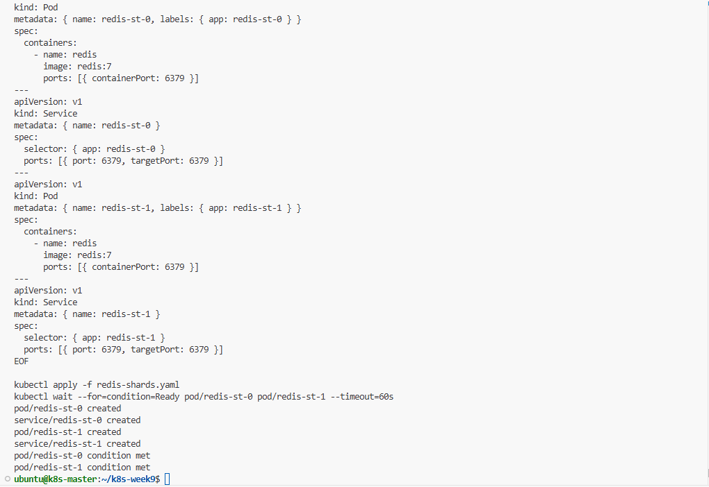

### 2. Ambassador 파드 생성

```bash
cat > ambassador-pod.yaml << 'EOF'
apiVersion: v1
kind: Pod
metadata:
  name: ambassador-example
spec:
  containers:
    # 1) 메인 컨테이너 (Redis Client) — 항상 localhost:6380 만 본다
    - name: redis-client
      image: redis
      command: ["sh", "-c", "sleep 3600"]
    # 2) 앰버서더 (Twemproxy) — 외부 Redis 샤드로 트래픽을 중계
    - name: ambassador
      image: malexer/twemproxy
      env:
        - name: REDIS_SERVERS
          value: "redis-st-0:6379:1 redis-st-1:6379:1"
      ports:
        - containerPort: 6380
EOF

kubectl apply -f ambassador-pod.yaml
kubectl wait --for=condition=Ready pod/ambassador-example --timeout=120s
kubectl get pod ambassador-example
```
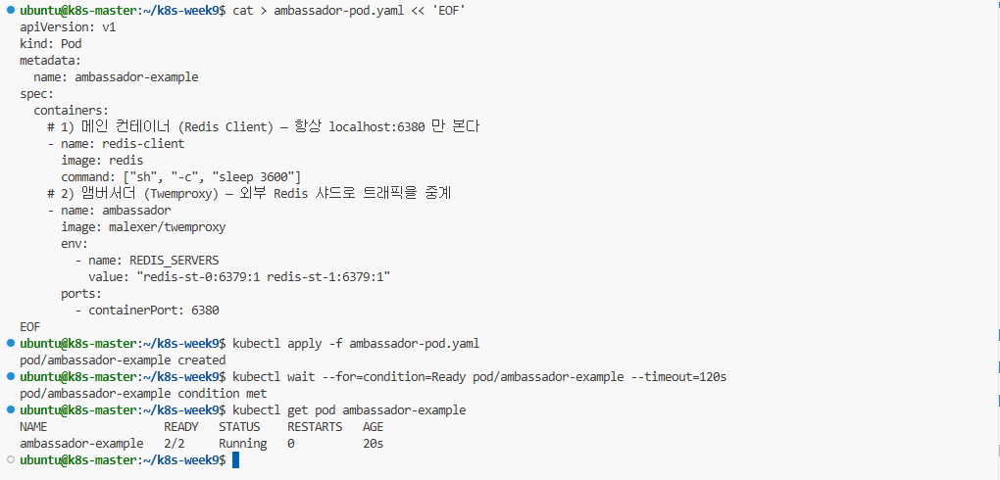

### 3. 메인 컨테이너에서 localhost로만 Redis 사용

```bash
# Twemproxy 가 6380 포트에 바인딩될 때까지 잠시 대기
sleep 3

# 메인은 외부 주소를 모름. localhost:6380(앰버서더) 으로 접속하면 끝.
kubectl exec ambassador-example -c redis-client -- \
  redis-cli -h 127.0.0.1 -p 6380 SET hello from-ambassador

kubectl exec ambassador-example -c redis-client -- \
  redis-cli -h 127.0.0.1 -p 6380 GET hello
```
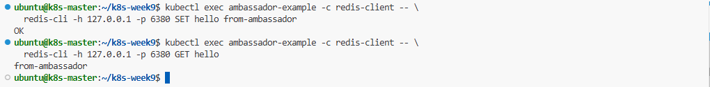

```bash
kubectl delete pod ambassador-example
kubectl delete -f redis-shards.yaml
```

---

## Step 6. 멀티 컨테이너 패턴 ④ — Init Container (PDF 18쪽)

**Init Container** 는 메인 컨테이너 시작 **전에** 순차 실행되는 컨테이너입니다. 의존성 체크·설정 동기화 등에 활용합니다.

### 1. YAML 작성 — 두 개의 의존 서비스가 준비될 때까지 대기

```bash
cat > myapp-pod.yaml << 'EOF'
apiVersion: v1
kind: Pod
metadata:
  name: myapp-pod
spec:
  initContainers:
    - name: init-myservice
      image: busybox:1.28
      command: ["sh", "-c", "until nslookup myservice; do echo waiting myservice; sleep 2; done"]
    - name: init-mydb
      image: busybox:1.28
      command: ["sh", "-c", "until nslookup mydb; do echo waiting mydb; sleep 2; done"]
  containers:
    - name: myapp
      image: busybox:1.28
      command: ["sh", "-c", "echo 'The app is running!' && sleep 3600"]
EOF

kubectl apply -f myapp-pod.yaml
sleep 5
kubectl get pod myapp-pod
# STATUS: Init:0/2 — 의존성을 기다리는 중
```
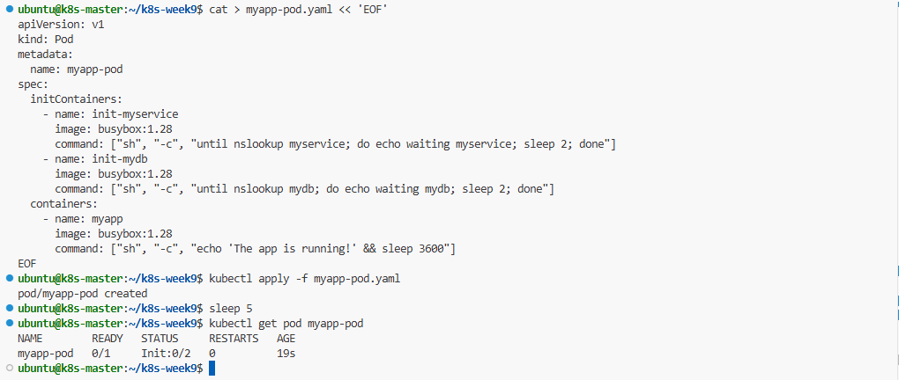

### 2. 첫 번째 의존성 충족 — Service 생성

```bash
kubectl create service clusterip myservice --tcp=80:80
sleep 5
kubectl get pod myapp-pod   # Init:1/2 로 전진하는지 확인
```
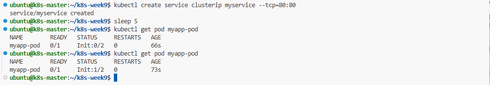

### 3. 두 번째 의존성 충족 → 메인 컨테이너 시작

```bash
kubectl create service clusterip mydb --tcp=80:80
# DNS 캐시/전파에 시간이 걸릴 수 있으므로 충분히 대기
sleep 20
kubectl get pod myapp-pod   # READY 1/1, Running
kubectl logs myapp-pod      # "The app is running!"
```
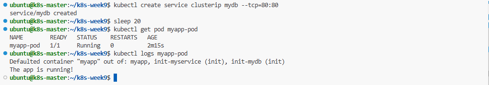

```bash
kubectl delete pod myapp-pod
kubectl delete svc myservice mydb
```

---

## Step 7. ReplicaSet — 자가 복구 (PDF 20~22쪽)

**ReplicaSet** 은 지정된 수의 파드 복제본을 항상 유지합니다. 파드가 사라지면 즉시 새 파드를 생성해 **Desired State** 에 맞춥니다.

### 1. ReplicaSet 생성

```bash
cat > nginx-replicaset.yaml << 'EOF'
apiVersion: apps/v1
kind: ReplicaSet
metadata:
  name: nginx-replicaset
spec:
  replicas: 3
  selector:
    matchLabels:
      app: nginx-rs
  template:
    metadata:
      labels:
        app: nginx-rs
    spec:
      containers:
        - name: nginx
          image: nginx:latest
          ports:
            - containerPort: 80
EOF

kubectl apply -f nginx-replicaset.yaml
kubectl get rs,pods -l app=nginx-rs -o wide   # NODE 컬럼에서 worker1/worker2 분산 확인
```
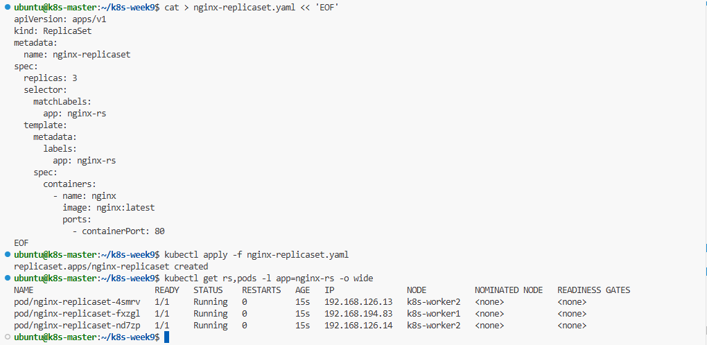

### 2. Auto-healing 시뮬레이션

```bash
# 파드 하나 강제 삭제
POD=$(kubectl get pod -l app=nginx-rs -o jsonpath='{.items[0].metadata.name}')
kubectl delete pod $POD

# 새 파드가 생성되도록 잠시 대기 후 3개가 유지되는지 확인
sleep 5
kubectl get pods -l app=nginx-rs
```
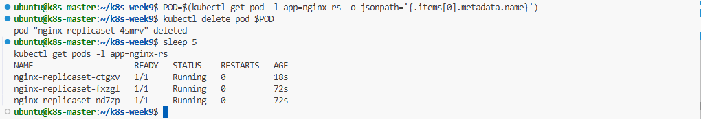

```bash
kubectl delete -f nginx-replicaset.yaml
```

---

## Step 8. Deployment — 롤링 업데이트 & 롤백 (PDF 23~25쪽, 31쪽)

**Deployment** 는 ReplicaSet을 추상화한 상위 컨트롤러로, **무중단 롤링 업데이트**와 **롤백**을 제공합니다.

### 1. Deployment 생성

```bash
cat > nginx-deployment.yaml << 'EOF'
apiVersion: apps/v1
kind: Deployment
metadata:
  name: nginx-deployment
spec:
  replicas: 3
  selector:
    matchLabels:
      app: nginx-deploy
  template:
    metadata:
      labels:
        app: nginx-deploy
    spec:
      containers:
        - name: nginx
          image: nginx:1.14.2
          ports:
            - containerPort: 80
EOF

kubectl apply -f nginx-deployment.yaml
kubectl get deploy,rs,pods -l app=nginx-deploy
```
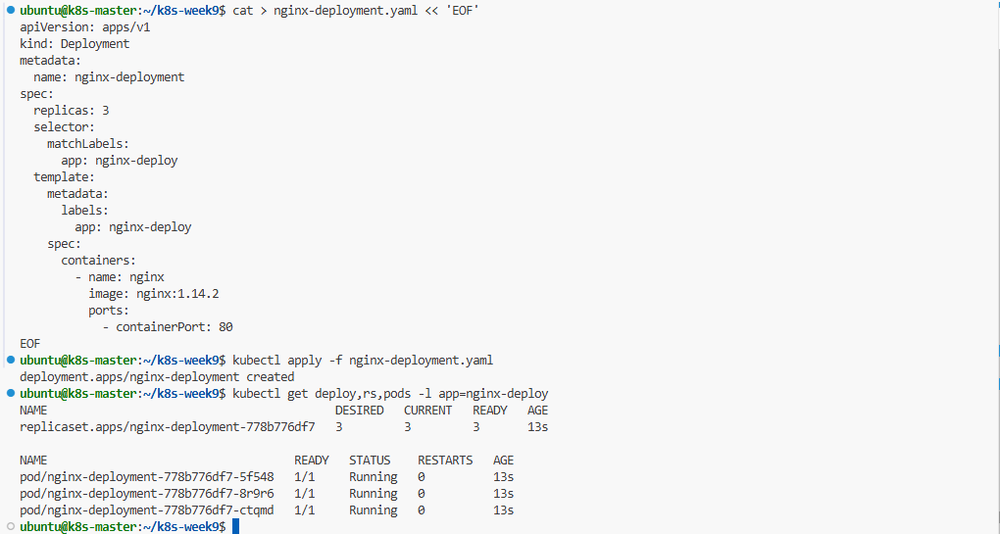

### 2. 롤링 업데이트 (1.14.2 → 1.16)

```bash
kubectl set image deployment/nginx-deployment nginx=nginx:1.16
kubectl rollout status deployment/nginx-deployment
kubectl get pods -l app=nginx-deploy
```
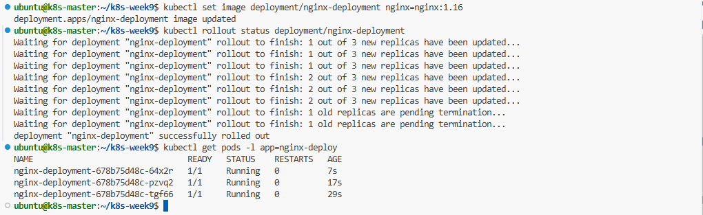

### 3. 배포 이력 조회 & 롤백

```bash
# 1.14.2 → 1.16 롤아웃 이력
kubectl rollout history deployment/nginx-deployment

# 일부러 잘못된 이미지로 업데이트 (실패 유도)
kubectl set image deployment/nginx-deployment nginx=nginx:does-not-exist

# 새 ReplicaSet 의 파드가 ImagePullBackOff 에 빠지기까지 대기
sleep 20
kubectl get pods -l app=nginx-deploy
kubectl get rs -l app=nginx-deploy   # 신/구 ReplicaSet 동시 존재 확인

# 직전 안정 버전(nginx:1.16)으로 롤백
kubectl rollout undo deployment/nginx-deployment
kubectl rollout status deployment/nginx-deployment --timeout=120s
kubectl get pods -l app=nginx-deploy
```
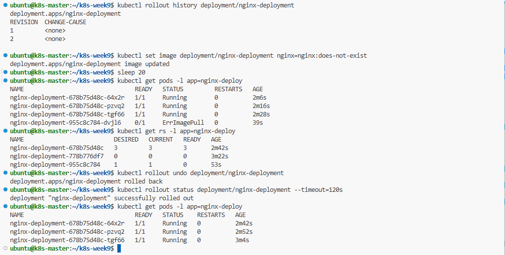

### 4. Dry-run으로 사전 검증

```bash
# 클러스터에 적용하지 않고 문법/유효성만 검증
kubectl apply -f nginx-deployment.yaml --dry-run=client
```
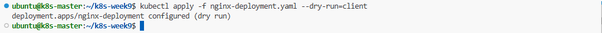

---

## Step 9. 배포 전략 비교 — Recreate vs RollingUpdate (PDF 29~30쪽)

### 1. RollingUpdate(기본) 전략 — `maxSurge`, `maxUnavailable` 설정

```bash
cat > nginx-deployment-rolling.yaml << 'EOF'
apiVersion: apps/v1
kind: Deployment
metadata:
  name: nginx-deployment
spec:
  replicas: 3
  strategy:
    type: RollingUpdate
    rollingUpdate:
      maxSurge: 25%
      maxUnavailable: 25%
  selector:
    matchLabels:
      app: nginx-deploy
  template:
    metadata:
      labels:
        app: nginx-deploy
    spec:
      containers:
        - name: nginx
          image: nginx:1.16
          ports:
            - containerPort: 80
EOF

kubectl apply -f nginx-deployment-rolling.yaml
kubectl rollout status deployment/nginx-deployment
```
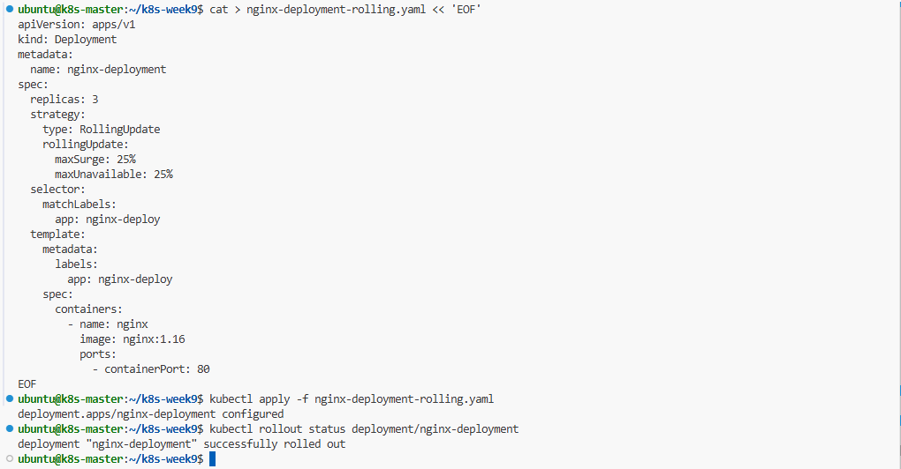

### 2. Recreate 전략으로 전환 (다운타임 발생)

```bash
cat > nginx-deployment-recreate.yaml << 'EOF'
apiVersion: apps/v1
kind: Deployment
metadata:
  name: nginx-deployment
spec:
  replicas: 3
  strategy:
    type: Recreate
  selector:
    matchLabels:
      app: nginx-deploy
  template:
    metadata:
      labels:
        app: nginx-deploy
    spec:
      containers:
        - name: nginx
          image: nginx:1.18
          ports:
            - containerPort: 80
EOF

kubectl apply -f nginx-deployment-recreate.yaml
# 기존 파드가 "전부 Terminating → 전부 사라진 뒤" 새 파드가 생성됨을 관찰
# (Ctrl+C 로 watch 종료)
kubectl get pods -l app=nginx-deploy -w
```
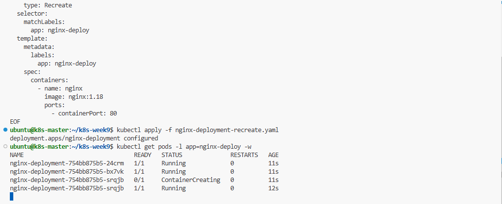

```bash
# 실습 종료 후 정리는 Step 14에서 일괄 진행
```

---

## Step 10. StatefulSet — 순차 배포 & 영구 식별자 (PDF 26~27쪽)

**StatefulSet** 은 각 파드에 **고유 순번(0,1,2...)** 과 안정적 호스트명을 부여하고, 파드별 영구 볼륨(PVC)을 보장합니다. DB·메시지큐 등 상태 저장형 앱에 사용합니다.

### 1. Headless Service 와 StatefulSet 생성

```bash
cat > web-statefulset.yaml << 'EOF'
apiVersion: v1
kind: Service
metadata:
  name: web              # serviceName과 일치해야 함 (Headless)
spec:
  clusterIP: None
  selector:
    app: web
  ports:
    - port: 80
      targetPort: 80
---
apiVersion: apps/v1
kind: StatefulSet
metadata:
  name: web-sts
spec:
  serviceName: "web"
  replicas: 3
  selector:
    matchLabels:
      app: web
  template:
    metadata:
      labels:
        app: web
    spec:
      containers:
        - name: web
          image: nginx
          ports:
            - containerPort: 80
          volumeMounts:
            - name: data
              mountPath: /usr/share/nginx/html
  volumeClaimTemplates:
    - metadata:
        name: data
      spec:
        accessModes: [ "ReadWriteOnce" ]
        resources:
          requests:
            storage: 100Mi
EOF

kubectl apply -f web-statefulset.yaml
```
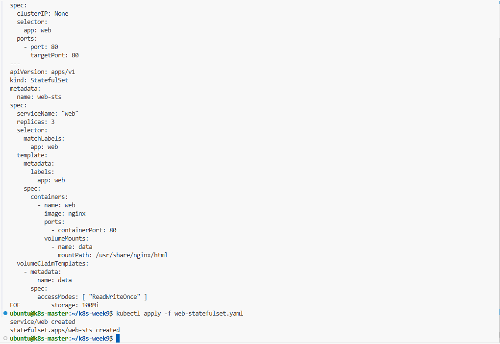

### 2. 순차 생성/식별자/PVC 확인

```bash
# 약 30~60초 대기 후 web-sts-0 → 1 → 2 순서로 생성되었는지 확인
sleep 60
kubectl get pods -l app=web    # 모두 Running, READY 1/1
kubectl get pvc                # data-web-sts-0/1/2 가 Bound 상태
```
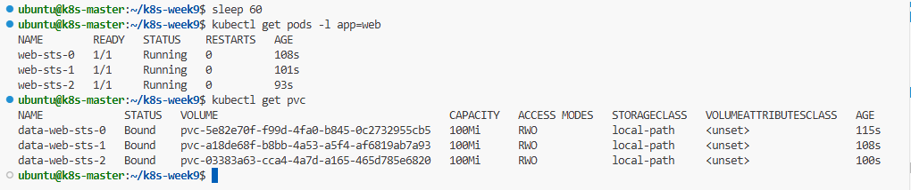

> PVC 가 `Pending` 으로 멈추면 StorageClass가 없는 것입니다. **사전 준비**에서 설치한 `local-path` 가 default 인지 `kubectl get sc` 로 확인하세요.

```bash
kubectl delete -f web-statefulset.yaml
# PVC 는 StatefulSet 삭제 시 함께 지워지지 않으므로 이름으로 직접 삭제
for i in 0 1 2; do
  kubectl delete pvc data-web-sts-$i --ignore-not-found
done
```

---

## Step 11. DaemonSet — 노드별 1파드 보장 (PDF 28쪽)

**DaemonSet** 은 클러스터의 모든(또는 선택한) 노드에 파드를 정확히 하나씩 실행합니다. 로그 수집·모니터링 에이전트 등에 사용합니다.

```bash
cat > node-exporter-daemonset.yaml << 'EOF'
apiVersion: apps/v1
kind: DaemonSet
metadata:
  name: node-exporter
  labels:
    app: node-exporter
spec:
  selector:
    matchLabels:
      app: node-exporter
  template:
    metadata:
      labels:
        app: node-exporter
    spec:
      # 컨트롤 플레인 노드에도 배치되도록 기본 taint 무시
      tolerations:
        - key: node-role.kubernetes.io/control-plane
          operator: Exists
          effect: NoSchedule
      containers:
        - name: exporter
          image: prom/node-exporter:v1.3.1
          ports:
            - containerPort: 9100
EOF

kubectl apply -f node-exporter-daemonset.yaml

# 노드 수(3개: master + worker1 + worker2)와 동일한 수의 파드가 생성되는지 확인
kubectl get nodes
kubectl get pods -l app=node-exporter -o wide   # 각 노드에 정확히 1개씩 배치됨
```
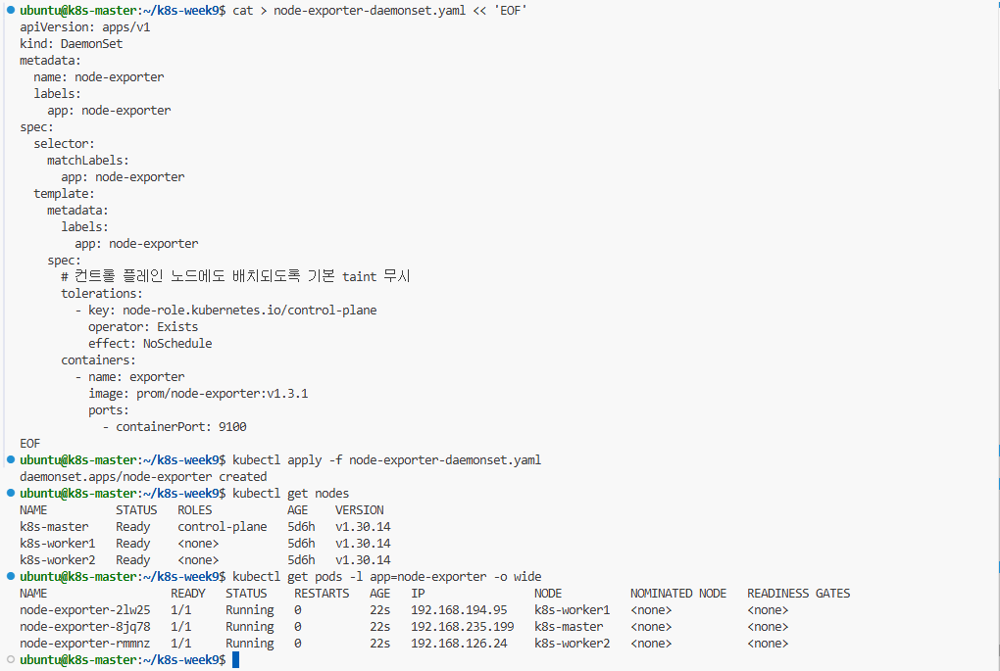

```bash
kubectl delete -f node-exporter-daemonset.yaml
```

---

## Step 12. HPA — 수평 오토스케일링 (PDF 32쪽)

**HPA(Horizontal Pod Autoscaler)** 는 CPU/메모리 사용률에 따라 파드 **개수** 를 자동 조정합니다. **Metrics Server** 가 사전 설치돼 있어야 합니다.

### 1. Metrics Server 설치

```bash
# Metrics Server 매니페스트 적용
kubectl apply -f https://github.com/kubernetes-sigs/metrics-server/releases/latest/download/components.yaml

# 학습 환경(자체 서명 인증서)에서 필수 옵션 추가
# 이미 추가돼 있으면 결과만 nochange 로 표시됨 (재실행 안전)
kubectl -n kube-system get deployment metrics-server -o yaml \
  | grep -q -- '--kubelet-insecure-tls' \
  || kubectl -n kube-system patch deployment metrics-server --type='json' \
       -p='[{"op":"add","path":"/spec/template/spec/containers/0/args/-","value":"--kubelet-insecure-tls"}]'

# Pod Ready 대기 (최대 2분)
kubectl -n kube-system rollout status deployment/metrics-server --timeout=120s

# 메트릭 수집까지 30초 정도 추가 대기 후 확인
sleep 30
kubectl top nodes
```
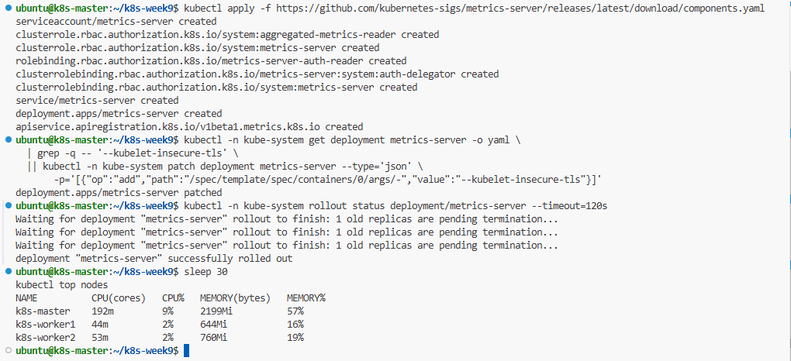

### 2. 부하 테스트용 Deployment 생성 (CPU 요청 지정 필수)

```bash
cat > php-apache.yaml << 'EOF'
apiVersion: apps/v1
kind: Deployment
metadata:
  name: php-apache
spec:
  replicas: 1
  selector:
    matchLabels: { app: php-apache }
  template:
    metadata:
      labels: { app: php-apache }
    spec:
      containers:
        - name: php-apache
          image: registry.k8s.io/hpa-example
          ports:
            - containerPort: 80
          resources:
            requests:
              cpu: 200m
            limits:
              cpu: 500m
---
apiVersion: v1
kind: Service
metadata: { name: php-apache }
spec:
  selector: { app: php-apache }
  ports:
    - port: 80
      targetPort: 80
EOF

kubectl apply -f php-apache.yaml
kubectl rollout status deployment/php-apache --timeout=180s
```
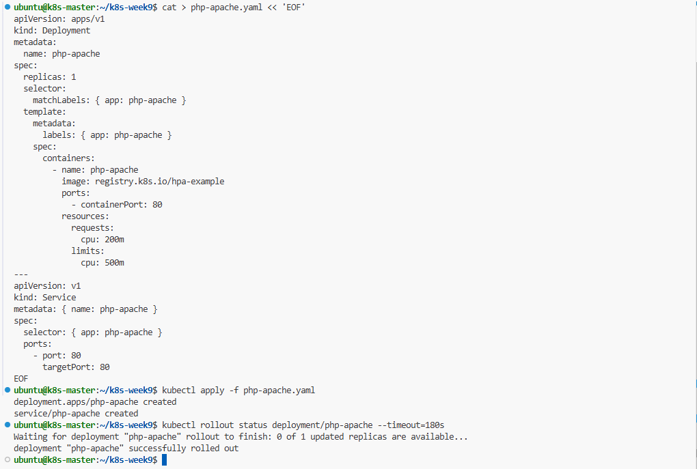

### 3. HPA 적용 (선언적 YAML)

```bash
cat > php-apache-hpa.yaml << 'EOF'
apiVersion: autoscaling/v2
kind: HorizontalPodAutoscaler
metadata:
  name: php-apache-hpa
spec:
  scaleTargetRef:
    apiVersion: apps/v1
    kind: Deployment
    name: php-apache
  minReplicas: 1
  maxReplicas: 5
  metrics:
    - type: Resource
      resource:
        name: cpu
        target:
          type: Utilization
          averageUtilization: 50
EOF

kubectl apply -f php-apache-hpa.yaml
kubectl get hpa php-apache-hpa
```
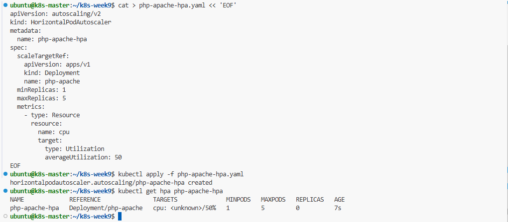

> 명령어 한 줄로도 동일하게 만들 수 있습니다:
> `kubectl autoscale deploy php-apache --min=1 --max=5 --cpu-percent=50`

### 4. 부하 발생 → 파드 증가 관찰

> **두 개의 터미널이 필요합니다.** 터미널 A에서 부하를 발생시키고, 터미널 B에서 HPA 변화를 모니터링합니다.

```bash
# [터미널 A] 부하 생성기 실행 — 종료는 Ctrl+C
kubectl run load-generator --rm -it --image=busybox:1.28 --restart=Never -- \
  /bin/sh -c "while true; do wget -q -O- http://php-apache; done"
```

```bash
# [터미널 B] 1~2분 후 REPLICAS 가 늘어나는 것을 확인 — 종료는 Ctrl+C
kubectl get hpa php-apache-hpa -w
```

```bash
# [터미널 B] 별도 시점 스냅샷
kubectl get hpa php-apache-hpa
kubectl get pods -l app=php-apache
```
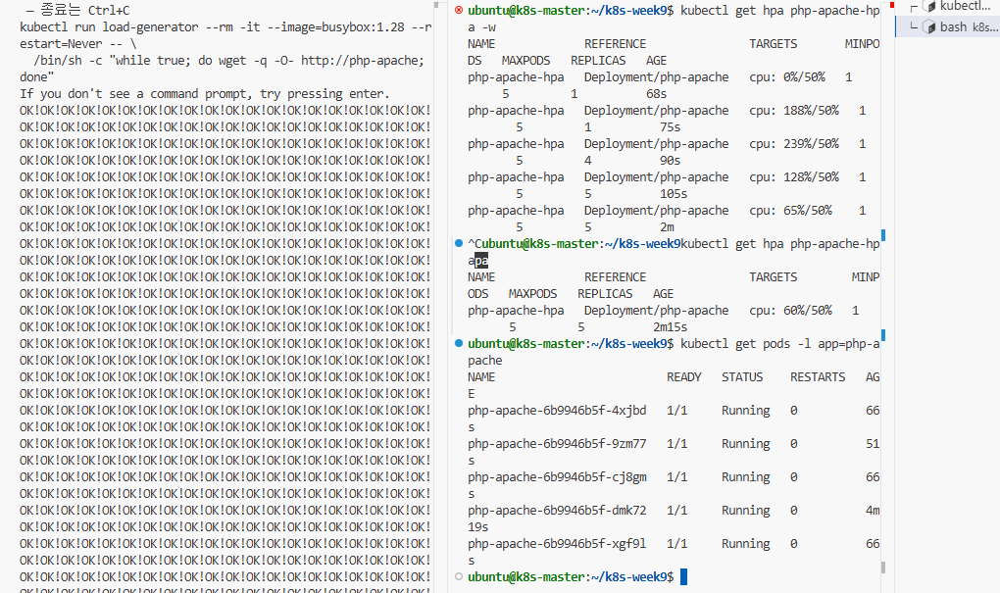

> 터미널 A 에서 `Ctrl+C` 로 부하를 멈춘 뒤 5~10분 정도 기다리면 다시 `minReplicas=1` 로 축소(scale-in)되는 것도 관찰할 수 있습니다.

---

## Step 13. VPA — 수직 오토스케일링 (PDF 33쪽)

**VPA(Vertical Pod Autoscaler)** 는 파드의 **CPU/메모리 요청·제한 값** 자체를 사용량 기반으로 자동 조정합니다. HPA와 달리 **별도 설치**가 필요합니다.

### 1. VPA 설치

```bash
# 설치 스크립트가 의존하는 도구 확인
sudo apt -y install openssl

# autoscaler 저장소 클론 후 설치 스크립트 실행
[ -d ~/autoscaler ] || git clone https://github.com/kubernetes/autoscaler.git ~/autoscaler
cd ~/autoscaler/vertical-pod-autoscaler
./hack/vpa-up.sh

# admission-controller / recommender / updater 세 개가 떠야 정상
kubectl -n kube-system get pods | grep vpa
cd ~/k8s-week9
```
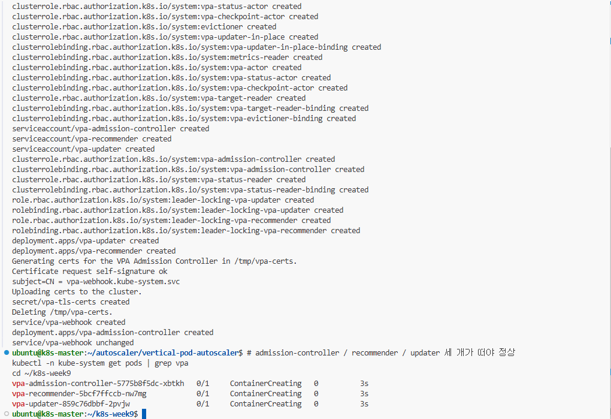

### 2. VPA 적용 — 추천만 받는 모드 (`Off`)

처음에는 **추천값만 확인**하고 실제 파드를 재시작하지 않는 것이 안전합니다.

```bash
cat > php-apache-vpa.yaml << 'EOF'
apiVersion: autoscaling.k8s.io/v1
kind: VerticalPodAutoscaler
metadata:
  name: php-apache-vpa
spec:
  targetRef:
    apiVersion: apps/v1
    kind: Deployment
    name: php-apache
  updatePolicy:
    updateMode: "Off"        # 추천만 제공. 운영은 Auto / Initial / Recreate 선택
EOF

kubectl apply -f php-apache-vpa.yaml
```
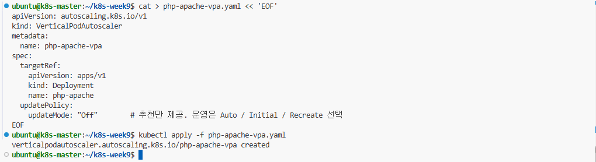

### 3. 추천값 확인

VPA Recommender가 메트릭을 수집해 추천값을 계산하기까지 5~10분 정도가 필요합니다. 이 시간 동안 **Step 12의 부하 생성기를 한 번 더 돌려 트래픽을 발생**시키면 더 의미 있는 추천값이 나옵니다.

```bash
# 5분 정도 기다린 뒤 추천값 확인 — 출력 마지막의 Recommendation 섹션을 봄
kubectl describe vpa php-apache-vpa
```

```bash
# 추천값만 깔끔하게 보기
kubectl get vpa php-apache-vpa -o jsonpath='{.status.recommendation}' && echo
# 예: {"containerRecommendations":[{"containerName":"php-apache","lowerBound":...,"target":...,"upperBound":...}]}
```
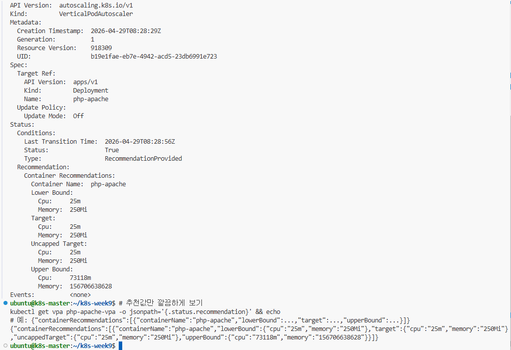

> `updateMode: Auto` 로 바꾸면 VPA가 직접 파드를 재시작하여 추천값을 적용합니다. **HPA(CPU)와 VPA(CPU)를 동일 워크로드에 동시에 켜지 마세요** — 서로 충돌합니다.

---

## Step 14. 리소스 정리

각 Step 끝에 이미 정리 명령이 있지만, 마지막에 한 번 더 일괄 정리합니다. (이미 삭제된 리소스는 NotFound 메시지가 떠도 무시하면 됩니다.)

```bash
# Step 12~13에서 만든 리소스
kubectl delete -f php-apache-vpa.yaml --ignore-not-found
kubectl delete -f php-apache-hpa.yaml --ignore-not-found
kubectl delete -f php-apache.yaml     --ignore-not-found
kubectl delete pod load-generator     --ignore-not-found    # Ctrl+C 못한 경우 대비

# Step 8~9 Deployment
kubectl delete deployment nginx-deployment --ignore-not-found

# 최초 파드
kubectl delete pod nginx-pod --ignore-not-found
```

```bash
# (선택) 사전 준비에서 설치한 인프라까지 모두 제거하려면 아래 주석을 풀어 실행
# cd ~/autoscaler/vertical-pod-autoscaler && ./hack/vpa-down.sh && cd ~/k8s-week9
# kubectl delete -f https://github.com/kubernetes-sigs/metrics-server/releases/latest/download/components.yaml
# kubectl delete -f https://raw.githubusercontent.com/rancher/local-path-provisioner/v0.0.27/deploy/local-path-storage.yaml
```
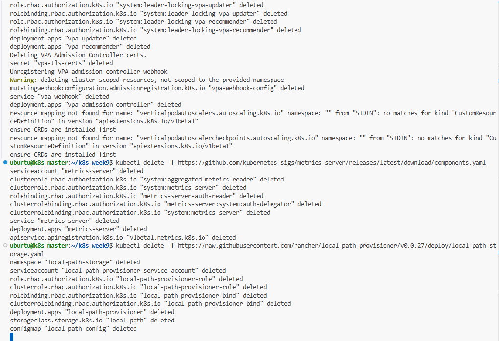

---

## 트러블슈팅 체크리스트

| 증상 | 주요 원인 / 조치 |
| :--- | :--- |
| 파드가 `Pending` 으로 멈춤 | 노드 리소스 부족 / `nodeSelector·toleration` 미충족 → `kubectl describe pod`의 Events 확인 |
| `ImagePullBackOff` | 이미지 이름·태그 오타, 사설 레지스트리 인증 누락 |
| `CrashLoopBackOff` | 컨테이너 명령어가 즉시 종료됨 → `kubectl logs`로 종료 사유 확인, RestartPolicy 검토 |
| Init Container 가 진행 안 됨 | 의존 Service/DNS 미생성 → `kubectl get svc`, 로그에서 `nslookup` 실패 메시지 확인 |
| StatefulSet PVC `Pending` | 기본 StorageClass 부재 → `kubectl get sc`, 로컬 환경에선 `local-path-provisioner` 등 설치 |
| DaemonSet 파드가 일부 노드에 없음 | 노드의 taint 와 파드의 toleration 불일치 → `kubectl describe node` 의 Taints 항목 확인 |
| `kubectl top` 명령이 에러 | Metrics Server 미설치 / `--kubelet-insecure-tls` 옵션 누락 |
| HPA 의 `TARGETS` 가 `<unknown>` | Metrics Server 미동작, 또는 Deployment 에 `resources.requests.cpu` 가 빠짐 |
| VPA 추천값이 비어 있음 | 메트릭 수집 시간 부족(최소 5분) / VPA Recommender 파드 비정상 |
| 롤링 업데이트 멈춤 | 새 파드가 `Ready` 가 안 됨 → `kubectl describe rs` 로 신규 ReplicaSet 진행 상황 확인 후 `kubectl rollout undo` |
| Ambassador `redis-cli` 가 connection refused | Twemproxy 파드 부팅 직후라 6380 포트 미바인딩 → 5초 정도 대기 후 재시도 |
| `kubectl exec` 에 `Unable to use a TTY` 경고 | `-it` 플래그를 일회성 명령에 붙였을 때의 경고일 뿐, 명령 자체는 정상 수행됨 |
| `nslookup` 이 실패하다 갑자기 통과 | Service 생성 직후 CoreDNS 캐시 미반영 — 정상 동작이며 수 초 후 해소됨 |
